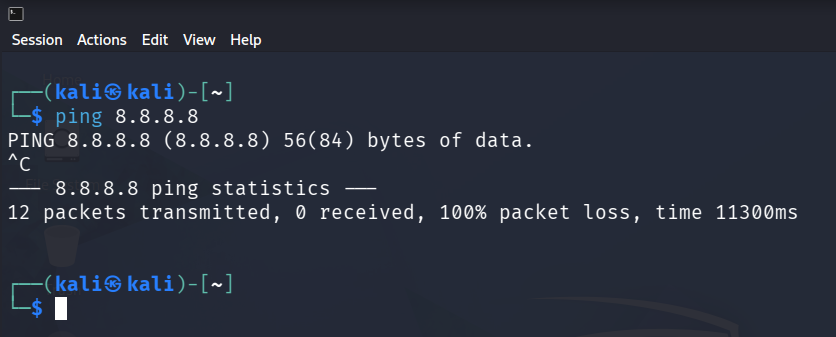
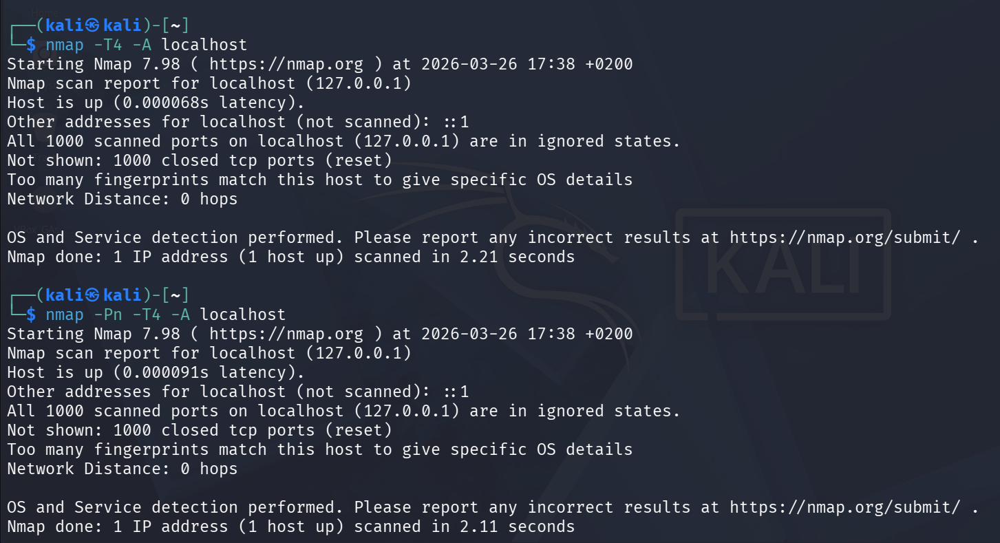
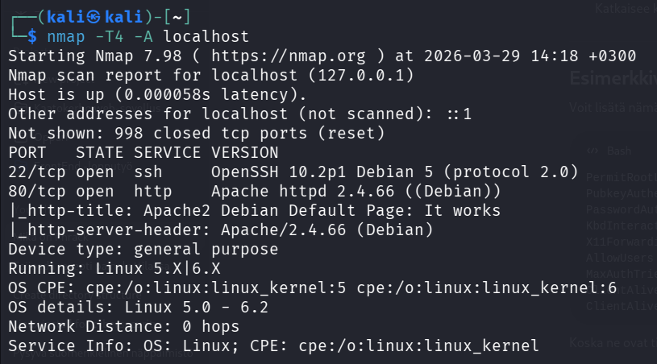

# Kybertappoketju

Harjoitukset on tehty kotitoimistossa Kaarinassa. Koneena oli Lenovo V14 G4 AMN. Käyttöjärjestelmänä Windows 11 Pro version 25H2. Virtuaalikoneena oli Linux Kali 6.16.8+kali-amd64.

## x

#### Intrusion Kill Chain (Amin, Cloppert & Hutchins 2011, 4-5)
- Intrusion Kill Chain on kyberhyökkäyksen toimintatapa, joka on johdettu Yhdysvaltojen armeijan vastaavanlaisesta lähestymistavasta. Se kuvaa hyökkäyksen etenemistä useassa peräkkäisessä vaiheessa, joista jokainen on tärkeä kokonaisuuden onnistumisen kannalta.
- Toimintatapa sisältää seuraavat vaiheet:
    - Reconnaissance, jossa eri menetelmiä hyödyntäen kerätään mahdollisimman kattavasti tietoa kohteesta.
    -  Weaponization, jossa haittaohjelma yhdistetään hyötykuormaksi, esimerkiksi tiedostoon.
    - Delivery, jossa hyötykuorma toimitetaan kohteelle.
    - Exploitation, jossa kohteen haavoittuvuutta hyödynnetään hyökkäyksen käynnistämiseksi.
    - Installation, jossa haittaohjelma asennetaan kohdejärjestelmään ja mahdollistetaan pysyvä pääsy.
    - Command and Control, jossa hyökkääjä saa etäyhteyden saastuneeseen koneeseen.
    - Actions on Objectives, jossa hyökkääjä toteuttaa varsinaisen tavoitteensa, kuten tiedon varastamisen tai käyttää järjestelmää muihin hyökkäyksiin.

#### KKO:2003:36 (Finlex 2003)
- Vuonna 1998 17-vuotias henkilö suoritti porttiskannauksen Osuuspankkikeskus-OPK:n tietojärjestelmään, tarkoituksenaan löytää siitä haavoittuvuuksia .
- Tapaus eteni korkeimpaan oikeuteen asti, jossa henkilö todettiin syylliseksi tietoliikenteen häirintään sekä tietomurron yritykseen. Hänet tuomittiin maksamaan asianomaisille yhteensä 75 000 markan korvaukset.
- Tapaus korostaa tietomurtoihin liittyvien rikosten vakavuutta, sillä jo pelkästä tietomurron yrityksestä seurasi merkittävät korvausvelvoitteet.

#### The Art of Hacking (McCoy, C., Santos, O., Sternstein, J. & Taylor R. Huhtikuu 2019)
- Video käy läpi erilaisten porttiskannereiden käyttöä käytännönläheisesti.
- Ensimmäisenä työkaluna esitellään Nmapin käyttöä. Esimerkissä lähetetään TCP SYN -paketti ja se kohdistetaan yhteen tiettyyn kohteeseen. Toisessa esimerkissä avataan TCP yhteys kolmivaiheisellä kättelyllä joka kohdistetaan verkon kaikille laitteille.
- Video esittelee myös masscan-työkalua, joka soveltuu paremmin isojen verkkojen skannaukseen nopeutensa ansiosta. Esimerkissä skannataan HTTP ja HTTPS portteja kohdeverkosta.
- Kolmantena työkaluna esitellään udpprotoscanner, joka on UDP porttien skannaukseen kehitetty työkalu.

#### Phrack (Rhysider 3.2.2026)
- Jaksossa haastatellaan legendaarisen hakkeri-julkaisu Phrackin työntekijöitä. Haastattelussa käsitellään julkaisun historiaa ja merkittävimpiä artikkeleita ja käännekohtia.

- Phrackilla on merkittävä asema hakkerikulttuurin historiassa. Se perustettiin vuonna 1985, ja monet tunnetut hakkerit ja tietoturva-alan ammattilaiset ovat kirjoittaneet siihen.

- Julkaisun historiassa on nähty myös kiistanalaisa tapauksia, esimerkiksi kun siinä julkaistiin Yhdysvaltojen kansallisen turvallisuuden kannalta kriittisen 911-hätäpuhelujärjestelmän teknisen dokumentin. Phrack on myös julkaissut exploitteja sekä muunmuassa ohjeita miten rakentaa kotitekoisia pommeja.

## a

Asensin Kalin virtuaalikoneen tiistain tunnilla, kun en enää muistanut Linux-kurssilla asentamani Debianin salasanaa. Asennus oli suoraviivainen eikä aiheuttanut ongelmia.

## b
26.3.2026 17:10

Kytkin Hacktheboxin starting_points VPN yhteyden päälle. Kokeilin pingata Googlen DNS-palvelinta ja yksikään paketti ei mennyt läpi.


 Myöskään selain ei avaa nettisivuja.

 ## c
17:38

Tein kaksi porttiskannausta. Ensimmäinen oli Teron kurssisivun (Karvinen 22.3.2026) ohjeistama. Toiseen lisäsin kokeilumielessä parametrin `-Pn`.


#### Parametrit

`-T4` "T" määrittää skannauksen nopeuden. Mitä korkeampi arvo, sen nopeampi skannaus (nmap -h). Korkeampi arvo säätää nmapin sisäisiä parametreja tehden siitää nopeamman ja agressiivisemman. Se lähettää enemmän SYN-paketteja lyhyessä ajassa mikä voi nostaa skannauksen epätarkkuutta ja helpoittaa IDS-järjestelmiä havaitsemaan skannauksen(ChatGPT1).

`-A` Mahdollistaa käyttöjärjestelmän, porttien takana pyörivien palveluiden versiot sekä suorittaa tracerouten(nmap -h). Lisäksi se käyttää NSE:tä (Nmap Script Scanning). Kun portit on löydetty, niitä vastaan "hyökätään" skriptien avulla. Sen avulla voidaan mm. kerätä lisätietoa sekä testata haavoittuvuuksia ja autentikointia.(ChatGPT1)

`-Pn` Tämä parametri ohittaa host discoveryn(nmap -h). Normaalisti nmap käyttää ICMPv4 -protokollaa, eli pingaa kohdetta. Palomuuri voidaan konfiguroida niin, että se blokkaa ICMP -paketit, jolloin nmap olettaa että portit ovat offline. -Pn siirtyy suoraan porttiskannaukseen ja olettaa että kaikki portit ovat online, joka yleisesti ottaen parantaa tuloksia. (ChatGPT1)

#### Tulokset
1. Aikaleima nmapin käynnistymisestä.
2. Näyttää että skannaus kohdistettiin hostin link-local osoitteeseen.
3. Kerrotaan että link-local osoite vastaa alle millisekunnin latencyllä.
4. Nmap skannasi pelkästää IPv4 -osoitteen.
5. Kaikki yleisimmät portit ovat kiinni.
6. "Reset" tarkoittaa että host vastaa aktiivisesti. Jos näkyisi "filtered", niin palomuuri blokkaisi skannausta. (ChatGPT2)
7. Käyttöjärjestelmää ei voitu päätellä.
8. Matkan varrella ei ollut reitittimiä.

Ps. `-Pn` ei vaikuttanut tuloksiin koska localhost ei blokkaa ICMP -paketteja

## d
29.3.2026 14:00

Asensin ssh-palvelimen ja apache -veppipalvelimen komennolla

`sudo apt-get install ssh-server apache2`.

Ja käynnistin palvelut
```
sudo systemctl start ssh
sudo systemctl start apache2
```

Tein uuden porttiskannauksen.


- Nyt tulokset näyttävät että portit 22 ja 80 ovat avattu.
- Porttiskannaus osasi myös määritellä ssh ja apache -palveluiden ohjelmistoversiot.
- Lisäksi se löysi apachen default pagen.
- Koska ssh ja apache ohjelmistot ovat debian pohjaisia, osasi nmap myös päätellä, että kohdejärjestelmä on Linux 5.0 - 6.2. Tämä tosin menee luultavasti ainakin osittain arvailuksi, sillä todellisuudessa käyttöjärjestelmän versio ei vastaa tätä.


## e
Tein starting pointin neljännen koneen (Redeemer).

16:56

Aloitin tekemällä perus skannauksen `nmap -T4 -A`. Tulosteen mukaan kaikki portit ovat offline tilassa.
Kokeilin ajaa skannauksen uudestaan, tällä kertaa parametrilla `-Pn`. Tämäkään ei antanut tuloksia.
Lisäsin vielä `-sS` parametrin jolloin lähetetään pelkästään TCP SYN. Myöskään tämä ei tuottanut tuloksia.

Tässä kohtaa painoin hacktheboxin hint-painiketta. Se kehotti käyttämään parametria `-p-`, joka skannaa kaikki 65535 porttia, sekä käyttämään `-T5` nopeuttamaan skannausta (man nmap).

Tätä vinkkiä hyödyntäen saatiin vihdoin tuloksia.


Tuloksista näkyy, että portin 6379 takana on redis, joka on in-memory database.

Tietokantaa voi käyttää komentoriviltä käsin käyttämällä ohjelmaa redis-cli (Redis).

Hacktheboxin kysymysiä miettimällä ja redisin help sivua hyödyntämällä pääsin kirjautumaan sisään. Info -komennolla tietokannasta sai lisää tietoa.


Käyttämällä komentoa `select` sain valittua oikean tietokannan, vaikka tässä taisi olla vain yksi tietokanta, joten se ei välttämättä ollut tarpeellinen komento(ChatGPT3). `keys *` -komennolla sain listattua kaikki tietokannan avaimet(ChatGPT4). Ja get flag komennolla näin lipun sisällön.


## Lähteet
Amin, R., Cloppert, M. & Hutchins, E. Tammikuu 2011. Intelligence-Driven Computer Network Defense
Informed by Analysis of Adversary Campaigns and
Intrusion Kill Chains. Luettavissa: https://lockheedmartin.com/content/dam/lockheed-martin/rms/documents/cyber/LM-White-Paper-Intel-Driven-Defense.pdf. Luettu: 24.3.2026.

ChatGPT1. "Selitä nampin parametrit -T, -Pn ja -A yksityiskohtaisesti ja teknisesti."

ChatGPT2. "Mitä "reset" tarkoittaa nmapin tuloksissa?"

ChatGPT3. "Which command is used to select the desired database in Redis?"

ChatGPT4. "Which command is used to obtain all the keys in a database?"

Rhysider, J. 3.2.2026. Phrack. Darknet Diaries -podcast. Kuunneltavissa: https://open.spotify.com/episode/0G8Q2d8x1XeXu7Zh0mxWEK?si=78d80a9c9ea449a8. Kuunneltu: 25.3.2026.

Finlex. KKO:2003:36. Luettavissa: https://www.finlex.fi/fi/oikeuskaytanto/korkein-oikeus/ennakkopaatokset/2003/36. Luettu: 24.3.2026.

Karvinen, T. 22.3.2026. Tunkeutumistestaus. Luettavissa: https://terokarvinen.com/tunkeutumistestaus/. Luettu: 24.3.2026.

McCoy, C., Santos, O., Sternstein, J. & Taylor R. Huhtikuu 2019. 4.3 Surveying Essential Tools for Active Reconnaissance: Port Scanning and Web Service Review. O'Reilly. Video. Katsottavissa: https://learning.oreilly.com/videos/the-art-of/9780135767849/9780135767849-SPTT_04_03/. Katsottu: 25.3.2026.

Nmap help page (nmap -h).

Nmap manual (man nmap)

Redis. redis-cli. Luettavissa: https://redis.io/docs/latest/operate/rs/references/cli-utilities/redis-cli/. Luettu: 29.3.2026.