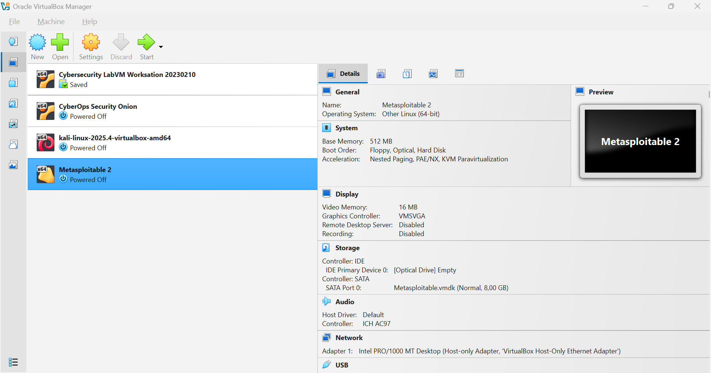
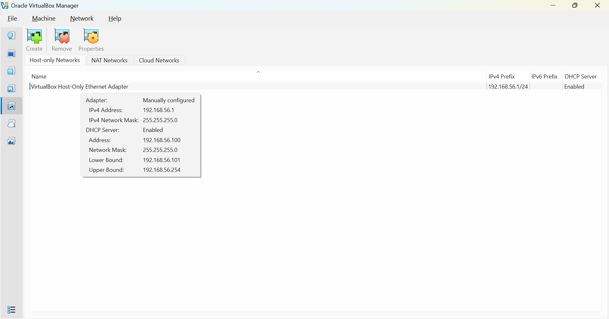
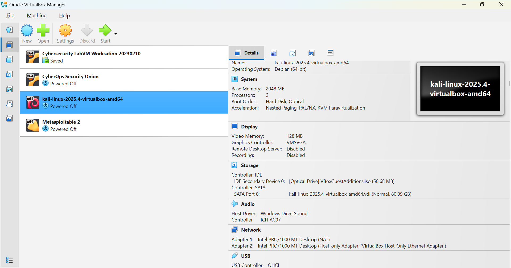
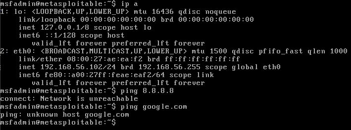
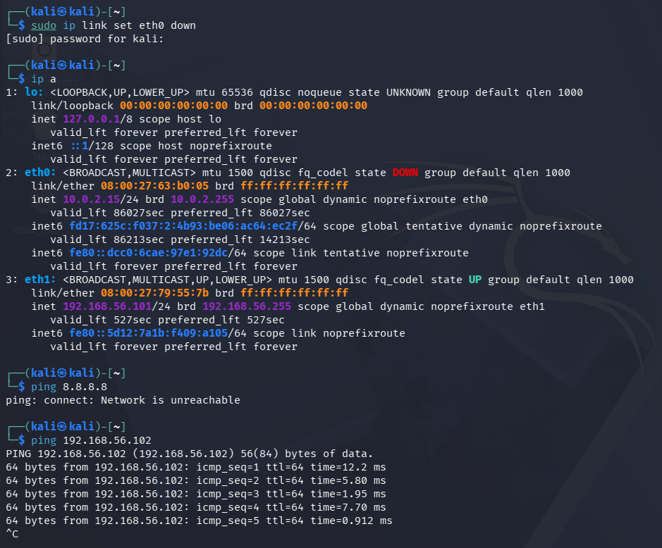
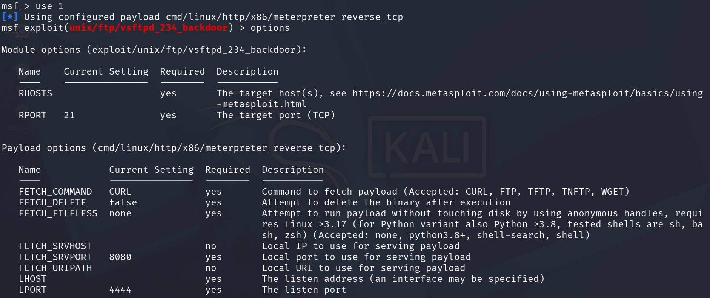
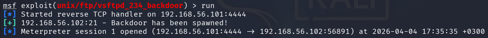
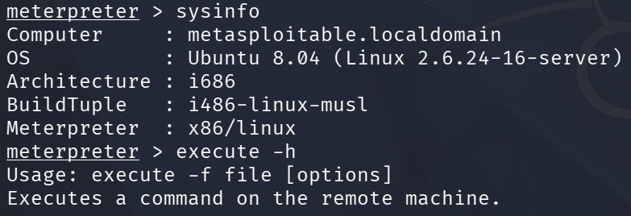
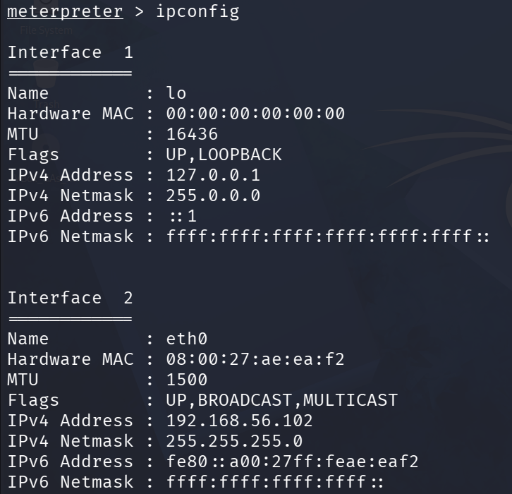
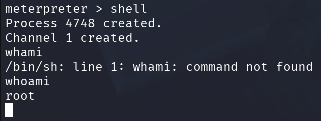

# DORA the Explora
Harjoitukset on tehty kotitoimistossani Kaarinassa. Koneena oli Lenovo V14 G4 AMN. Käyttöjärjestelmänä Windows 11 Pro version 25H2. Virtuaalikoneena oli Linux Kali 6.16.8+kali-amd64.

Harjoituksessa on seurattu Teron kurssisivun (Karvinen 22.3.2026) tehtävänantoa ja vinkkejä.

## Lue ja Tiivistä
#### DORA and TLPT testing (Buuri 2026)
- Digital Operations Resilience Act (DORA), on Euroopan Unionin määrittelemä standardi joka velvoittaa finanssialan sektorin yritykset huolehtimaan digitaalisten järjestelmiensä turvallisuudesta.
- TIBER-EU tarjoaa yhteisen viitekehyksen Red teamaukselle(Realistinen hyökkäyssimulaatio joka testaa organisaation puollustuskykyä). Sitä on päivitetty vastaamaan DORA:n esittämiin vaatimuksiin.

#### Article 26 (DORA)
- Finanssialan organisaatioiden on tehtävä TLTP-testaus vähintään 3 vuoden välein. Testien laajuus ja säännöllisyys määräytyy kyseisen uhkatason perusteella.
- Testauksen tulee sisältää kaikki kriittiset toiminnot ja ICT-järjestelmät, mukaan lukien kaikki ulkoistetut palvelut.

#### Article 27 (DORA)
- Organisaatioiden tulee käyttää TLPT-tastauksessa ainoastaan sertifioituja alan huippuosaajia, joilla on riittävä kokemus ja osaaminen vastaamaan työn vaatimuksiin.

#### TIBER-FI (Suomen Pankki)
- Red team -testaus sisältää kaksi vaihetta: suunnitelma sekä aktiivinen hyökkäyssimulaatio. Hyökkäyssimulaatiossa pyritään saavuttamaan ennalta määritellyt tavoitteet.

- Testin tehokkuutta voidaan parantaa testaajille annettavalla lisätiedolla (leg-up), koska testejä rajoittavat aika, sekä eettiset ja lailliset rajat.

## Asenna Metasploitable 2

Latasin Metasploitable 2 -virtuaalikoneen osoitteesta https://sourceforge.net/projects/metasploitable/. Asennus oli suoraviivainen eikä aiheuttanut ongelmia. Valitsin default muistin (512MB) ja CPU:den (1 kpl) määrän. Verkkokortiksi laitoin Host-only Adapter.

## Virtuaaliverkko

VirtualBoxissa oli valmiiksi määritelty Host-only verkko, joten sitä ei tarvinnut luoda erikseen.

Kali -koneelleni annoin kaksi virtuaalista verkkokorttia. Toisena on NAT, joka reitittää pois lähiverkosta, ja toisena Host-only, joka toimii labraverkkona virtuaalikoneiden välillä.

## Verkon testaaminen
Käynnistin Kalin ja tarkistin ip-osoitteen komennolla `ip a`. Eth0 -liitäntä on NAT:n käytössä ja eth1 on host-only. Suljin eth0 -liitännän komennolla `sudo ip link set eth0 down`. Nyt näemme että liitäntä on down -tilassa. Kokeilin pingata 8.8.8.8 ja syötteessä ilmoitettiin välittömästi, että verkko ei ole tavoitettavissa.

Seuraavaksi käynnistin Metasploitablen ja tarkistin ip osoitteen. Ip -osoite oli samassa verkkoavaruudessa kuin Kali. Metasploitablelta ei myöskään saanut yhteyttä internettiin.

Lopuksi pingasin Kalilta Metasploitableen ja tämä onnistui, eli kaiken pitäisi olla kunnossa porttiskannausta varten.

## Etsi Metasploitable nmapilla.
Skannasin koko lähiverkon komennolla `namp -sn 192.168.56.0/24`. -sn flagi jättää portit skannaamatta ja etsii vain hosteja(nmap -h).

Nmap löysi 4 hostia verkosta. Tiedämme, että .1 on default gateway, .100 on dns-palvelin, .101 on kali, joten 102 on oltava metasploitable. Metasploitablen web-sivu vahvisti asian.

## Porttiskannaus
Tein porttiskannauksen `nmap -A -T4 -p- 192.168.56.102`.

Kiinnostavat portit:
#### 21/tcp
Tämän portin takana on Very Secure File Transfer Protocol Daemon (vsftpd). Mikä tekee siitä kiinnostavan on versionumero 2.3.4, joka sisältää tunnetun haavoittuvuuden; Jos hyökkääjä ottaa FTP-yhteyden porttiin ja kirjoittaa hymiön käyttäjänimen perään, esim. käyttäjä:), tämä avaa root shellin porttiin 6200, josta saa suoran pääsyn järjestelmään. (Google 1)

#### 23/tcp
Kyseinen portti on aina kiinnostava, koska sitä käyttää Telnet, joka ei tunnetusti salaa liikennettä.

#### 80/tcp
Kyseistä porttia käyttää HTTP, joka ei salaa liikennettä. Lisäksi web-palvelut tarjoavat monenlaisia tapoja hyökätä järjestelmää vastaan (XSS, SQL injektio, File upload).

Palveluna tässä toimii Apache 2.2.8 jonka tuki lopetettiin lähes vuosikymmen sitten. Se sisältää lukuisia haavoittuvuuksia. (apache.org)

## Korkataan
Katsoin Youtubesta Metasploit tutorialin ja rupesin hommiin (Bombal 14.3.2025).

Käynnistin Metasploitin komennolla `msfconsole`. Päätin koittaa hyödyntää aiemmin mainitsemaani vsftpd -haavoittuvuutta. Kirjoittamalla `search vsftpd` voin hakea metasploitin kirjastoista kaikkia kyseiseen palvelinohjelmaan liittyviä moduuleja.

Haku löysi kaksi moduulia. Toinen vaikuttaisi olevan DoS -hyökkäyksen scripti ja toinen etsimämme backdoor -exploitti.

Otin exploitin käyttöön komennolla `use 1`. Komennolla `options` saa lisätietoa konfiguroitavista parametreista, joita hyökkäys tarvitsee onnistuakseen. Tässä tapauksessa piti konfiguroida ainoastaan LHOST (listening host) ja RHOST (remote host).

Parametrit saa asetettua `set` -komennolla.

Sitten ajetaan vain komento `run` tai `exploit`, joka aloittaa hyökkäyksen. Kuten syötteestä näkyy, metasploit kertoo että takaovi on avattu Meterpreter sessioon. Meterpreter on hyökkäyksessä lähetetty hyötykuorma, joka avaa hyökättävään koneeseen komentotulkin (doubleoctopus).

Nyt voimme ajaa komentoja korkatussa metasploitablessa. `help` komennolla saa lisätietoa mitä komentoja meterpreterissä voi ajaa. `sysinfo` ja `ipconfig` vahvistavat, että olemme tosiaan päässeet kohdekoneeseen.

Voimme myös avata perinteisen linux terminaalin komennolla `shell`. Nyt näemme että meillä on root-oikeudet käytössä.

## Lähteet
Apache. Apache HTTP Server 2.2 vulnerabilities. Luettavissa: https://httpd.apache.org/security/vulnerabilities_22.html. Luettu: 3.4.2026.

Bombal, D. 14.3.2025. Metasploit Hacking Demo (includes password cracking). Katsottavissa: https://www.youtube.com/watch?v=bBut8D7usKA&t=95s. Katsottu: 4.4.2026.

Buuri, M. 31.3.2026. DORA and TLPT testing. Payment Systems Department, Bank of Finland. Luettavissa: https://terokarvinen.com/buuri-2026-dora-and-threat-lead-penetration-testing/buuri-2026-dora-and-threat-lead-penetration-testing--teros-pentest-course.pdf. Luettu: 1.4.2026.

DORA. Article 26, Advanced testing of ICT tools, systems and proesses vased on TLPT. Luettavissa: https://www.digital-operational-resilience-act.com/Article_26.html. Luettu 2.4.2026.

DORA. Article 27, Requirements for testers for the carrying out of TLPT. Luettavissa: https://www.digital-operational-resilience-act.com/Article_27.html. Luettu: 2.4.2026.

Doubleoctopus. Meterpreter. Luettavissa: https://doubleoctopus.com/security-wiki/threats-and-tools/meterpreter/. Luettu: 4.4.2026.

Google 1. AI-yhteenveto. "vsftpd 2.3.4 vulnerability"

Karvinen, T. 22.3.2026. Tunkeutumistestaus. Luettavissa: https://terokarvinen.com/tunkeutumistestaus/. Luettu: 24.3.2026.

Nmap help page (nmap -h).

Suomen Pankki. 12.3.2025. TIBER-FI Procedures and Guidelines. Luettavissa: https://www.suomenpankki.fi/globalassets/bof/en/money-and-payments/the-bank-of-finland-as-catalyst-payments-council/tiber-fi/tiber-fi-2.0-procedures-and-guidelines.pdf. Luettu: 2.4.2026