# EternalHomework
Harjoitukset on tehty kotitoimistossa Kaarinassa. Koneena oli Lenovo V14 G4 AMN. Käyttöjärjestelmänä Windows 11 Pro version 25H2. Virtuaalikoneena oli Linux Kali 6.16.8+kali-amd64.

## Lue ja tiivistä

## b) Tallenna porttiskannauksen tuloksia Metasploitin tietokantoihin

##### 8.4.2026 21:48
Aloitin harjoituksen tarkistamalla, että koneeni on host-only verkossa ja saa yhteyden ainoastaan metasploitableen.

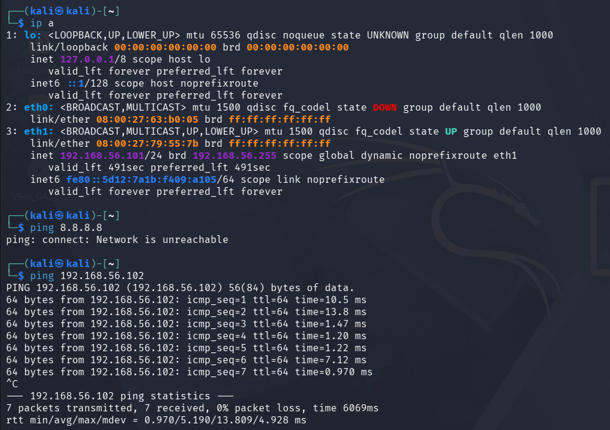

##### 21:55
Avasin metasploitablen ja tarkistin että tietokanta on yhdistetty.

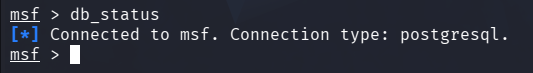

##### 22:00
Tein skannauksen komennolla `db_nmap -n -sV -T4 -p- 192.168.56.102`

- `-n` Nmap ei yritä tehdä DNS -resoluutiota (nmap -h). Eli ei muunna ip-osoitetta hostnimeksi.
Tämä nopeuttaa skannausta jonkin verran.
- `-sV` Service/Version detection. Tässä olisi voinut ajaa myös parametrin -A,
sillä se sisältää myös -sV:n, mutta se sisältää myös käyttöjärjestelmän tunnistamisen,
traceroutin ja script scannauksen. (nmap -h)
- `-T4` Skannauksen nopeus.
- `-p-` Porit 1-65535.

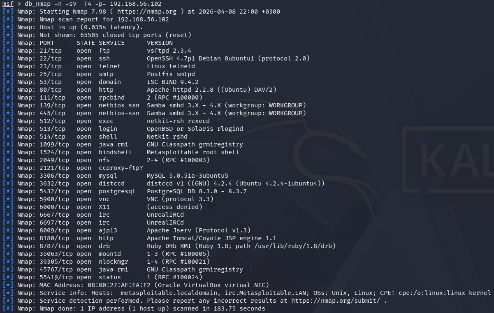

Tuloksena tuli tutun näköinen lista portteja, joskin tämä on hieman suppeampi,
koska -A parametria ei annettu.

## c) Tarkastele Metasploitin tietokantoihin tallennettuja tietoja komennoilla "hosts" ja "services"

#### Hosts
##### 22:40
Komennolla `hosts` saa listan kaikista skannauksessa löydetyistä laitteista.

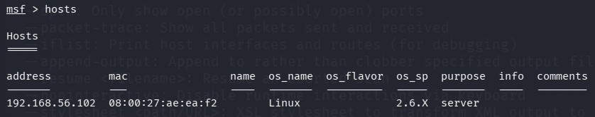

Tässä esimerkissä listassa on vain yksi kone, koska skannaus kohdistettiin yksinomaan Metasploitableen.

Oletuksena komento listaa kuvassa näkyvät tiedot. Saatavilla olevia kolumneja on
kuitenkin huomattavasti enemmän, jos haluaa nähdä itselleen hyödyllisempää tietoa.
Kolumneja voi vapaasti valita `-c` parametrin avulla. `-U` parametrin avulla tietoja
voi päivittää manuaalisesti. (hosts -h)

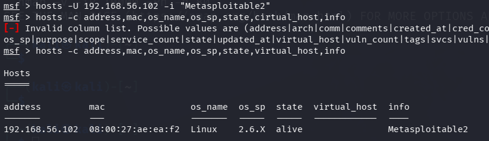

Luonnollisesti tulosten kattavuus ja tarkkuus riippuu skannauksen laajuudesta ja agressiivisuudesta.

#### Services
Komennolla `services` saa listan avoimista porteista sekä niiden takana toimivista palveluista.

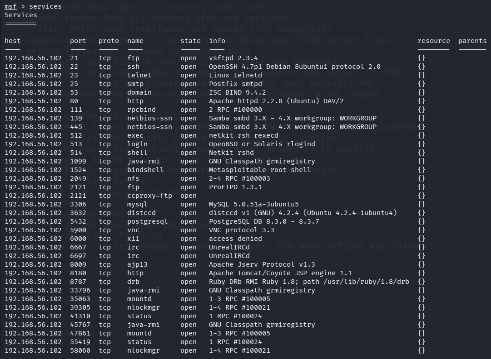

Parametrilla `-S` voi hakea tuloksia hakusanan perusteella. (services -h)

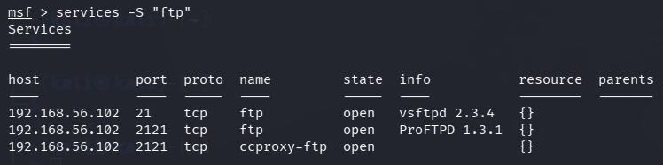

Sekä hosts että services ovat hyödyllisiä työkaluja. Metasploitissa toimii myös clear -komento, eli jos haluaa "siivota" terminaalia, niin hostit ja portit saa aina uudestaan näkyviin tietokannasta. 

## d) Internet famous
EternalBlue on NSA:n kehittämä hyökkäystyökalu, joka hyödynsi Microsoftin SMB-protokollan nollapäivähaavoittuvuutta. Vuonna 2017 Eternal Blueta hyödynnettiin sekä WannaCry että NotPetya -kyberhyökkäyksissä, joista arvioiden mukaan koitui yhteensä noin 14 miljardin dollarin vahingot. (Wikipedia)

##### 9.4.2026 17:58
Exploitti löytyy metasploitista hakusanalla "eternalblue".

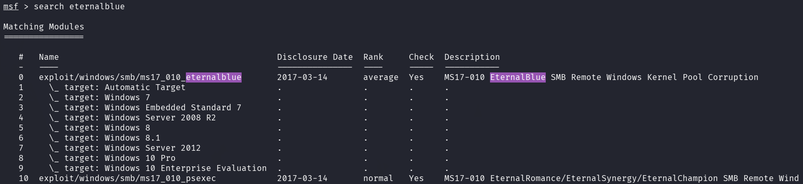

Koska en tiedä tarkalleen mikä windows-versio metasploitablessa on, valitsin "Automatic target", eli `use 1`.

Asetin rhostin ja lhostin ip-osoitteet ja tarkistin että konfiguraatiot on oikein.

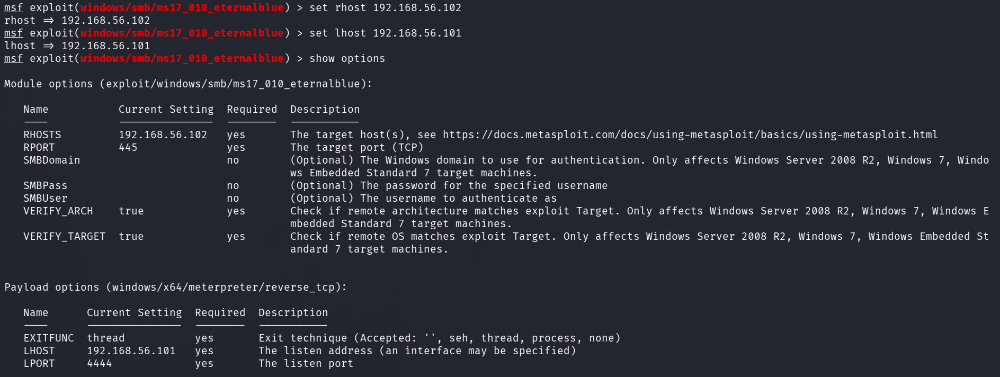

##### 18:34
Ajoin hyökkäyksen pariin otteeseen, mutta molemmilla kerroilla tuli ilmoitus "Host does not appear vulnerable".

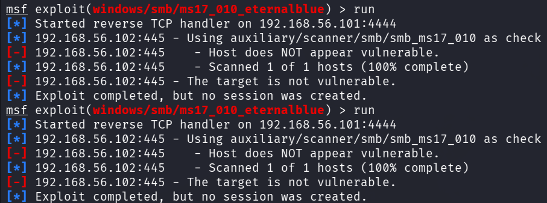

Vasta tässä kohtaa tajusin olleeni tyhmä. EternalBlue on windows haavoittuvuus, eli se ei tietenkään toimi metasploitableen.

## e) Vertaile nmap:n omaa tiedostoon tallennusta (-oA foo) ja db_nmap:n tallennusta tietokantoihin

#### Metasploit database
Metasploitin tietokannan sisältöä voi käsitellä monilla eri komennoilla (metasploit help). Näistä hyödyllisimmät ovat varmaankin juuri services ja hosts joita käsiteltiin aiemmassa harjoituksessa. Analyze kuulostaa paperilla hyvältä, mutta se ei löydä ainakaan metasploitablesta suoraan haavoittuvuuksia, vaikka ajoin nmapin uudestaan ``-A`` flagilla.

Tiedot esitetään järjestellyssä ja siistityssä muodossa. Eli esim verbose -tiedot eivät näy edellä mainituilla komennoilla.

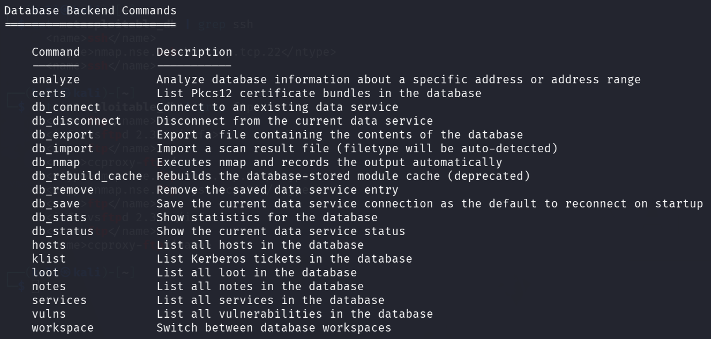

Tietokannan sisällön voi myös ``db_export -f xml metasploit_db`` exportata tiedostoon, jolloin siitä pysty hakemaan grepin avulla, mutta oman testaukseni perusteella en näe tässä hirveästi lisäarvoa.

- `-f` Määrittele formaatti (vaihtoehtoina xml ja pwdump)
- `xml` Valittu formaatti
- `metasploit_db` Tiedoston nimi

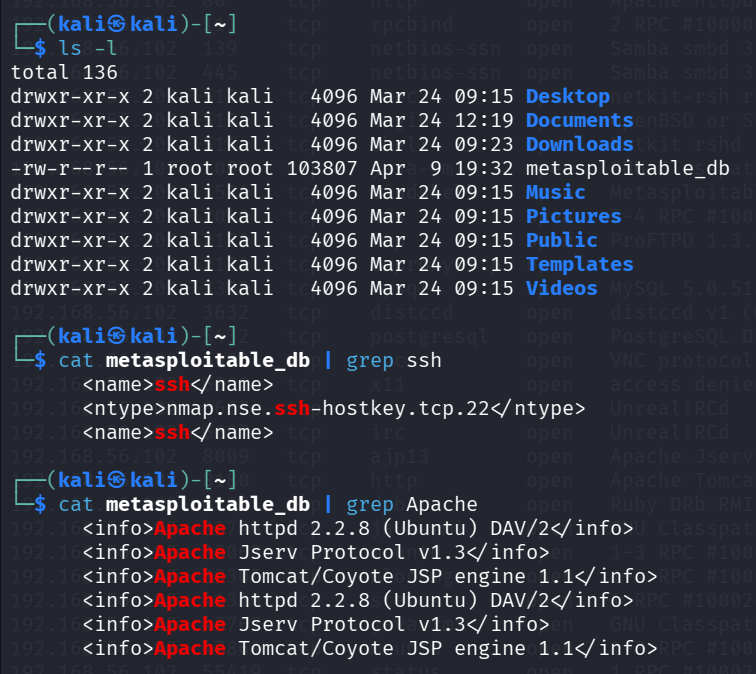

#### Nmap save to file

Tein uuden porttiskannauksen samoilla parametreilla,
mutta nyt lisäsin -oA flagin, joka tallentaa
skannauksen tulokset kolmeen eri formaattiin.

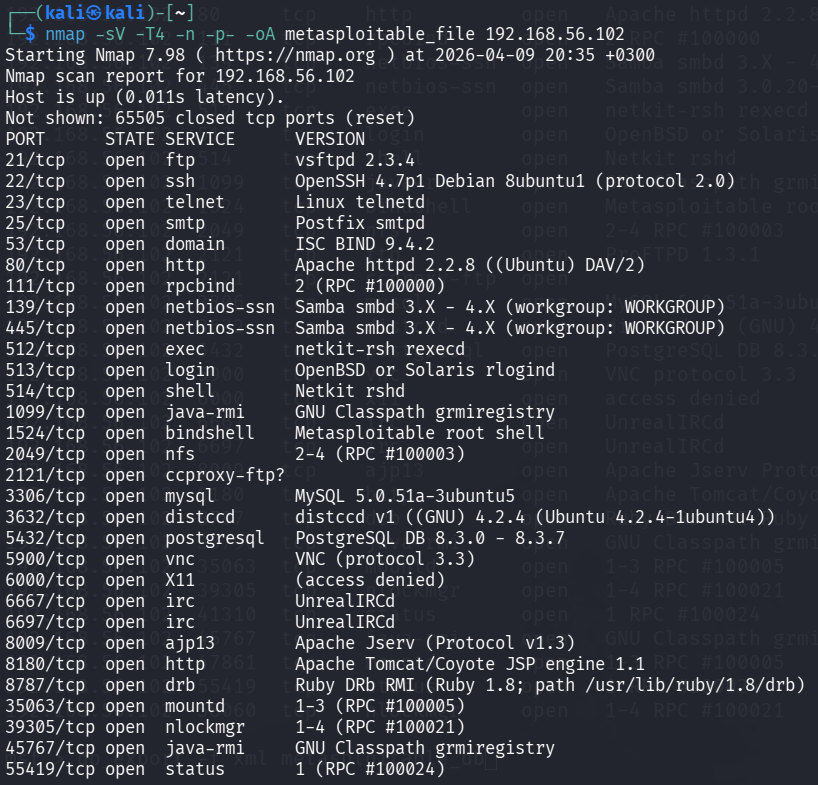
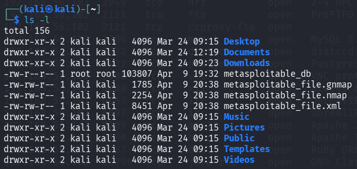

Näistä gnmap ja xml ovat melko ikävää luettavaa, joten unohdetaan
ne tässä kohtaa. Nmap formaatti sen sijaan on suora kopio itse skannauksesta.
Mainittavampana erona metasploitin tietokantaan on se, että myös verbose tiedot tallentuvat.
Näin ollen käyttäjä voi nähdä mitä "taustalla" on tapahtunut skannauksen aikana.

## Murtaudu Metasploitablen vsftpd-palveluun

Tein tämän jo viime viikolla metasploitin avulla.
Yritän siis nyt tehdä saman käyttäen alkuperäistä metodia,
josta näin sattumalta videoan viime viikolla kun yritin opetella
metasploitin käyttöä. (Bombal, D 14.3.2025)

Tarvittavat työkalut ovat nmap ja ncat.
Ncat on Nmap-projektiin kuuluva komentorivityökalu,
jolla voidaan lähettää ja vastaanottaa dataa verkon yli
TCP- ja UDP-protokollilla. (GeeksfotGeeks 25.4.2023)

Aloitetaan tarkastelemalla tiedostoon tallennettuja porttiskannauksen tuloksia.

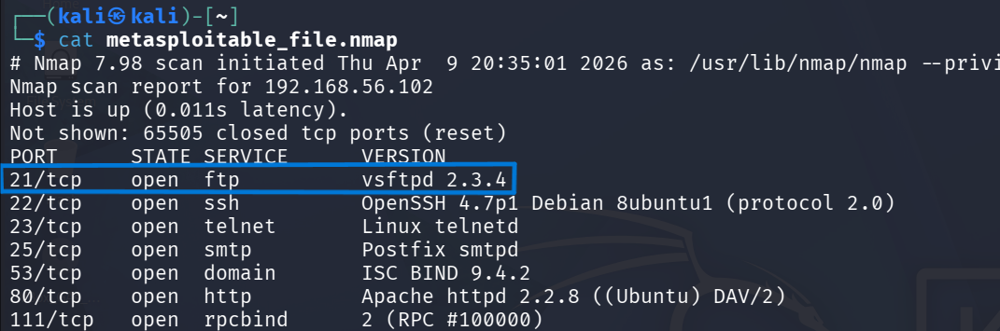

Vsftp -palvelin on portin 21 takana. Se tulee siis olemaan hyökkäyksen kohteena.

##### 10.4.2026 22:00

Ensimmäinen tehtävä on otta yhteys porttiin 21 netcatilla.
220-koodi kertoo että yhteys on avattu.

Palvelimelle täytyy antaa käyttäjänimi komennolla USER sekä salasana komennolla PASS.
Käyttäjänimeksi kelpaa mitä tahansa, kunhan se loppuu hymiöön :). Hymiö on se, mikä laukaiseen varsinaisen haavoittuvuuden.
Salasanaksi kelpaa mitä tahansa.

Tämän jälkeen palvelin ei kerro että mitään olisi tapahtunut,
mutta nyt portin 6200 taakse pitäisi avautua root shell.
Ctrl-C:llä pääsee pois netcatin yhteydestä.

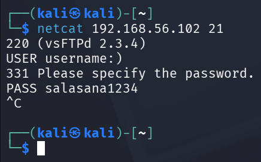

Voimme tarkistaa onko portti todella auki skannaamalla sen nmapilla.

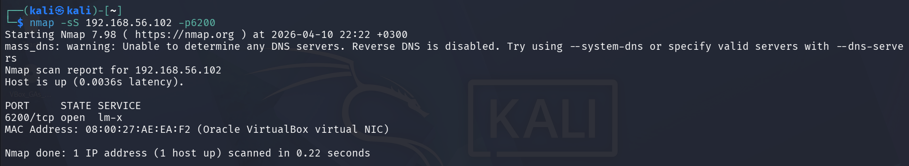

Skannaus osoittaa että portti on auki. 
Tässä on tärkeää käyttää `-sS` -flagia sillä se suorittaa vain osittaisen handshaken (SYN) (nmap -h).
Ilmeisesti skannaamalla portin ilman tätä voi aiheuttaa portin sulkeutumisen (Bombal, D 14.3.2025).

Sitten otetaan vain yhteys kyseiseen porttiin, mikä antaa root-oikeudet kohdekoneelle.

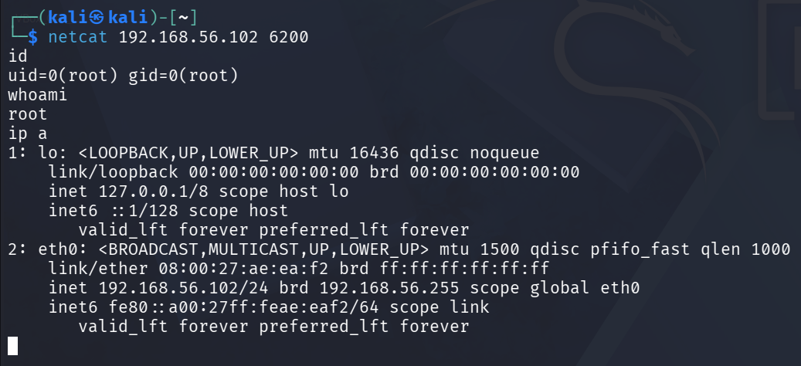

## Kerää levittäytymisessä (lateral movement) tarvittavaa tietoa metasploitablesta

11.4.2026 13:30
Aloitin selvittämällä mitä tietoa kannattaa etsiä, josta voi olla hyötyä pivotoinnissa (ChatGPT1).
Ehdotuksia tuli rutkasti, mutta aikatauluhaasteista johtuen käyn läpi ainoastaan yhden esimerkkitapauksen.

Passwd sisältää järjestelmän käyttäjiin liittyvää tietoa, kun taas shadow sisältää käyttäjien salasanojen hashit.
Molemmat tiedostot löytyvät /etc hakemistosta.

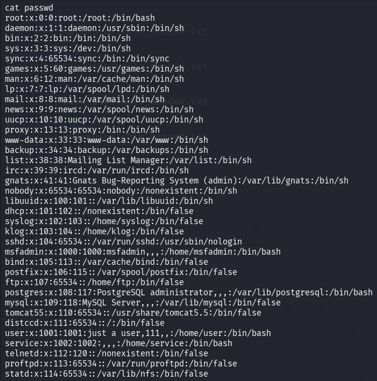
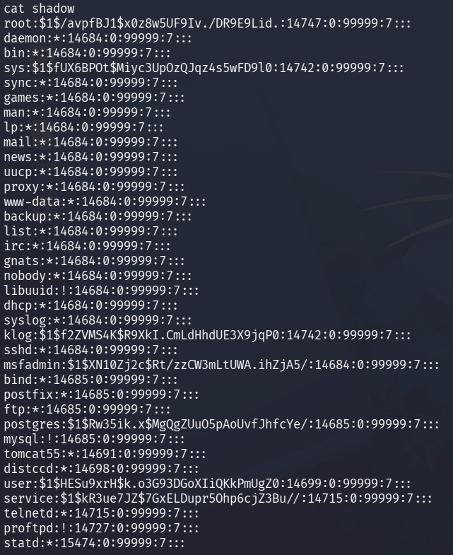

Avasin kaliin toisen terminaalin ja loin kaksi tiedosta,
jonka jälkeen copypaste tiedostojen sisällöt omalle koneelleni.
Nyt voimme käyttää erilaisia työkaluja hashien murtamiseen.

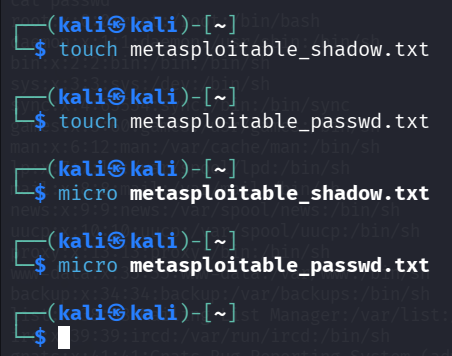

John the Ripper on suosittu salasanojen murtamiseen kehitetty ohjelma. Unshadow taas on osa John the Ripper -pakettia, 
joka yhdistää passwd ja shadow tiedostot, jotta John voi käyttää niitä. (Ubuntu Manuals)

Unshadow ajetaan komennolla `unshadow [passwd] [shadow] > [uusi tiedosto]`.

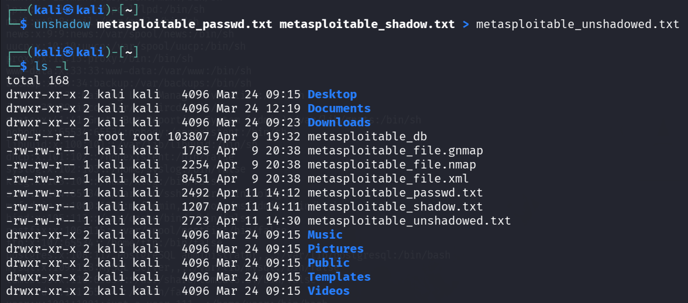

Käytin John the Ripperiä vertaamaan hasheja salasanalistaan. (kali.org)

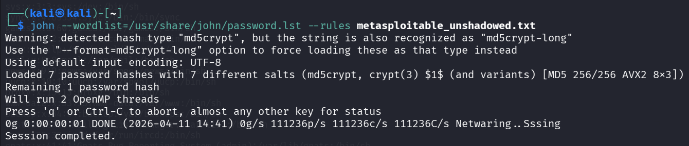

Käyttämäni salasanatiedosto sisälsi 6/7 salasanoista. Ainoastaan root -käyttäjän salasanaa ei onnistuttu murtamaan.

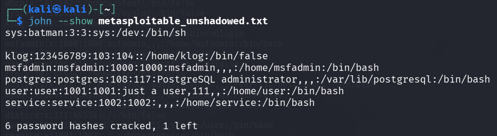

Tässä kohtaa olisin voinut kokeilla toista salasanalistaa, tai koittaa bruteforcettaa sitä,
mutta päätin että tämä riittää tältä erää.

Koitin ottaa ssh-yhteyden msfadmin käyttäjänä. Tämä ei onnistunut heti,
ja lyhyen selvitystyön jälkeen kävi ilmi, että ssh ei oletuksena enää tue vanhentunutta HostKeyAlgoritmia. (AskUbuntu)
Tämän voi onneksi pakottaa `-o` flagilla (option), jolloin voi manuaalisesti määritellä mitä algoritmia halutaan käyttää.

Nyt pääsimme takaisin sisään ja meillä on tukeva jalansija kohdekoneella.

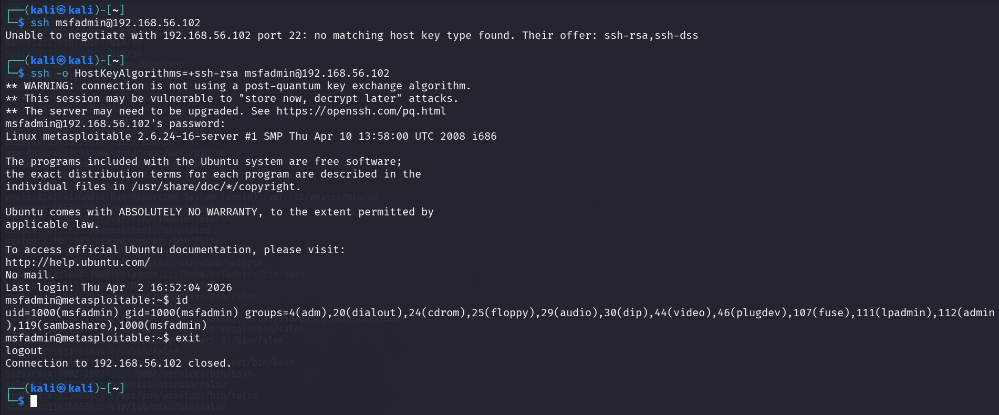

Menin vielä myöhemmin takaisin sisään ja tarkistin millaiset oikeudet msfadminilla on, ja kävi ilmi että meillä on nyt täydet sudo oikeudet.

## h) Murtaudu Metasploitableen jollain toisella tavalla

##### 22:10

Valitsin kohteekseni Samba SMB daemonin joka on portin 139 takana.

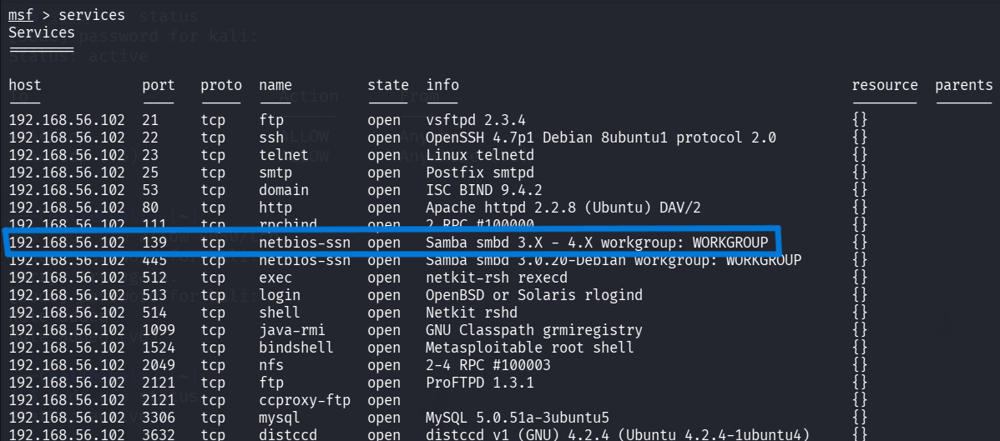

Etsin exploittia komennolla `search samba`, mutta metasploit palautti 77 moduulia, joten tässä kohtaa piti googlettaa 
Samba smbd vulnerabilities. Nopeasti kävi ilmi, että kyseessä on username map script (rapid7). Tämä löytyikin etsinnän tuloksista, joten valitsin sen.

Exploitille piti määritellä lhost ja rhost joten laitoin ne kuntoon.

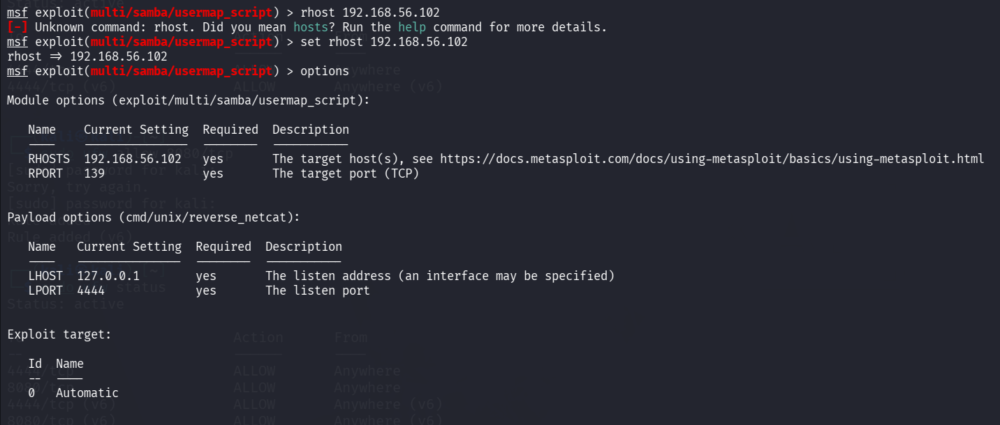

Tässä kohtaa muistin käydä avaamassa listening portin 4444 komennolla `sudo ufw allow 4444/tcp`.

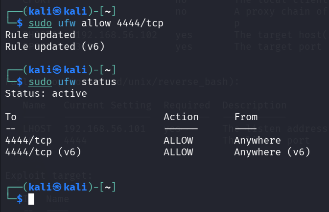

Kun ajoin exploitin se avasi reverse shellin root oikeuksin kohdekoneelle.

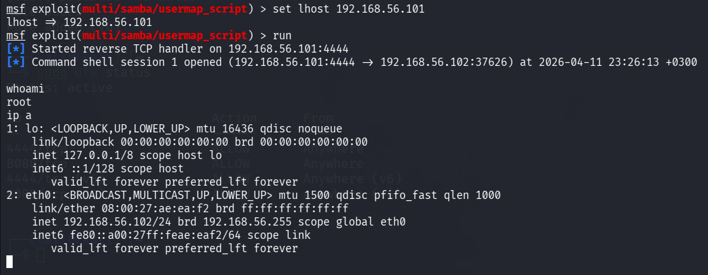

## i) Demonstroi Meterpretrin ominaisuuksia
Meterpreterissä on paljon komentoja joilla pystyy tutkimaan kohdekoneen hakemistoja ja tiedostoja.
Tiedostoja ja hakemistoja voi myös ladata `download` komennolla. Saattaa kyllä olla parempi vain kopioida niitä toiseen shelliin,
mutta jos tiedosto on todella iso, niin tämä voi olla hyvä vaihtoehto siihen.

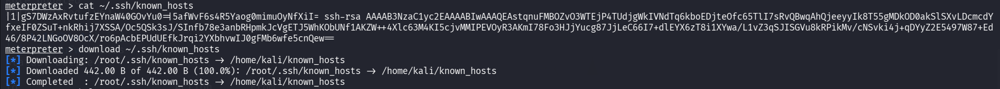

Meterpreterissä on myös paljon hyödyllisiä komentoja pivotointia varten. Maininnan arvoisia ovat
esim. `arp` arp-taulun tutkimiseen, `netstat` verkkoyhteyksien tarkasteluun ja `route` reititystaulun näkemiseen.

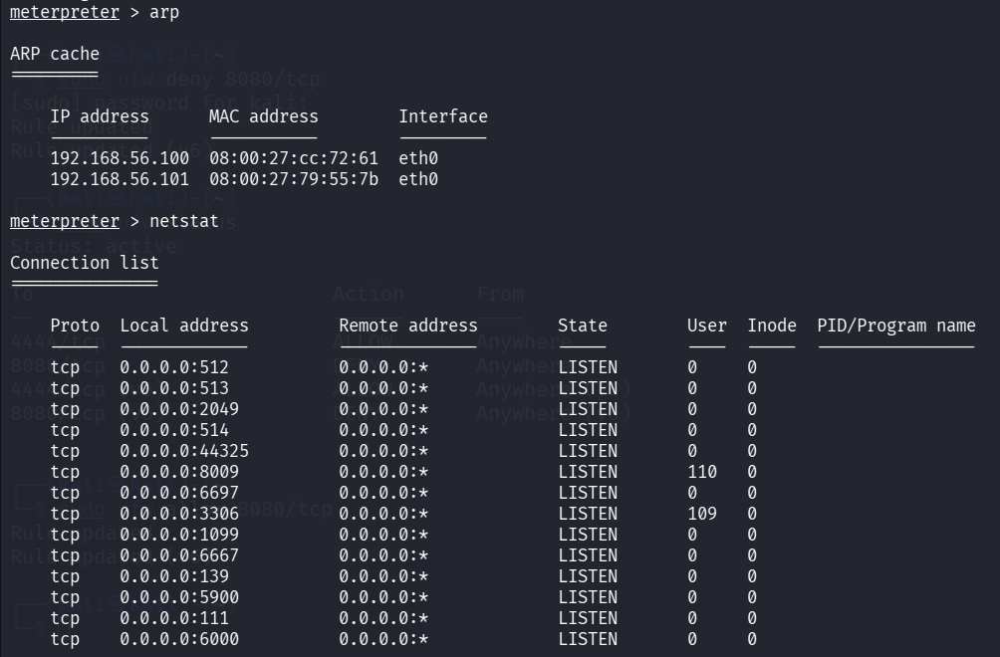
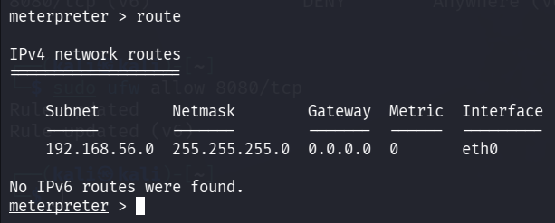

Tämän lisäksi sillä voi ottaa kuvakaappauksia näytöstä, käynnistää keyloggerin (windowsilla) kohdekoneen näppäimistön painallusten tallentamiseen, sekä käynnistää kohdekoneen web-camin ja mikrofonin.

## j) Tallenna shell-sessio tekstitiedostoon script-työkalulla

##### 12.4.2026 16:40
Aloitin tallennuksen komennolla `script -fa log001.txt`.
- `-f` Tallentaa komennot reaaliajassa, jotta niitä voidaan myös seurata reaaliajassa (StackOverflow).
- `-a` Määrittää että tiedostossa olevaa sisältöä ei ylikirjoiteta, vaan uudet komennot lisätään tiedoston loppuun (man script).
- `log001.txt` Tiedoston nimi.

## k) Pivot point. Laita kaikki harjoituksen tiedostot (script -fa, nmap -oA...) samaan kansioon. Hae sopiva pivot point (sovellus, versio, osoite, MAC-numero) 'grep -r' -komennolla. Keksi uskottava esimerkkikysymys, johon haet vastausta.^

##### 17:00
Loin uuden hakemiston komennolla ``mkdir lab_metasploitable``. Sitten siirsin kaikki tämän viikon aikana luodut
tiedostot siihen komennoilla `mv metasploitable* known_hosts arp.txt lab_metasploitable/` ja `mv ~/.john/john.pot lab_metasploitable/`.
- `metasploitable*` kattaa kaikki tiedostot jotka alkavat sanalla metasploitable.

Nyt minulla on kaikki tiedostot yhdessä paikassa.

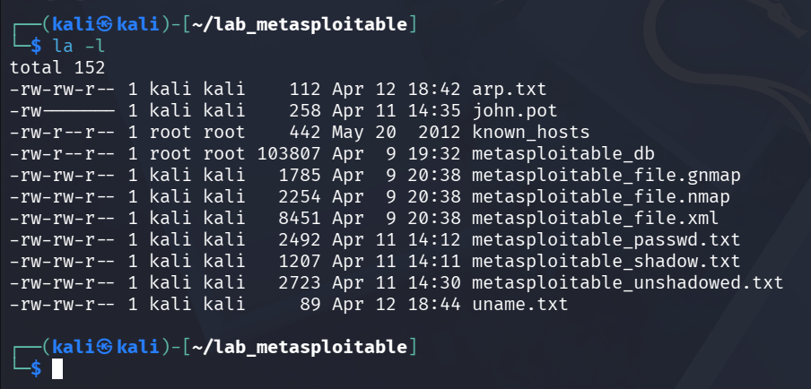

#### Pivot point

Mihin muihin verkossa oleviin järjestelmiin voin murtautua?

Minullahan on nyt sellainen tilanne, että olen murtautunut kohdejärjestelmälle paria eri haavoittuvuutta hyödyntäen. Olen myös saanut käyttäjien salasanoja murrettua mm. msfadmin, jolla on täydet sudo-oikeudet, eli tämä kone on aikalailla korkattu ja tukeva jalansija varmistettu.

Voin hakea muita koneita verkosta greppaamalla "192.168.56".
Se palauttaa minulle arp-taulun sisällön jonka olin aikaisemmin kopioinut kohdekoneelta.

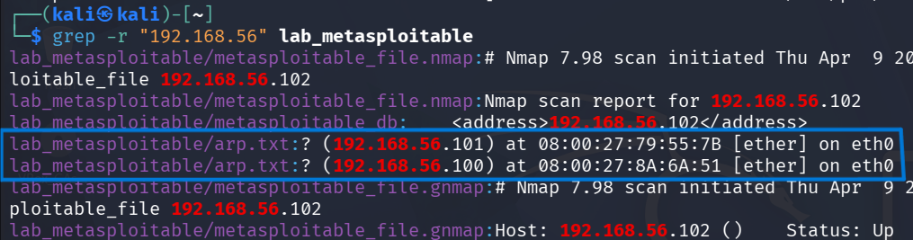

Sieltä löytyy 100 -loppuinen osoite. Tätä voimme lähteä tutkimaan ja skannaamaan mikä järjestelmä on kyseessä ja miten sitä kohtaan voitaisiin hyökätä.

## l) Attaaack! Mitä Mitre Attack taktiikoita ja tekniikoita käytit tässä harjoituksessa?

- Reconnaissance
    - Gather victiom host information
    - Gather victim network information
- Resource Development
    - Acquire access
- Initial access
    - Exploit public-facing application
- Privilege escalation & Persistence
    - Valid accounts
- Credential access
    -Credentials from password stores
-Discovery
    - System network connections discovery
    - System owner/user discovery

(Mitre Attack)

## Lähteet
AskUbuntu. SSH returns: no matching host key type found. Their offer: ssh-dss. Luettavissa: https://askubuntu.com/questions/836048/ssh-returns-no-matching-host-key-type-found-their-offer-ssh-dss. Luettu: 11.4.2026

Bombal, D. 14.3.2025. Metasploit Hacking Demo (includes password cracking). Katsottavissa: https://www.youtube.com/watch?v=bBut8D7usKA&t=95s. Katsottu: 4.4.2026.

ChatGPT1. "Mitä tietoa kannattaa etsiä linux koneesta, mistä voisi olla hyötyä pivotoinnissa".

GeeksforGeeks. 25.4.2023 Introduction to Netcat. Luettavissa: https://www.geeksforgeeks.org/computer-networks/introduction-to-netcat/. Luettu 10.4.2026.

hosts -h. Metasploitin help-sivu hosts -komennolle.

kali.org. John. Luettavissa: https://www.kali.org/tools/john/. Luettu: 11.4.2026

man script. Script -työkalun manuaali linuxin terminaalissa.

metasploit help. Metasploitin help sivu.

Mitre Attack. ATT&CK Matrix for Enterprise. Luettavissa: https://attack.mitre.org/. Luettu: 12.4.2026.

Nipun, J. Kesäkuu 2020. Mastering Metasploit - Fourth Edition. Luettavissa: https://learning.oreilly.com/library/view/mastering-metasploit/9781838980078/. Luettu: 11.4.2026

nmap -h. Nmapin help -sivu linuxin terminalissa.

rapid7. Samba "username map script" Command Execution. Luettavissa: https://www.rapid7.com/db/modules/exploit/multi/samba/usermap_script/. Luettu: 11.4.2026.

StackOverflow. Force flushing of output to a file while bash script is still running. Luettavissa: https://stackoverflow.com/questions/1429951/force-flushing-of-output-to-a-file-while-bash-script-is-still-running. Luettu: 12.4.2026.

Ubuntu Manuals. Unshadow. Luettavissa: https://manpages.ubuntu.com/manpages/noble/man8/unshadow.8.html. Luettu: 11.4.2026.

services -h. Metasploitin help-sivu services -komennolle.

Wikipedia. EternalBlue. Luettavissa: https://en.wikipedia.org/wiki/EternalBlue. Luettu: 9.4.2026