# Täysin Laillinen Sertifikaatti

Harjoitukset on tehty kotitoimistossa Kaarinassa. Koneena oli Lenovo V14 G4 AMN. Käyttöjärjestelmänä Windows 11 Pro version 25H2. Virtuaalikoneena oli Linux Kali 6.16.8+kali-amd64.

Harjoituksessa seurataan Teron kotisivujen Karvinen (Karvinen, T 22.3.2026) tehtävänantoa.

## Lue ja tiivistä

#### Broken Access Control (owasp1)
- Broken access control on haavoittuvuus sovelluksen auktorisoinnissa, mikä johtaa siihen, että käyttäjä pääsee operoimaan omien valtuutuksien ulkopuolella.
- Tyypillisiä haavoittuvuuksia ovat vähimmän oikeuden periaatteen rikkominen, sekä pääsynhallinnan ohittaminen (URL-manipulaatio ja API-pyyntöjen myokkaus).
- Muita riskejä ovat käyttäjäoikeuksien korottaminen, toisten käyttäjien tietojen käsittely, sekä virheelliset token-, cookie- tai CORS- asetukset.
- Ehkäisykeinoihin kuuluvat pääsynhallinnan rajaamista backendin puolella, yhtenäisten pääsynhallintamekanismien käyttöä koko sovelluksessa, CORS-käytön rajoittamista, sekä JWT -tokenien voimassaolon rajoittamista. Lisäksi useat virheelliset sisäänkirjautumisyritykset olisi hyvä lokittaa ja niistä pitää lähteä ilmoitus adminille.

#### Insecure direct object references (portswigger1)
- IDOR on access control -haavoittuvuus jossa hyökkääjä pääsee nostamaan omia käyttöoikeuksiaan tai siirtymään käyttäjätililtä toiselle.
- Hyödynnetään useiten manipuloimalla kohteen URL:ia, esim vaihtamalla käyttäjän ID, jolloin sovellus palauttaa tietoa ilman että tarkistaa käyttäjän oikeudet.
- URL:t tulisi suojata niin, että backendissä tarkistetaan jokaisessa pyynnössä, onko käyttäjällä oikeus kyseiseen resurssiin. Käyttöoikeudet tulee myös suunnitella niin, että käyttäjä pääsee käsiksi vain hänelle välttämättömiin resursseihin (least privilige -periaate).

#### Path traversal (portswigger2)
- Path traversal tarkoittaa hyökkäystä, jossa hyökkääjä pääsee selaimesta navigoimaan palvelimen hakemistoihin, ja näkemään siellä olevia tiedostoja.
- Yleensä johtuu siitä, että sovellus lataa kuvia URL-parametrin perusteella (esim. filename=218.png) ja hakee tiedoston palvelimen kansiosta /var/www/images/.
- Haavoittuvuus syntyy, koska sovellus ei tarkista syötettä. Hyökkääjä voi käyttää ../ siirtyäkseen hakemistorakenteessa yläspäin.
- Tehokkain tapa ehkäistä, on olla käyttämättä käyttäjän syötettä suoraan tiedostopolkujen käsittelyssä. Tietyillä toimenpiteillä voidaan myös varmistaa, että polku pysyy sallitun hakemiston sisällä eikä pääse sen ulkopuolelle.

#### Cross-site scripting (portswigger3)
- XSS on on haavoittuvuus, jossa hyökkääjä syöttää haitallista JavaScript-koodia sovellukseen, joka suoritetaan uhrin selaimessa.
- XSS -haavoittuvuutta voi testata syöttämällä sovellukseen alert() tai print() -funktion ja ajamalla sen omassa selaimessa.
- Hyökkäykstyyppejä on erilaisia:
    - Reflected XSS: haitallinen koodi tulee suoraan HTTP-pyynnöstä.
    - Stored XSS: koodi tallennetaan palvelimeen tai tietokantaan ja suoritetaan myöhemmin.
    - DOM-based XSS: hoovoittuvuus sijaitsee selaimen JavaScript-koodissa.
- Hyökkääjä voi kaapata käyttäjän session ja kirjautumistiedot, suorittaa toimintoja käyttäjän puolesta, tai muokata sivun sisältöä ja lisätä haitallisia ominaisuuksia.
- Hyökkäyksiä voidaan estää validoimalla käyttäjän syöte, enkoodaamalla data ennen kuin se näytetään selaimessa, sekä käyttää turvallisia HTTP-otsikoita ja Content Security Policyä.

## a) Totally Legit Sertificate. Asenna OWASP ZAP, generoi CA-sertifikaatti ja asenna se selaimeesi. Laita ZAP proxyksi selaimeesi. Laita ZAP sieppaamaan myös kuvat, niitä tarvitaan tämän kerran kotitehtävissä. Osoita, että hakupyynnöt ilmestyvät ZAP:n käyttöliittymään

##### 15.4.2026 14:55
Päivitin kirjaston ja koneen.
```
sudo apt-get update
sudo apt-get -y upgrade
```
Asensin zaproxyn.
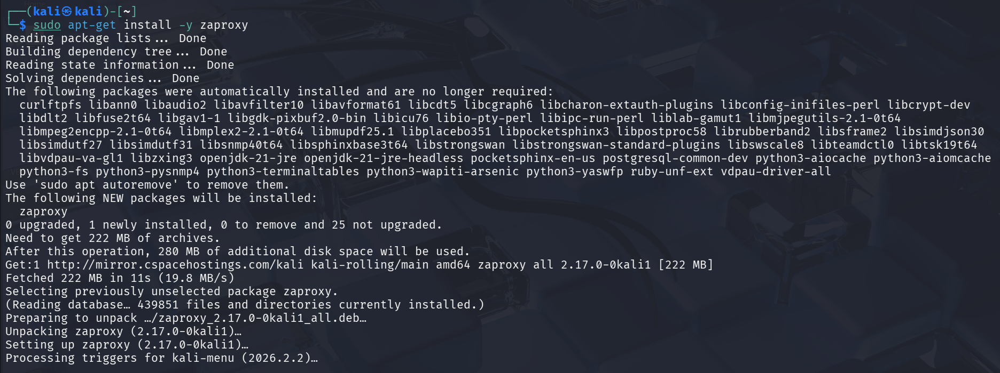

Zaproxy kysyi haluanko tallentaa istunnon. Valitsin ei tässä vaiheessa.


Seuraavaksi kysyttiin halutaanko päivittää paketit. Valitsin Update All.


Ja näin saatiin ohjelma toimimaan.


Seuraavaksi piti generoida CA-sertifikaatti ja asentaa se selaimeen. Seurasin Teron kurssisivun (Karvinen, T 22.3.2026) ohjeita. zaproxyssä menin Settings -> Network -> Server Certificates, jonka jälkeen tallensin sertifikaatin kotihakemistoon.

Tämän jälkeen seurasin virallista dokumentaatiota (zaproxy) jonka avustuksella sain lisättyä sertifikaatin selaimeen.

Dokumentaatiossa mainittiin, että sertifikaatin käytössä piilee vaara. Kaikki, joilla on root sertifikaatti käytössä, voivat nyt ujuttaa dataa selaimeeni. Eli tämä kannattaa ottaa varmuuden vuoksi pois päältä kun ei tee testauksia.

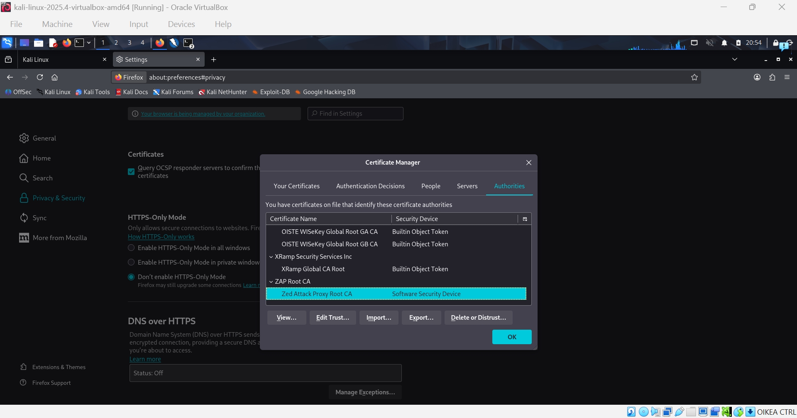

Määritin zaproxyn sieppaamaan kuvia.
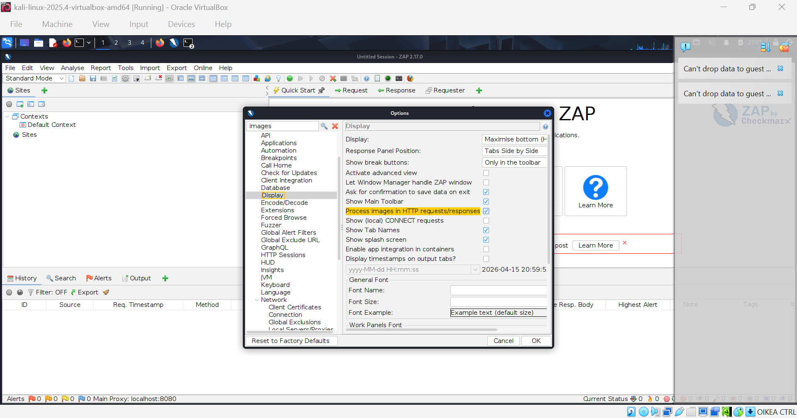

Sitten kävin vielä tarkistamassa että proxy toimii link-local osoitteella.
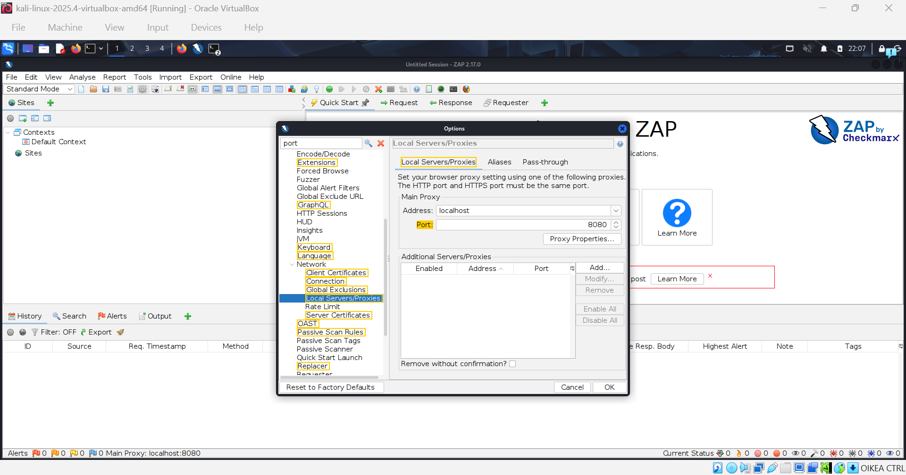

Tässä kohtaa en lähtenyt vielä asettamaan proxya firefoxiin, koska en ollut vielä asentanut foxyproxya. Eli kuva ZAPin käyttöliittymässä näkyvästä liikenteestä tulee seuraavassa osiossa.

## b) Kettumaista. Asenna "FoxyProxy Standard" Firefox Addon, ja lisää ZAP proxyksi siihen. Käytä FoxyProxyn "Patterns" -toimintoa, niin että vain valitsemasi weppisivut ohjataan Proxyyn

Asensin foxyproxy -lisäosan ja lisäsin ZAProxyn siihen. Tein myös Proxy by Patterns -konfiguraatiot, joihin laitoin PortSwiggerin ja link-local -osoitteen.

`*` -merkit urlissa tarkoittavat kaikkia mahdollisia osoitteita. Kävin katsomassa, että PortSwiggerin labrat käyttävät osoitteena .web-security-academy.net -loppuisia osoitteita. Näillä säädöillä kaikki labrat pitäisivät toimia ZAP:ssa.

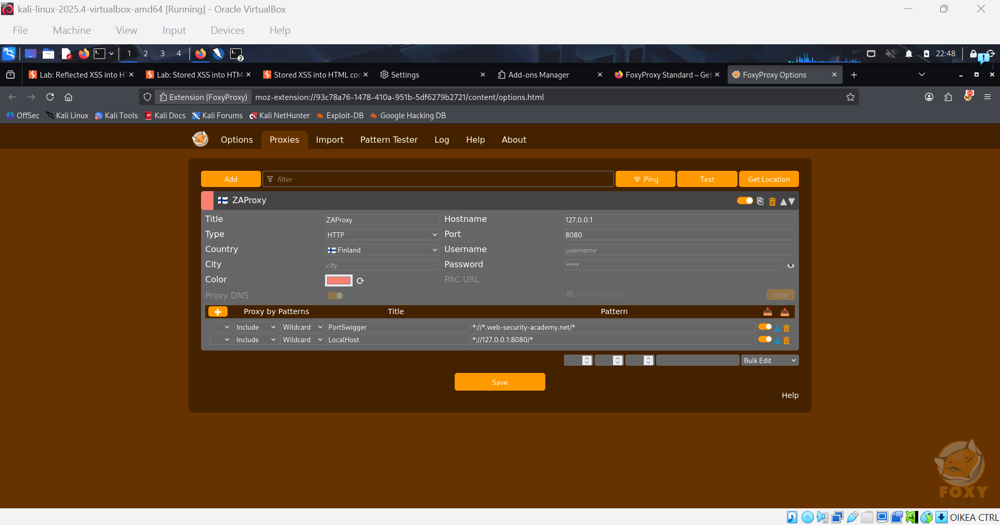

Sitten aloin surffailemaan ydessä labrassa ja testailin tuleeko liikenne näkyviin ZAP:n käyttöliittymään ja hyvin näyttäisi toimivan.

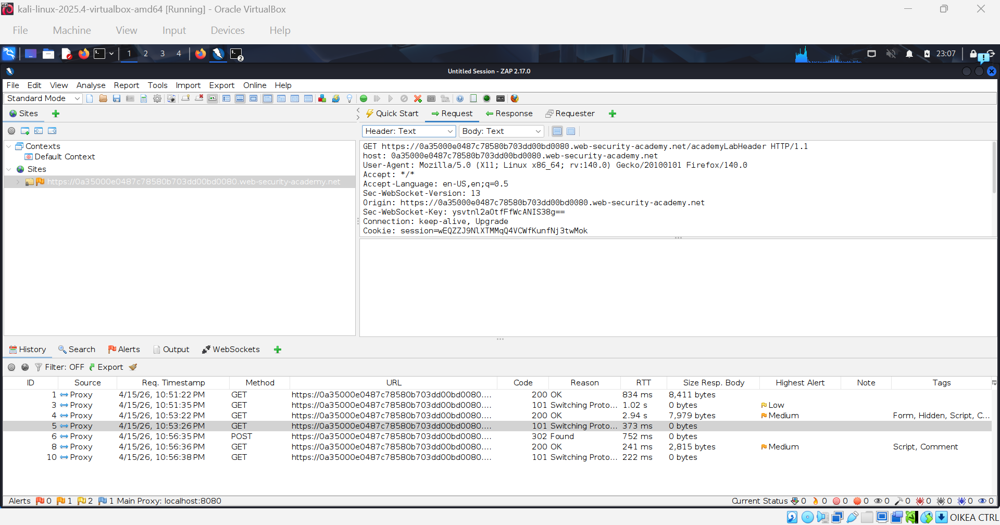

## c) Reflected XSS into HTML context with nothing encoded

##### 16.4.2026 12:45

Avasin labran ja kokeilin search toimintoa. Kirjoitin hakukenttään Holidays. Kun painoin enteriä, näin että urlin loppuosa oli `/?search=Holidays`. Sen jälkeen manipuloin urlia. Poistin Holidays sanan ja kirjoitin sen tilalle `<script>alert("You have been hacked!")</script>`. Tämä ratkaisi labran. Ratkaisu oli pääteltävissä labran kuvauksesta, jossa vihjattiin, että haavoittuvuus on nettisivun search ominaisuudessa.

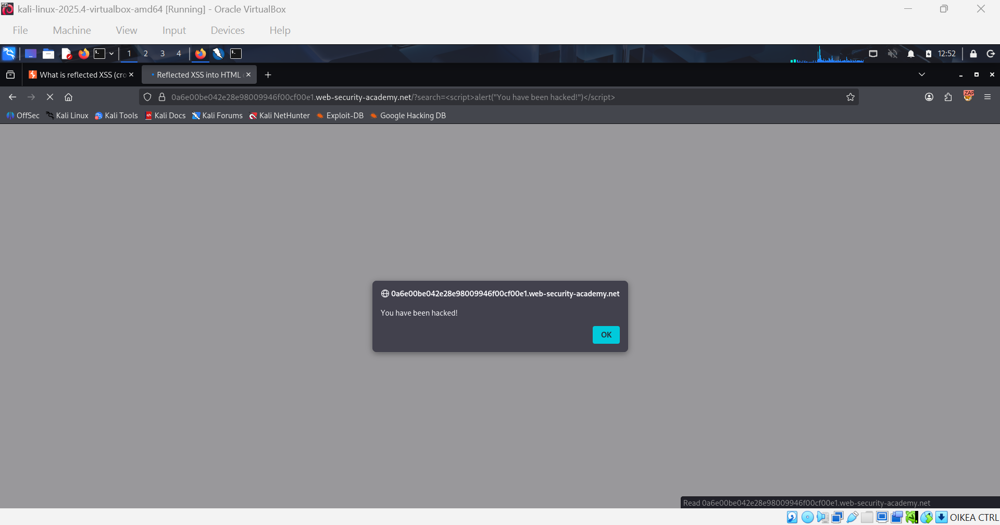

Kävin vielä katsomassa miltä GET-pyyntö näyttää zapissa.

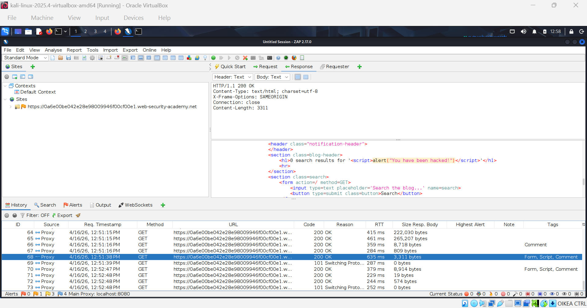

Täällä näemme että hyökkäys onnistuu, koska se muokkaa html-koodia jonka palvelin lähettää GET-pyynnön vastauksena. Selain suorittaa HTML:n ja sen mukana tulevan JavaScriptin. Jos linkin laittaisi esimerkiksi jollekin keskustelupalstalle, kuka tahansa sitä klikkaava joutuisi hyökkäyksen uhriksi.

## d) Stored XSS into HTML context with nothing encoded

##### 14:50

Tässä labrassa hyökkäys voidaan toteuttaa kirjoittamalla skripti kommenttikenttään.

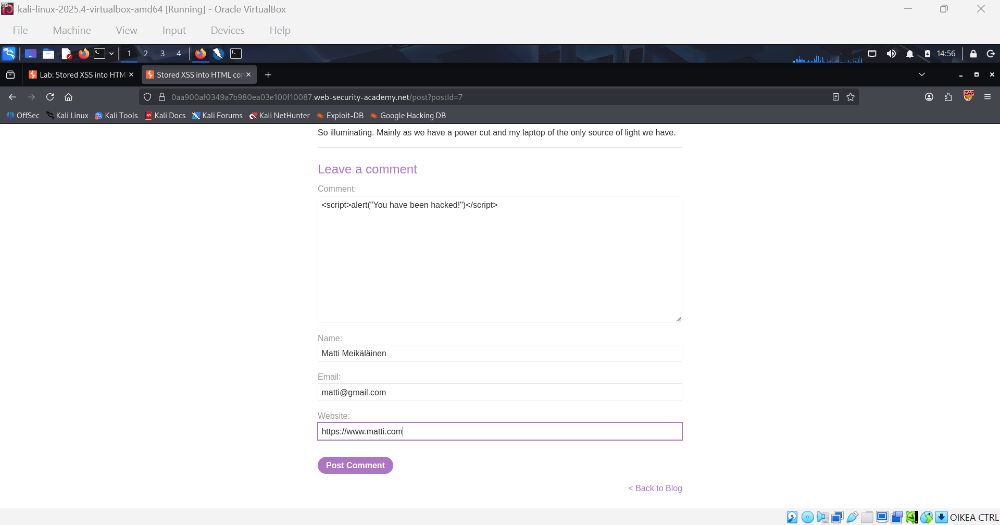

Jos sovellusta ei ole koodattu prosessoimaan tai tarkistamaan syötteen sisältöä, lähetetään se palvelimelle sellaisenaan.

Koska kommentit ovat GET-pyynnön response bodyssa lähetettävässä HTML:ssä, altistuu scriptille jokainen joka menee katsomaan kyseistä blogipostausta.

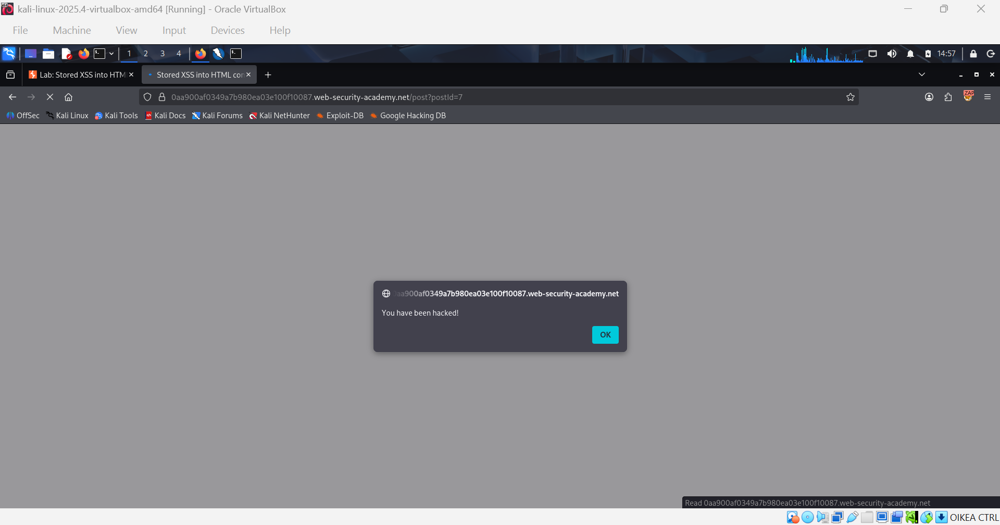

Voimme vielä mennä tarkastelemaan ZAP:n sisältöä tähän harjoitukseen liittyen.

Alla näemme POST-pyynnön bodyssa lähetettävän scriptin, joka tallennetaan tietokantaan.

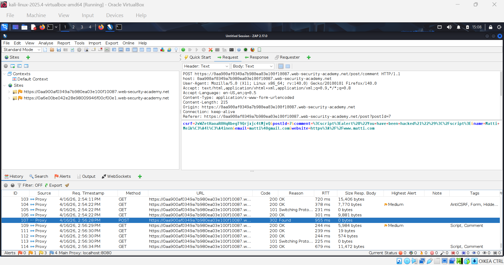

Ja tässä on aikaisemmin mainitsemani GET-pyynnön response body kun avasin blogipostauksen uudestaan.

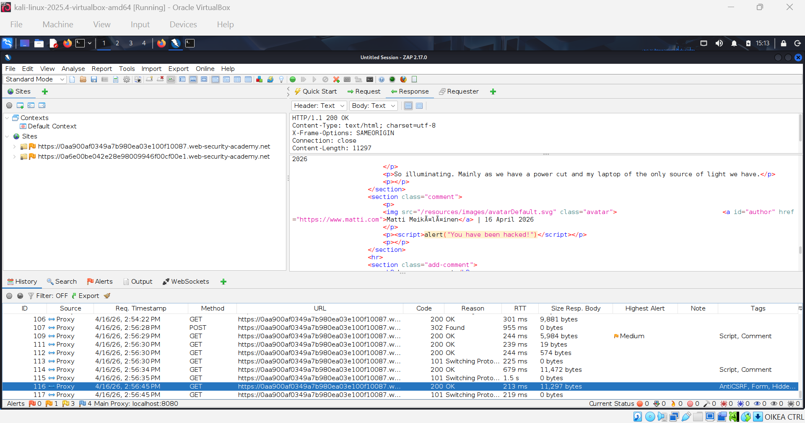

## e) Selitä esimerkin avulla, mitä hyökkääjä hyötyy XSS-hyökkäyksestä

Jos sovellus käyttää cookieita istunnonhallintaan, voidaan käyttäjän session token varastaa scriptillä `<script>alert(document.cookie)</script>`. Hyökkääjä voi liittää varastetun session tokenin omaan selaimeensa, jolloin sovellus luulee että hän on kirjautunut sisään kyseisenä käyttäjänä. (Hakatemia)

Tämä edellyttää, että sovelluksessa ei ole käytetty HttpOnly -atribuuttia, joka suojaa cookieta JavaScript -koodilta (owasp2).

## f) File path traversal, simple case
##### 17:45
Tämä harjoitus oli melko selkeä. URLia manipuloimalla piti päästä käsiksi /etc/passwd -tiedostoon.

Aloitin tarkistamalla mitä ZAP:sta mitä urlia kuvien hakemiseen käytetään. Tästä selvisi heti että se on `/image?filename=<tiedoston_nimi>`.

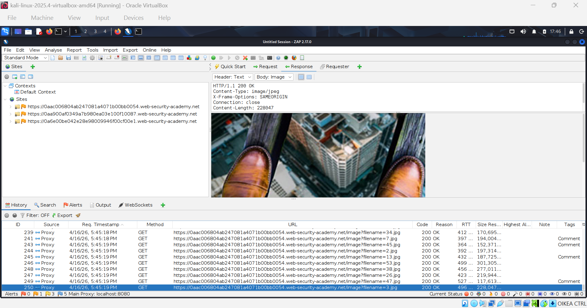

Kokeilin heti vaihtaa tiedoston nimen `../../../etc/passwd`, mutta selain sanoi että kuvaa ei pysty näyttämään koska se sisältää virheitä.

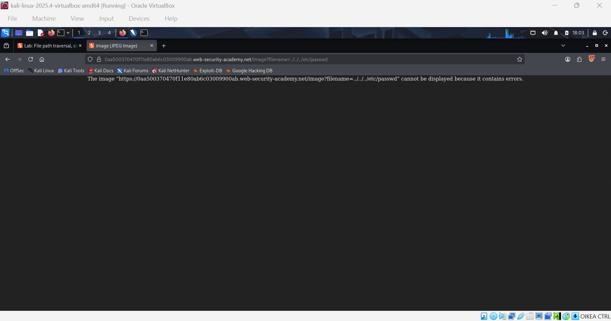

Kokeilin myös pidemmillä ../ kombinaatioilla mutta ne tuottivat saman lopputuloksen. Katsoin myös ZAP:sta mitä siellä näkyy, mutta siellä GET-pyyntö ei sisältänyt mitään bodya.

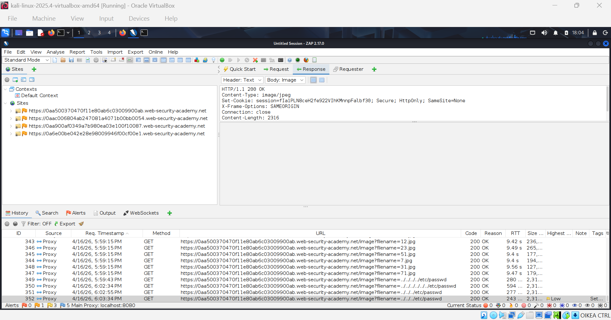

Olin melko hämilläni, koska olin melko varma että olin toiminut oikein ja tämän olisi pitänyt ratkaista labra, joten menin katsomaan portswiggerin esimerkkiratkaisuista mallia, joissa kerrottiin tismalleen samat toimenpiteet mitä olin jo tehnyt.

Tässä kohtaa minulla oli alkamassa sulkapallovuoro, joten päätin palata asiaan illemmalla.

Kun muutaman tunnin päästä avasin labran uudestaan, huomasin, että se ilmoitti että olen ratkaissut labran.

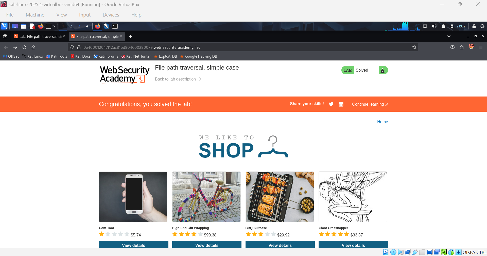

Kokeilin samaa ratkaisua uudestaan. Jos vaikka nettisivu olisi ollut aiemmalla kerralla buginen, mutta sama ongelma toistui.

Menin vielä ZAP:iin uudestaan ja tässä kohtaa huomasin että olin ollut huolimaton, sillä response bodyn tyyppinä oli image, varmaankin sen takia koska selain odottaa kuvatiedostoa. Vaihdoin sen tekstiksi ja sain passwd tiedoston sisällön näkyviin.

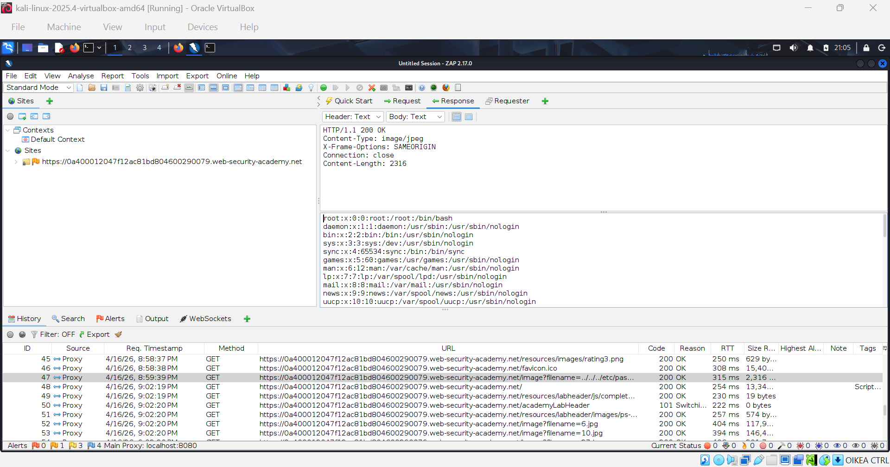

## g) File path traversal, traversal sequences blocked with absolute path bypass

Tämä labra olikin sitten helppo, kun tiesin mistä viimeksi jäi kiikastamaan.
Kuten labran kuvauksessa vihjattiin, käytin absoluuttista polkua ja sain tämän heti ratkaistua.

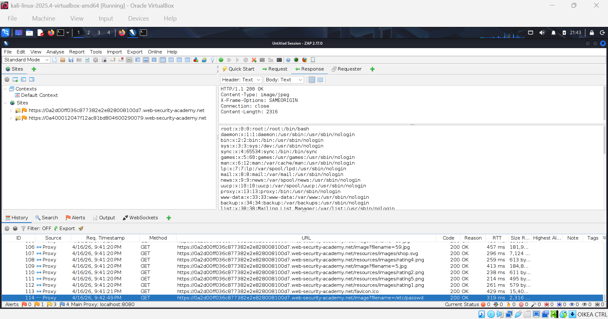

## h) File path traversal, traversal sequences stripped non-recursively

Tässä labrassa en ollut ihan varma miten `....//` traversalia pitäisi käyttää, joten lähdin vaan kokeilemaan erilaisia kombinaatioita, kunnes sain 200 OK -vastauksen.

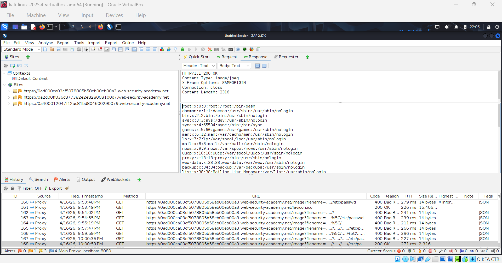

Minua jäi mietityttämään, että miksi tämä ratkaisu toimii. Sitä ei selitetty hirveän tarkasti portswiggerin sivuilla. Löysin kuitenkin hyvän blogipostauksen aiheesta.

Ilmeisesti backendissä voi määritellä erilaisia turvamekanismeja, jotka havaitsevat path traversal yrityksiä. Näitä voi kuitenkin kiertää erilaisin keinoin. Jotkin mekanismit esim. suodattavat ainoastaan `../` merkit kerran. Eli polun rakenne piilotetaan erilaisin keinoin jotta turvafiltterit eivät huomaa sitä. (Sopyan, A 6.7.2025)

## i) Insecure direct object references

##### 22:50

Aloitin surffailemalla sivulla, kokeilemalla sen eri toimintoja, samalla keräten dataa ZAP:iin.

ZAP:ssa ensimmäinen asia mikä kiinnitti huomioni oli ``/download-transcript/2.txt``.

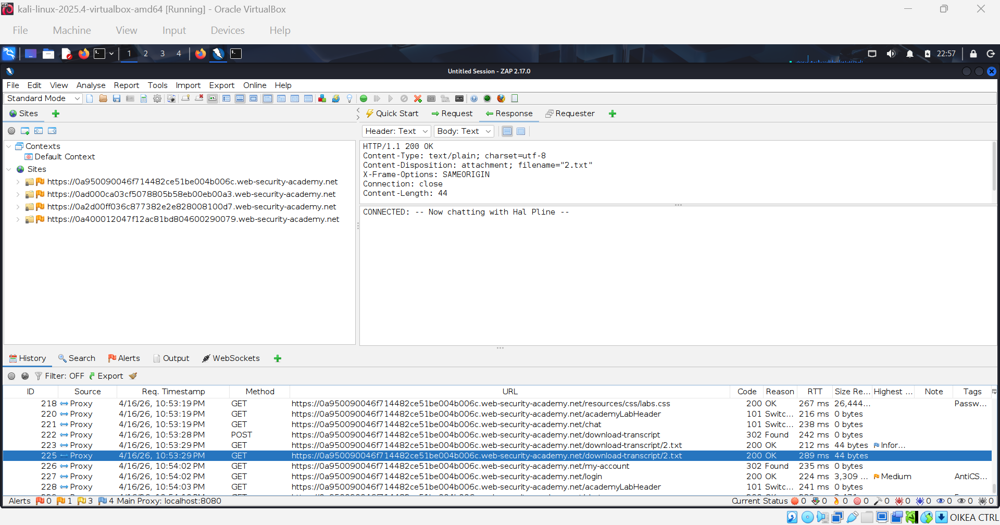

Kiinnitin huomiota siihen, koska se oli indeksöity 2. Päättelin, että jos minun chattini transkriptio oli indeksillä 2, luultavasti indeksillä 1 löytyy myös jotain, ehkä myös indeksillä 0.

Klikkaamalla GET-pyyntöä hiiren oikealla huomasin että valikosta löytyi vaihtoehto Open/Resend with Request Editor. Tämä osoittautui käteväksi työkaluksi. Olin aikaisemmin muokannut URLia pelkästään selaimessa.

Muutin Request Editorissa GET-pyynnön indeksin 2 -> 1 ja lähetin sen (indeksillä 0 ei löytynyt mitään).

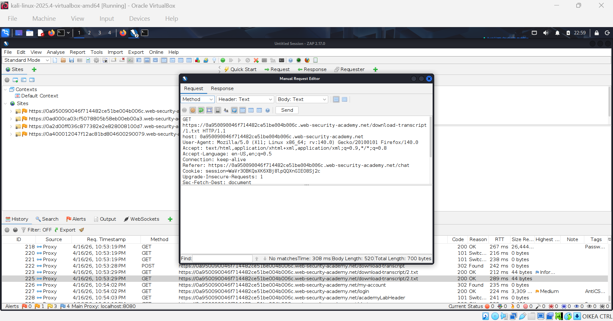

Vastaukseksi tuli keskustelu, jossa käyttäjä paljastaa salasanansa.


Keskustelusta ei selvinnyt käyttäjän käyttäjänimeä, mutta koska tehtävänannossa pyydettiin löytämään carlosin salasanan, päätin koittaa kirjautua sisään sillä käyttäjänimellä ja löytämälläni salasanalla. Tämä ratkaisi labran.

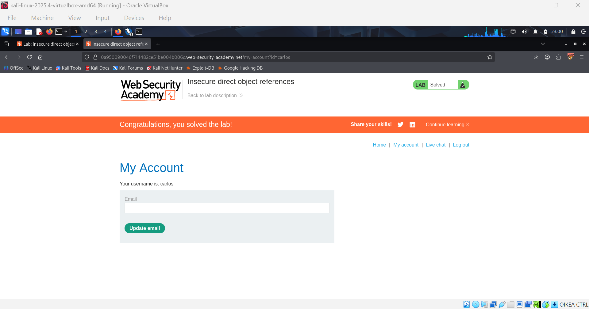

## Lähteet
Hakatemia. Stored XSS and stealing session cookies. Luettavissa: https://www.hakatemia.fi/en/courses/xss-cross-site-scripting/stored-xss-injection-and-stealing-cookies. Luettu: 16.4.2026.

Karvinen, T. 22.3.2026. Tunkeutumistestaus. Luettavissa: https://terokarvinen.com/tunkeutumistestaus/. Luettu: 8.4.2026.

owasp1. A01:2021 – Broken Access Control. Luettavissa: https://owasp.org/Top10/2021/A01_2021-Broken_Access_Control/index.html. Luettu: 15.4.2026.

owasp2. HttpOnly. Luettavissa: https://owasp.org/www-community/HttpOnly. Luettu: 16.4.2026.

portswigger1. Insecure direct object references (IDOR). Luettavissa: https://portswigger.net/web-security/access-control/idor. Luettu: 15.4.2026.

portswigger2. Path traversal. Luettavissa: https://portswigger.net/web-security/file-path-traversal. Luettu: 15.4.2026.

portswigger3. Cross-site scripting. Luettavissa: https://portswigger.net/web-security/cross-site-scripting. Luettu: 15.4.2026.

Sopyan, A. 6.7.2025. Path Traversal part-3 : traversal sequences stripped non-recursively. Luettavissa: https://medium.com/@AhmadSopyan/path-traversal-part-3-traversal-sequences-stripped-non-recursively-ee0f1a9c9887. Luettu: 16.4.2026

zaproxy. Server Certificates. Luettavissa: https://www.zaproxy.org/docs/desktop/addons/network/options/servercertificates/#install. Luettu: 15.4.2026.

