# Fuzzy
Harjoitukset on tehty kotitoimistossa Kaarinassa. Koneena oli Lenovo V14 G4 AMN. Käyttöjärjestelmänä Windows 11 Pro version 25H2. Virtuaalikoneena oli Linux Kali 6.16.8+kali-amd64.

Harjoituksessa seurataan Teron kotisivujen Karvinen (Karvinen, T 22.3.2026) tehtävänantoa.

## Lue ja tiivistä
#### Find Hidden Web Directories - Fuzz URLs with ffuf (Karvinen, T 10.3.2023)
- Fuff on Joona "joohoi" Hoikkalan kehittämä työkalu, joka automatisoi hakemistohen fuzzakuksen.
- Artikkeli opettaa fuffin asennusta ja käyttöä. Tässä raportissa palaamme tähän tehtävään hieman myöhemmin.

#### ffuf README.md (Hoikkala, J 16.9.2023)
- Ffufin voi asentaa lataamalla binäärin githubista tai kloonaamalla repon. Nykyisin sen voi asentaa myös suoraan terminaalissa komennolla `sudo apt install ffuf`.
- Ffuf on tehokas työkalu. Sillä voi fuzzata, hakemistoja, piilotettuja virtuaalihosteja, GET-parametrien nimiä sekä POST-pyyntöjä.
- Kun ffuf ajetaan, osa url:sta korvataa sanalla FUZZ esim. `https://target/FUZZ`
- Yhtenä parametrina annetaan sanalista, jonka avulla voidaan fuzzata huomattavasti nopeammin kuin manuaalisesti.

## a) Ratkaise dirfuz-1 artikkelista Karvinen 2023: [Find Hidden Web Directories - Fuzz URLs with ffuf](https://terokarvinen.com/2023/fuzz-urls-find-hidden-directories/)

#### dirfuzt-0
##### 26.4.2026 11:20
Aloitin asentamalla ffufin.

Ilmeisesti ffuf oli jo asennettuna valmiiksi kalille, tai sitten olin asentanut sen aikaisemmin, en muista. Joka tapauksessa ffuf päivitettiin ja iso kasa paketteja asennettiin joita ei tarvitse. Poistin ne komennolla `sudo apt autoremove`.

Asensin myös SecLists -kirjaston (Missler, D), joka sisältää ison määrän sanalistoja, jotka ovat tarkoitettu pentestauksen avuksi. `sudo apt install -y seclists`.

Kävin lataamassa testikohteen Teron sivuilta ja annoin käyttäjälle ajo-oikeudet.


Käynnistin web-palvelun komennolla `./dirfuzt-0`, jonka jälkeen tarkistin selaimesta että se toimii.


Avasin toisen terminaalin, irroitin koneen verkosta ja tarkistin ettei ping toimi.


Seuraamalla Hoikkalan ohjeita videolla (HelSec 16.5.2020), jolla hän demonstroi ffufin käyttöä, ajoin fuffin komennolla
```
ffuf -w /usr/share/seclists/Discovery/Web-Content/big.txt -u http://127.0.0.2:8000/FUZZ -c -v
```
- ``-w`` Määrittää että käytetään wordlistiä.
- ``/usr/share/seclists/Discovery/Web-Content/big.txt`` Polku käytettävään sanalistaan.
- `-u` Määrittää että käytetään URLia kohteena.
- `http://127.0.0.2:8000/FUZZ` FUZZ on avainsana joka korvataan sanalistan sisällöllä.
- `-c` Värillinen output (mukavampaa lukea).
- `-v` Verbose


Ohjelma alkoi tulostaa jokaista lähetettyä skannausta joten painoin crtl+c.

Tein uuden fuzzaus -komennon. Tämä oli tismalleen samanlainen, mutta lisäsin loppuun filterin, joka suodattaa pois kaikki 132 tavuiset tulokset. Näin ollen näemme pelkästään oikeat osumat kohteesta.


Nyt löytyi yksi osuma, /admin. Jos tämän kirjoittaa selaimeen niin huomaamme, että tehtävä on ratkaistu.


#### dirfuzt-1

##### 17:57

Kokeillaan vielä toista Teron harjoitusmaalia. Latasin sen ja tein samat toimenpiteet kuin aikaisemmalle harjoitusmaalille.


Ajetaan sama fuzzaus kuin aikaisemmassa harjoituksessa.


Nyt huomaamme, että GET-responset ovat 154 tavuisia, eli suodatetaan ne pois seuraavassa fuzzauksessa.


Kuten näkyy, nyt löysimme kaksi piilotettua endpointtia; .git, joka on 301 redirect, sekä wp-admin, joka on perus 200 ok.

Ja nämä olivatkin ratkaisut tehtävään.


## b) Fuff me. Asenna FuffMe-harjoitusmaali. Karvinen 2023: [Fuffme - Install Web Fuzzing Target on Debian](https://terokarvinen.com/2023/fuffme-web-fuzzing-target-debian/)

#### 18:12
Kohdeympäristön alustaminen oli suoraviivaista ja onnistui ongelmitta.

Asensin dockerin ja kloonasin ffufme paketin GitHubista
```
sudo apt-get -y install docker.io
git clone https://github.com/BuildHackSecure/ffufme.git
```
Sitten rakensin Docker containerin.

`sudo docker build -t ffufme .`
- `build` Komento rakentaa imagen Dockerfilestä.
- `-t ffufme` Määrittää rakennettavan Docker-imagen nimi (ChatGPT).
- `.` Määrittää että image rakennetaan nykyiseen hakemistoon.

Sitten ajoin containerin.

`sudo docker run -d -p 80:80 ffufme`
- `-d` Container ajetaan taustalla ja tulostetaan ID (docker run --help).
- `-p 80:80` Julkaistaan containerin portti hostin portille (docker run --help).
- `ffufme` Ajettavan containerin nimi.

Ja näin saatiin harjoitusmaali toimimaan.
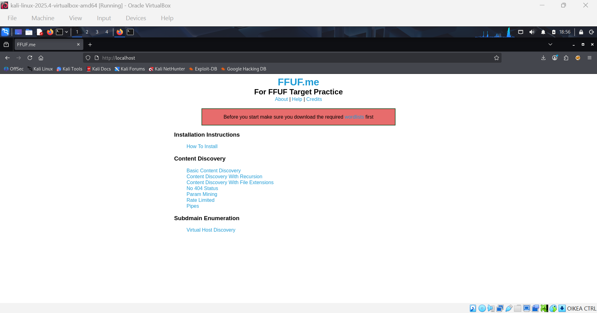

Päätin olla lataamatta Teron ehdottamaa sanalistaa, koska olin jo ladannut seclistsin koneelleni.

## c) Basic Content Discovery
#### 19:46
Ensimmäinen fuzzaus palautti yhden etsimämme endpointin. Mielenkiintoista oli, että nyt tuloksia ei tarvinnut suodattaa, sillä palvelin oli konfiguroitu oikein palauttamaan 404 NOT FOUND, jos kyseistä endpointtia ei löytynyt, ja tätä kyseistä koodia ffuf ei matchaa.

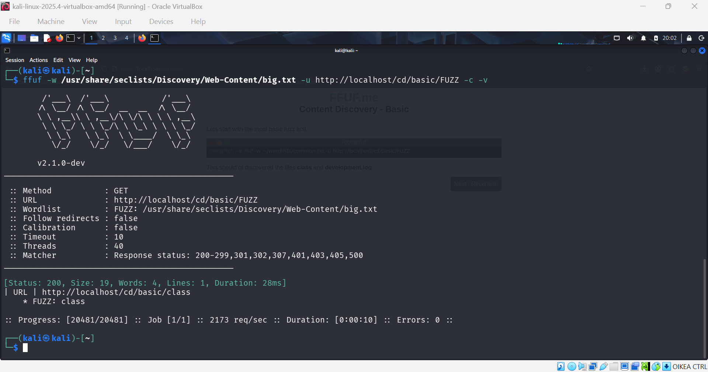

Tiestin että piti tehdä vielä toinen fuzzaus, jotta löydän tuon development.log -endpointin. Koska aika oli kortilla, fuskasin vähän ja greppasin hakemaani.

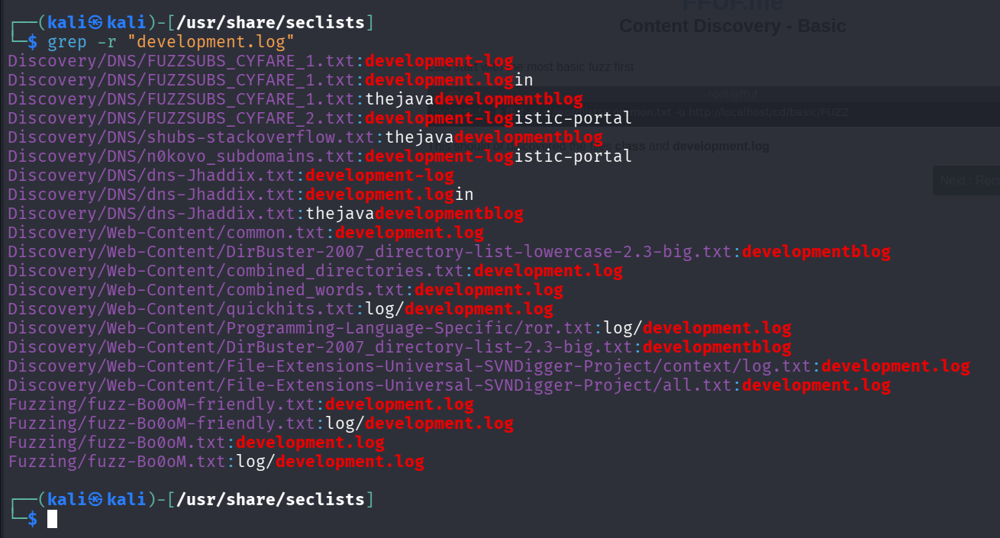

Sieltä löytyikin saman niminen (common.txt) lista, jota Tero oli käyttänyt esimerkkiratkaisussa, joten ajattelin että tämä voi hyvällä todennäköisyydellä olla jopa sama lista.

Tein saman fuzzauksen, nyt common.txt -listalla, ja näin löydettiin molemmat endpointit.
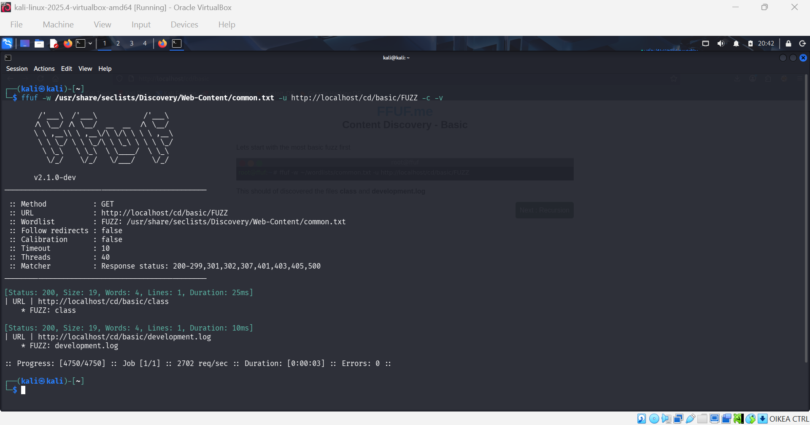

## d) Content Discovery With Recursion
Tässä ajettiin sama komento kuin aikaisemmin, mutta nyt `-recursion` parametrilla, joka siis ajaa saman sanalistan jokaiselle endpointille jonka se löytää, kunnes se ei enää löydä mitään.

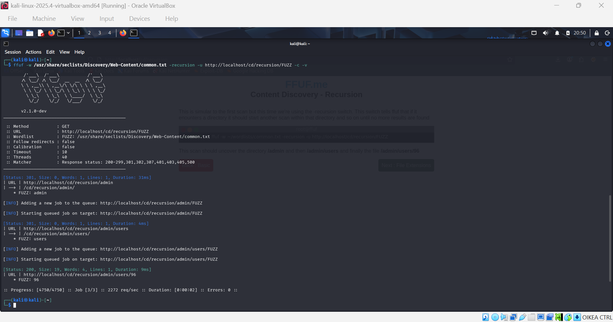

## e) Content Discovery With File Extensions
Tässä esitellään ffufin ``-e`` switchiä, jonka avulla voidaan määritellä tiedostomuoto ja laittaa se jokaisen sanalistan sanan perään.

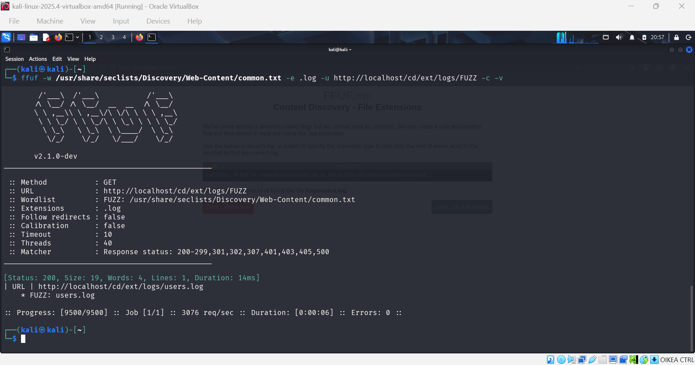

## f) No 404 Status
Tässä taas ideana osata käyttää suodatinta `-fs` (filter size), kun backendiä ei ole ohjelmoitu palauttamaan 404 -statuskoodia.

Tässä huomaamme, että kaikki responset ovat kooltaan samoja (669 tavua), joten `-fs` on looginen valinta.

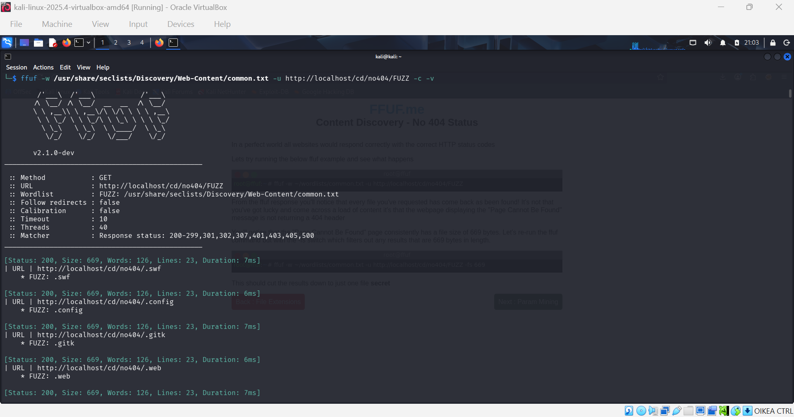

Toisaalta tässä tapauksessa myös sanojen `-fw` ja rivien `-fl` mukaan olisi voinut suodattaa.

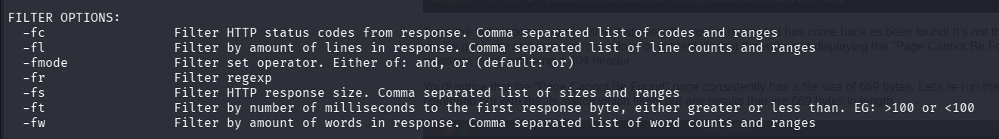

Joka tapauksessa, suodattamalla jonkin näistä, löydämme etsimämme.

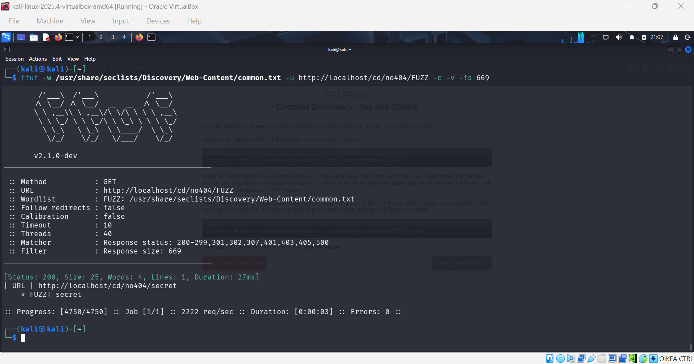

## g) Param Mining

Tässä on tarkoitus fuzzata parametria. Eli ollaan oikeassa tiedostopolussa, mutta backend odottaa jotain parametria esim. hakukentästä tai lomakkeesta jonka frontend sitten lähettää backendille.

Tässä tehtävässä oletetaan että id:n arvolla 1 löytyy joka tapauksessa jotain, ja etsitään sille oikeaa parametria.

SecLists:stä löytyi sanalista joka vaikutti lupaavalta.
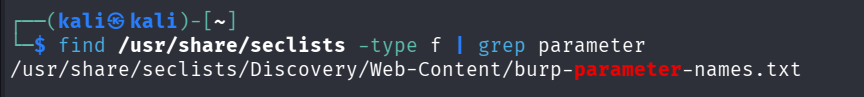

Ja sanalista myös toimitti.
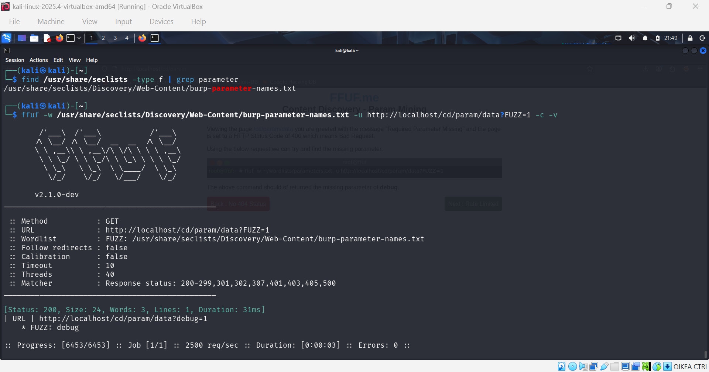

## h) Rate Limited
Tässä pyritään ratkaisemaan ongelma, jossa endpointti on suojattu liian monelta GET-pyynnöltä tietyssä ajassa. Tämä on todennäköisesti tehty joko turvallisuussyistä tai kuorman rajoittamiseksi. `-p` switchillä määritellään aika sekunneissa, jonka ffuf odottaa ennen kun se lähettää seuraavan pyynnön. `-t` switchillä määritellään kuinka monta pyyntöä lähetetään kerralla (oletus on 40 kpl). (ffuf -h)

Ajetaan ensin fuzzaus ilman näitä em. switchejä.

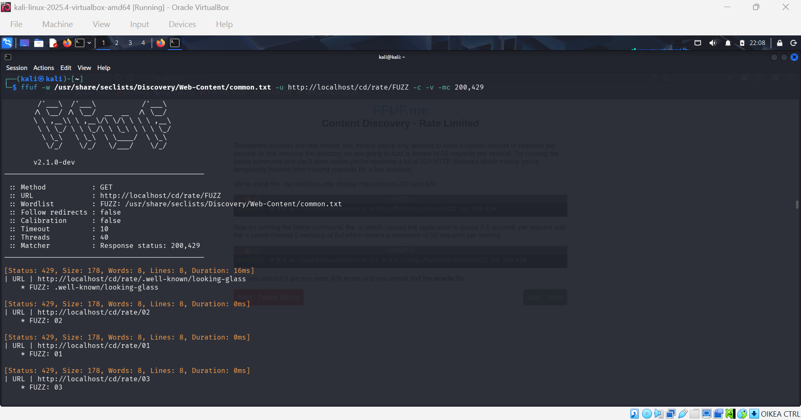

`-mc` switchillä määritellään mitkä HTTP-statuskoodit näytetään. Koska backend on rajoittanut pyynnöt 50/s, ja koska ffuf lähettää 40 pyyntöä kerralla ja lähettää niitä niin nopeasti kuin mahdollista, saamme pelkästään 429 Too Many Requests -vastauksia.

Kun rajasimme pyynnöt viiteen kerralla ja 0.1 sekunnin intervalleihin, emme saaneet enää yhtäkään 429 statuskoodia. Operaatioon meni yli puolitoista minuuttia (48 pyyntöä sekunnissa), kun aikaisempi oli ohi sekunnissa (2898 pyyntöä sekunnissa), mutta nyt löysimme etsimämme.
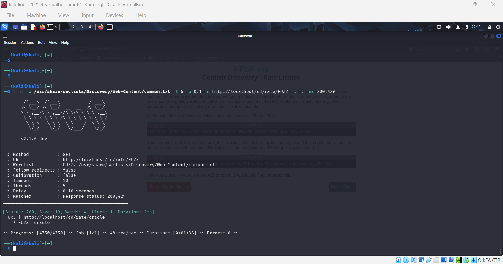

## i) Subdomains - Virtual Host Enumeration

Viimeisessä tehtävässä etsitään alidomaineja. Niitä voi hakea `-H` switchillä, jolla määritettän headerin nimi=Header ja arvo=FUZZ, eli sanalistan sisältö (ffuf -h).

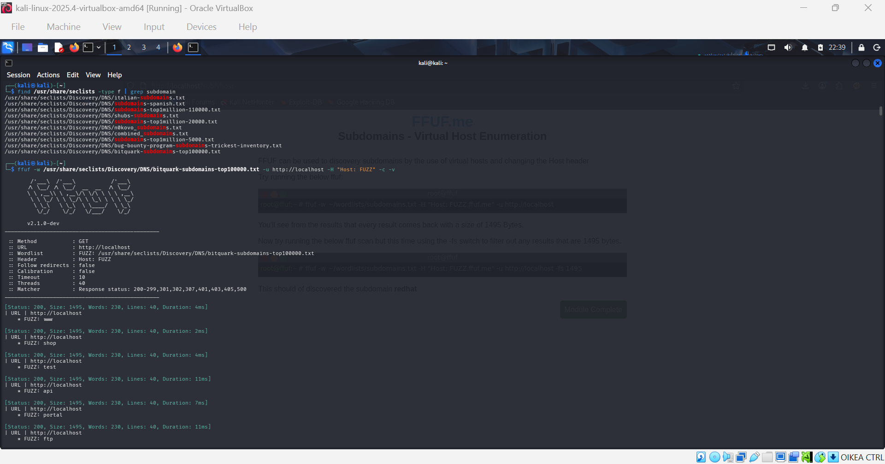

Nähdään, että kaikki vastaukset ovat jälleen kooltaan samoja, jote suodatetaan kyseinen koko pois.

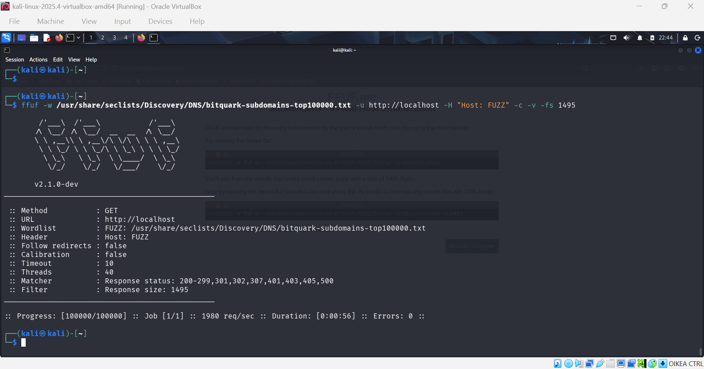

Tällä ei löytynytkään osumaa, koska en ollut lukenut ohjeistusta huolella, ja olin määritellyt headeriksi vain sanalistan sisällön.

Kun lisäsin sanalistan sisällön perään vielä .ffuf.me, niin löysin redhatin.

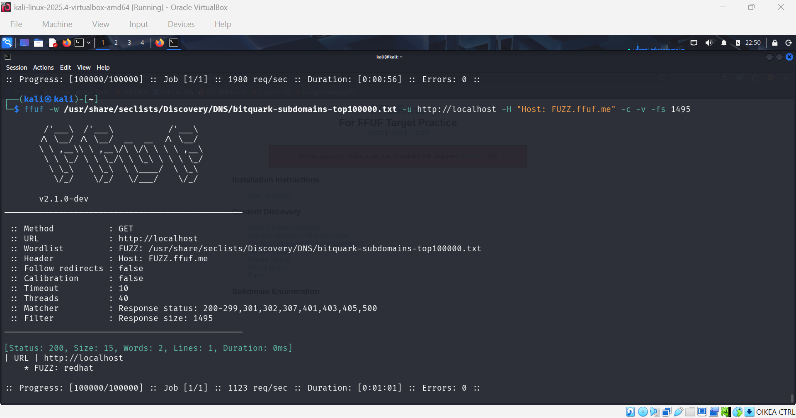

## Lähteet
ChatGPT. "Mitä -t lippu tekee komennossa sudo docker build -t ffufme?"

docker run --help. Dockerin run -komennon help page.

ffuf -h. Ffuf help page.

Helsec. 0x03 Still Fuzzing Faster (U Fool) - joohoi - HelSec Virtual meetup #1 Katsottavissa: https://www.youtube.com/watch?v=mbmsT3AhwWU. Katsottu: 25.4.2026.

Hoikkala, J. 16.9.2023. ffuf - Fuzz Faster U Fool. Luettavissa: https://github.com/ffuf/ffuf/blob/master/README.md. Luettu: 24.4.2026.

Karvinen, T. 22.3.2026. Tunkeutumistestaus. Luettavissa: https://terokarvinen.com/tunkeutumistestaus/. Luettu: 24.4.2026.

Karvinen, T. 10.3.2023. Find Hidden Web Directories - Fuzz URLs with ffuf. Luettavissa: https://terokarvinen.com/2023/fuzz-urls-find-hidden-directories/. Luettu: 24.4.2026

Karvinen, T. 30.10.2023. Fuffme - Install Web Fuzzing Target on Debian. Luettavissa: https://terokarvinen.com/2023/fuffme-web-fuzzing-target-debian/. Luettu: 26.4.2026.

Langley, A. FFUF Me - Target Practice For FFUF. Luettavissa: https://github.com/BuildHackSecure/ffufme. Luettu: 26.4.2026.

Missler, D. SecLists. The Pentester's Companion. Luettavissa: https://github.com/danielmiessler/seclists. Luettu: 26.4.2026.