# Fuzzy
Harjoitukset on tehty kotitoimistossa Kaarinassa. Koneena oli Lenovo V14 G4 AMN. Käyttöjärjestelmänä Windows 11 Pro version 25H2. Virtuaalikoneena oli Linux Kali 6.16.8+kali-amd64.

Harjoituksessa seurataan Teron kotisivujen Karvinen (Karvinen, T 22.3.2026) tehtävänantoa.

## Lue ja tiivistä
#### Find Hidden Web Directories - Fuzz URLs with ffuf (Karvinen, T 10.3.2023)
- Fuff on Joona "joohoi" Hoikkalan kehittämä työkalu, joka automatisoi hakemistohen fuzzakuksen.
- Artikkeli opettaa fuffin asennusta ja käyttöä. Tässä raportissa palaamme tähän tehtävään hieman myöhemmin.

#### ffuf README.md (Hoikkala, J 16.9.2023)
- Ffufin voi asentaa lataamalla binäärin githubista tai kloonaamalla repon. Nykyisin sen voi asentaa myös suoraan terminaalissa komennolla `sudo apt install ffuf`.
- Ffuf on tehokas työkalu. Sillä voi fuzzata, hakemistoja, piilotettuja virtuaalihosteja, GET-parametrien nimiä sekä POST-pyyntöjä.
- Kun ffuf ajetaan, osa url:sta korvataa sanalla FUZZ esim. `https://target/FUZZ`
- Yhtenä parametrina annetaan sanalista, jonka avulla voidaan fuzzata huomattavasti nopeammin kuin manuaalisesti.

## a) Ratkaise dirfuz-1 artikkelista Karvinen 2023: [Find Hidden Web Directories - Fuzz URLs with ffuf](https://terokarvinen.com/2023/fuzz-urls-find-hidden-directories/)

#### dirfuzt-0
##### 26.4.2026 11:20
Aloitin asentamalla ffufin.
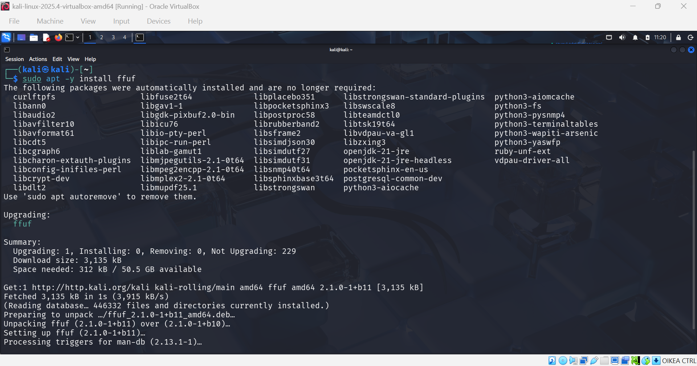
Ilmeisesti ffuf oli jo asennettuna valmiiksi kalille, tai sitten olin asentanut sen aikaisemmin, en muista. Joka tapauksessa ffuf päivitettiin ja iso kasa paketteja asennettiin joita ei tarvitse. Poistin ne komennolla `sudo apt autoremove`.

Asensin myös SecLists -kirjaston (Missler, D), joka sisältää ison määrän sanalistoja, jotka ovat tarkoitettu pentestauksen avuksi. `sudo apt install -y seclists`.

Kävin lataamassa testikohteen Teron sivuilta ja annoin käyttäjälle ajo-oikeudet.
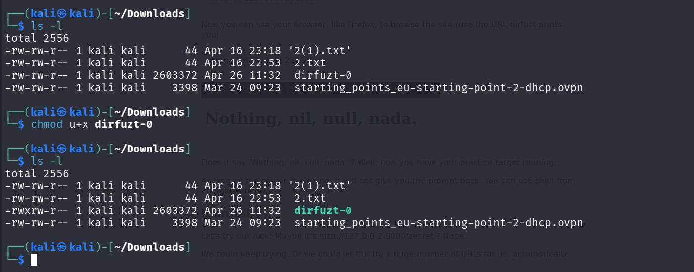

Käynnistin web-palvelun komennolla `./dirfuzt-0`, jonka jälkeen tarkistin selaimesta että se toimii.
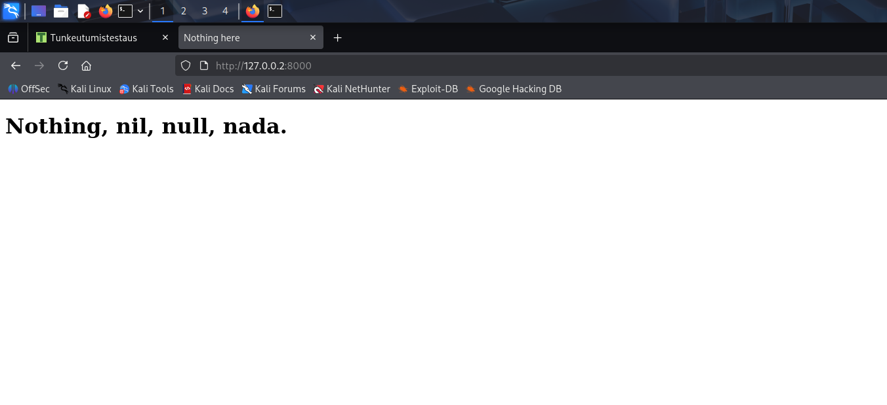

Avasin toisen terminaalin, irroitin koneen verkosta ja tarkistin ettei ping toimi.
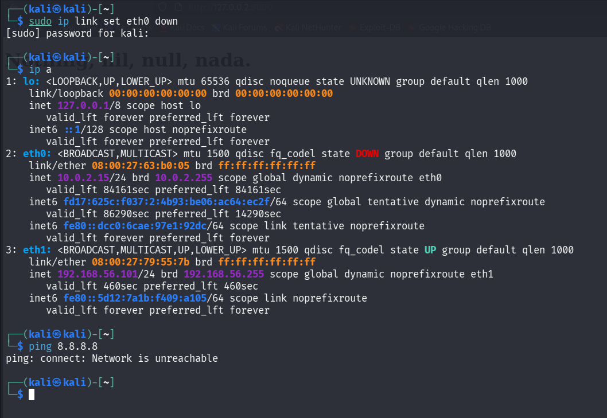

Seuraamalla Hoikkalan ohjeita videolla (HelSec 16.5.2020), jolla hän demonstroi ffufin käyttöä, ajoin fuffin komennolla
```
ffuf -w /usr/share/seclists/Discovery/Web-Content/big.txt -u http://127.0.0.2:8000/FUZZ -c -v
```
- ``-w`` Määrittää että käytetään wordlistiä.
- ``/usr/share/seclists/Discovery/Web-Content/big.txt`` Polku käytettävään sanalistaan.
- `-u` Määrittää että käytetään URLia kohteena.
- `http://127.0.0.2:8000/FUZZ` FUZZ on avainsana joka korvataan sanalistan sisällöllä.
- `-c` Värillinen output (mukavampaa lukea).
- `-v` Verbose

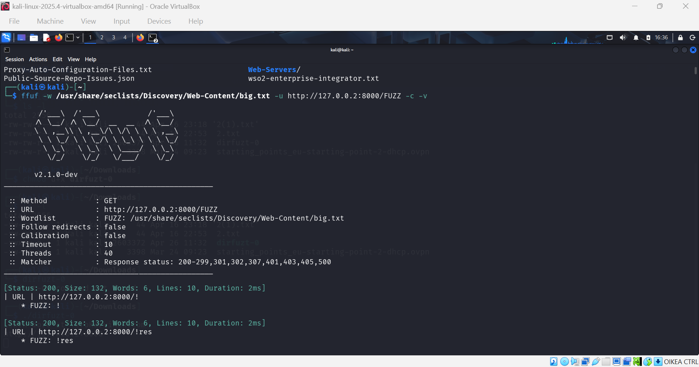

Ohjelma alkoi tulostaa jokaista lähetettyä skannausta joten painoin crtl+c.

Tein uuden fuzzaus -komennon. Tämä oli tismalleen samanlainen, mutta lisäsin loppuun filterin, joka suodattaa pois kaikki 132 tavuiset tulokset. Näin ollen näemme pelkästään oikeat osumat kohteesta.

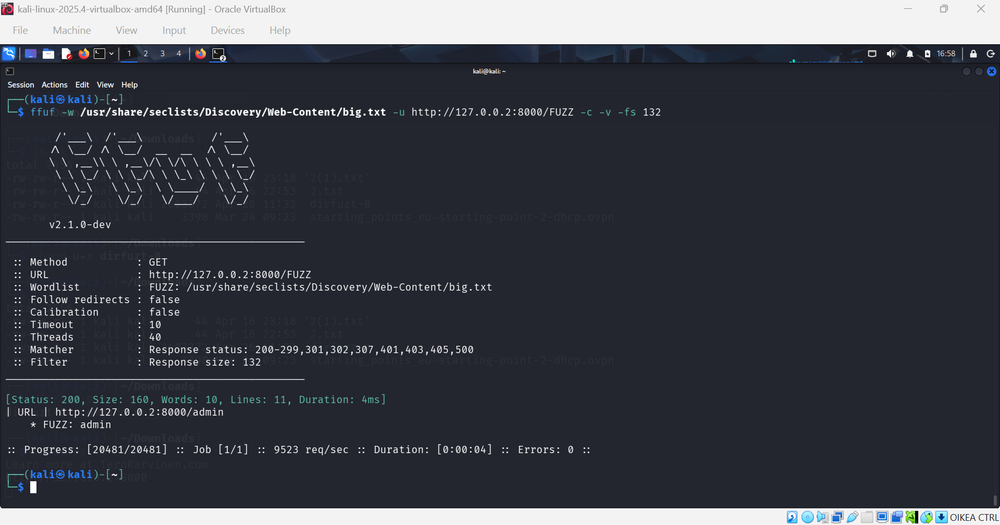

Nyt löytyi yksi osuma, /admin. Jos tämän kirjoittaa selaimeen niin huomaamme, että tehtävä on ratkaistu.

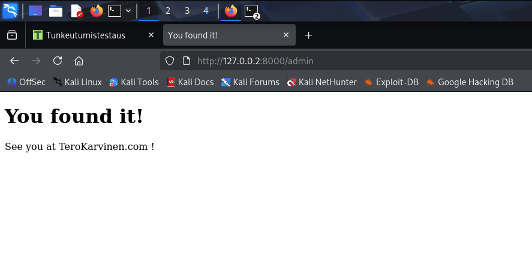

#### dirfuzt-1

##### 17:57

Kokeillaan vielä toista Teron harjoitusmaalia. Latasin sen ja tein samat toimenpiteet kuin aikaisemmalle harjoitusmaalille.

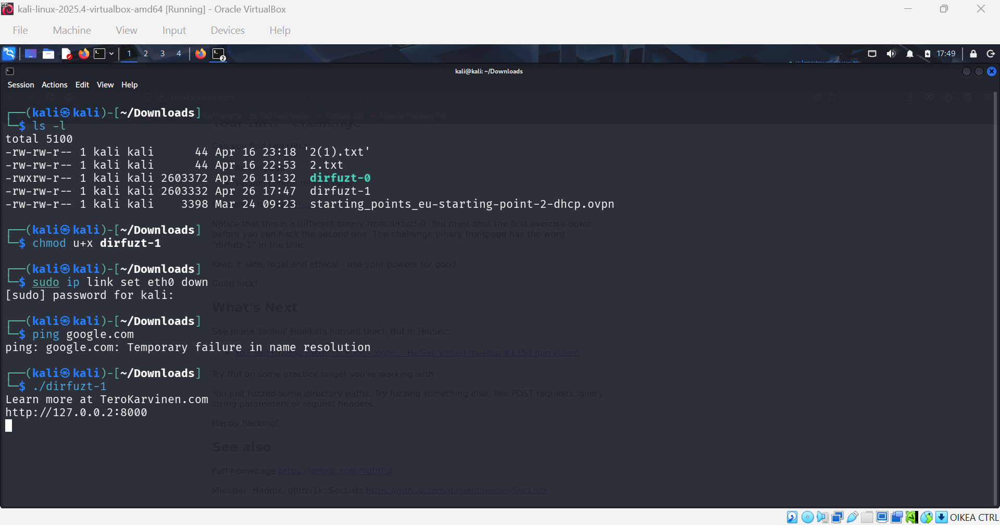
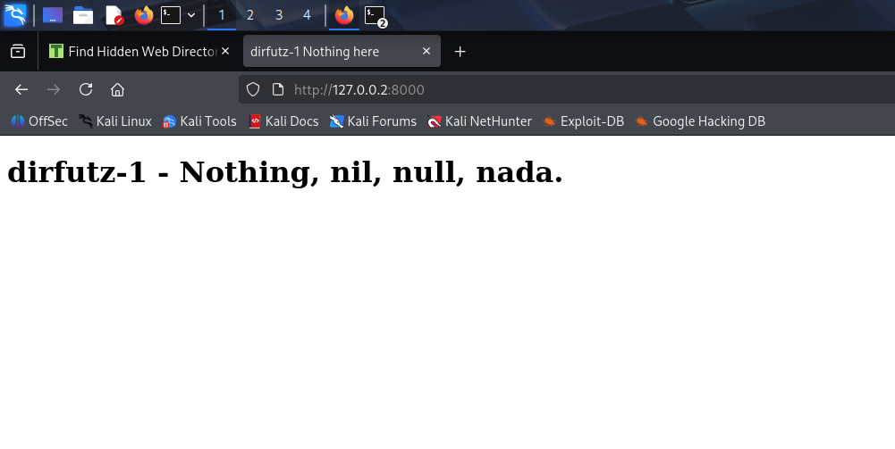

Ajetaan sama fuzzaus kuin aikaisemmassa harjoituksessa.

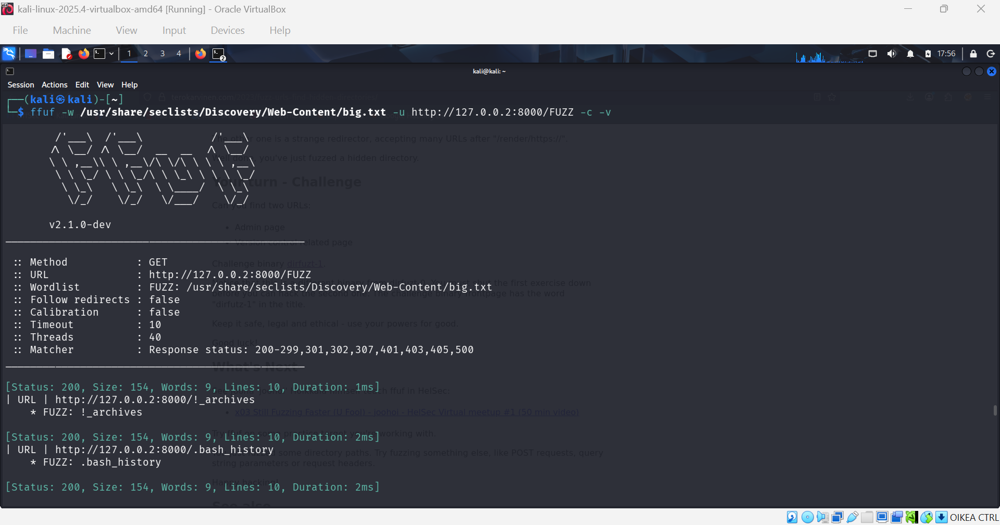

Nyt huomaamme, että GET-responset ovat 154 tavuisia, eli suodatetaan ne pois seuraavassa fuzzauksessa.

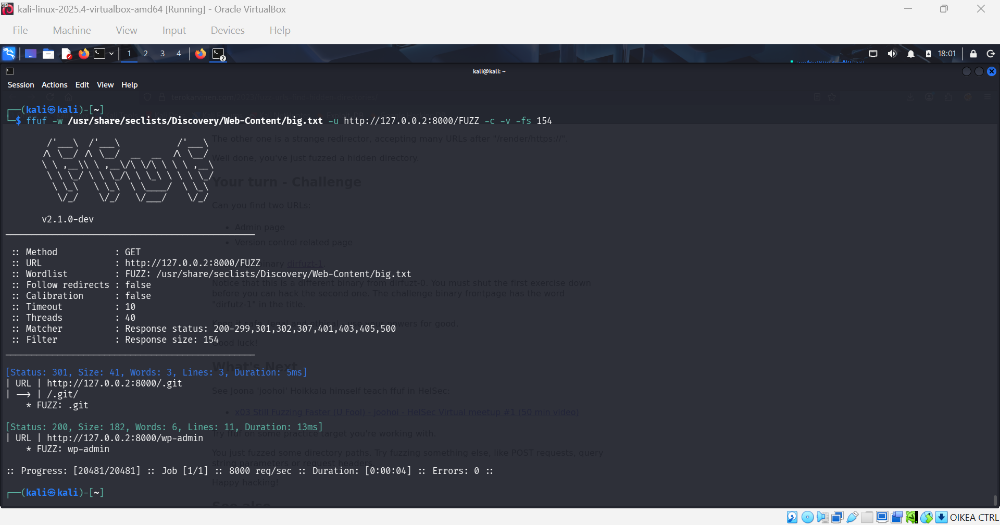

Kuten näkyy, nyt löysimme kaksi piilotettua endpointtia; .git, joka on 301 redirect, sekä wp-admin, joka on perus 200 ok.

Ja nämä olivatkin ratkaisut tehtävään.
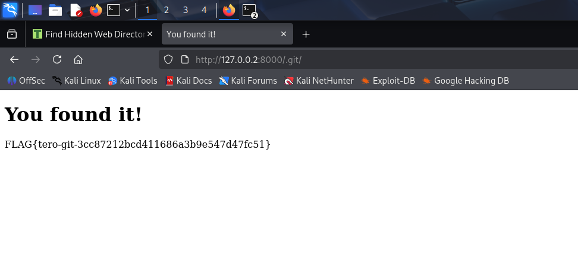
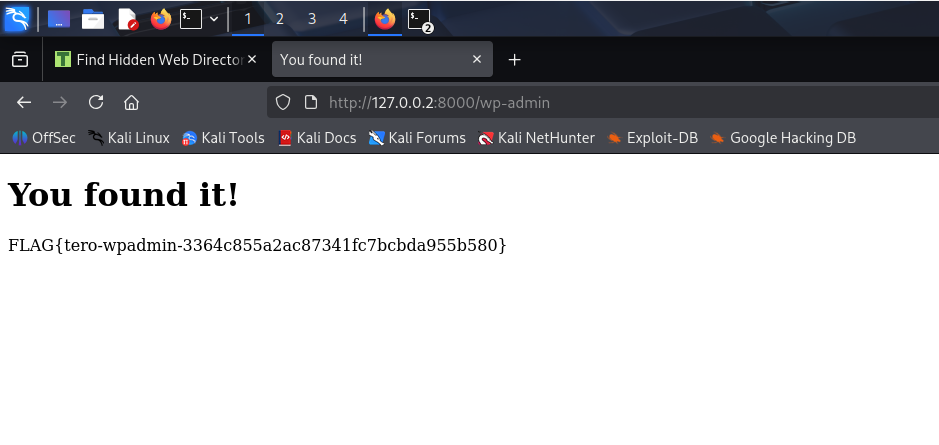

## Lähteet
Karvinen, T. 22.3.2026. Tunkeutumistestaus. Luettavissa: https://terokarvinen.com/tunkeutumistestaus/. Luettu: 24.4.2026.

Karvinen, T. 10.3.2023. Find Hidden Web Directories - Fuzz URLs with ffuf. Luettavissa: https://terokarvinen.com/2023/fuzz-urls-find-hidden-directories/. Luettu: 24.4.2026

Helsec. 0x03 Still Fuzzing Faster (U Fool) - joohoi - HelSec Virtual meetup #1 Katsottavissa: https://www.youtube.com/watch?v=mbmsT3AhwWU. Katsottu: 25.4.2026.

Hoikkala, J. 16.9.2023. ffuf - Fuzz Faster U Fool. Luettavissa: https://github.com/ffuf/ffuf/blob/master/README.md. Luettu: 24.4.2026.

Missler, D. SecLists. The Pentester's Companion. Luettavissa: https://github.com/danielmiessler/seclists. Luettu: 26.4.2026.