# Toukokuu2026!
Harjoitukset on tehty kotitoimistossa Kaarinassa. Koneena oli Lenovo V14 G4 AMN. Käyttöjärjestelmänä Windows 11 Pro version 25H2. Virtuaalikoneena oli Linux Kali 6.16.8+kali-amd64.

Harjoituksessa seurataan Teron kotisivujen (Karvinen, T 22.3.2026) tehtävänantoa.

## [Cracking Passwords with Hashcat](https://terokarvinen.com/2022/cracking-passwords-with-hashcat/) (Karvinen, T 6.4.2022)

- Tyypillisesti järjestelmissä ei säilytetä selkokielisiä salasanoja, vaan salasanojen hash-arvoja. Hashing on yksisuuntainen funktio, eli hashia ei voi kääntää takaisin selkokieliseksi tekstiksi. Sen sijaan hasheja voi vertailla keskenään, esim hashaamalla kaikki mahdolliset sanat ja vertailemalla niitä salasanan hashiin.
- hashcatin voi asentaa komennolla `sudo apt-get -y install hashcat`. Lisäksi kannattaa myös asentaa hashid, joka tunnistaa satoja eri hash-tyyppejä (google ai-yhteenveto), sekä jonkin sortin sanalista.
- hashcatin ajo ottaa parametreina hash-tyypin id:n, hashin joka halutaan crackata sekä sanalistan johon sitä verrataan. Lopuksi määritellään tiedoston nimi mihin crackatty salasana tallennetaan.

## [Crack File Password With John](https://terokarvinen.com/2023/crack-file-password-with-john/) (Karvinen, T 9.2.2023)

- Artikkeli opettaa Jumbo Johnin asennusta ja käyttöä, sekä sen kääntämistä lähdekoodista toimivaksi binääriksi.
- Ohjelma asennetaan kloonaamalla github repo. Tämän jälkeen ohjelmasta tehdään make-tiedosto komennolla `./configure`. Lopuksi ohjelma käännetään komennolla `make -s clean && make -sj4`.
- Ajamalla Johnin run-hakemistossa sen pitäisi palauttaa versionumero jos kaikki on kondiksessa.
- Ajamalla tiedoston joka sisältää hashin `john <tiedosto>` Jumbo John tunnistaa automaattisesti mikä hash muoto on kyseessä ja vertaa sitä sisäänrakennettuun sanalistaan.

## a) Asenna Hashcat ja testaa sen toiminta murtamalla esimerkkisalasana

Sekä hashcat että hashid olivat jo valmiiksi asennettuna uudella kalilla, jonka asensin lipunryöstöä varten.


Asensin rockyou-sanalistan hieman eri tavalla kuin Teron artikkelissa, sillä sen saa nykysisin ladattua suoraan pakettikirjastosta.
```
sudo apt-get -y install seclists
```
Sitten purin tar-arkiston komennolla

```
tar -xf rockyou.txt.tar.gz
```
- `tar` Arkistointiohjelma linuxissa.
- `-xf` Extract file.
- `rockyou.txt.tar.gz` Purettava arkisto.

Sitten piti enää luoda jokin hash mitä lähdemme crackaamaan. Helpoiten hashin saa luultavasti luotua käyttämällä `sha256sum` -komentoa. Käytetään salasanana jotain mitä voisi oikeastu löytää vuotaneesta tietokannasta, esim. syntymäkuukausi ja vuosi.

```
printf november1991 | sha256sum
```

Output näyttää tältä

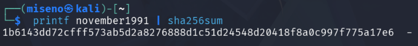

Siten voimme tarkistaa hashin

```
hashid -m 1b6143dd72cfff573ab5d2a8276888d1c51d24548d20418f8a0c997f775a17e6
```

- `-m` Määrittää että hashcatissa käytettävä hashid tulostetaan.

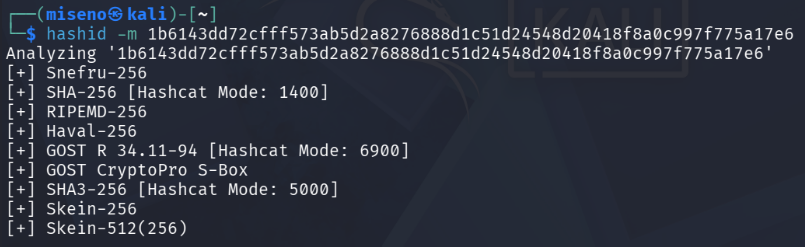

Tämän outputin perusteella voisimme kokeilla 1400, 6900, 5000 sekä 256. Mutta koska tiedämme, että hash oli generoitu sha256 salauksella, kokeillaan suoraan sitä.

Sitten kokeillaan.

```
hashcat -m 1400 '1b6143dd72cfff573ab5d2a8276888d1c51d24548d20418f8a0c997f775a17e6' rockyou.txt -o solved
```
- `-m 1400` sha256 id
- `'1b6143dd72cfff573ab5d2a8276888d1c51d24548d20418f8a0c997f775a17e6'` crackattava hash
- `rockyou.txt` Käytettävä sanakirja
- `-o solved` Output solved nimiseen tiedostoon

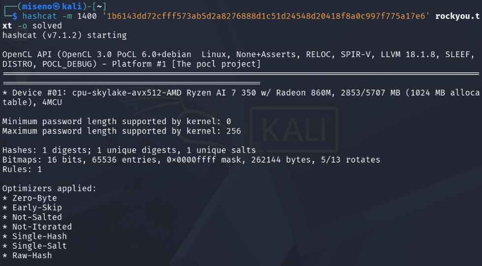


Tallennetussa tiedostossa näkyy alkuperäinen hash sekä crackatty salasana.

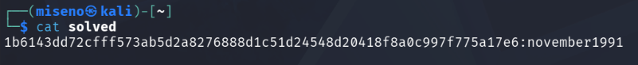

## c) Asenna John the Ripper ja testaa sen toiminta murtamalla jonkin esimerkkitiedoston salasana

Asensin itseltäni puuttuvat paketit ja riippuvuudet.
```
sudo apt-get -y install micro bash-completion build-essential libssl-dev zlib1g zlib1g-dev libbz2-1.0 libbz2-dev atool wget
```

Asennus onnistui nätisti Teron artikkelia seuraamalla. Ainoa muutos mitä tein oli vaihtaa kloonattavan github repon osoite.

```
git clone https://github.com/openwall/john.git
```
Sitten ajetaan src -hakemistossa oleva configure -tiedosto, joka tutkii millainen linux-järjestelmä kyseesä on, tarkistaa että kaikki tarvittavat riippuvuudet löytyvät ja generoi make -tiedoston.
```
cd john/src/
./configure
```
Tässä nähdään että joitain riippuvuuksia ei löytynyt, joten kaikki lisäominaisuudet eivät toimi. Liitin kuvakaappauksen chatgpt:lle ja se vakuutti, että kaikki tarvittavat perustoiminnallisuudet ovat silti käytössä, joten ei murehdita näistä tässä vaiheessa.

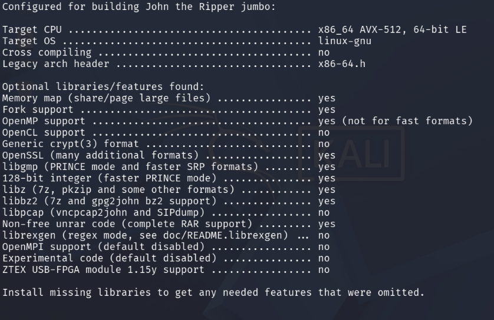
```
make -s clean && make -sj4
```
- `-s` hiljainen ajo, ei printata tulosteita.
- `clean` poistaa build tiedostot.
- `-sj4` hiljainen ajo, suorita 4 jobia samanaikaisesti (käytä kaikkia 4 prosessoriydintä samanaikaisesti)

Tein vielä .zshrc -tiedostoon aliaksen, joka ajaa jumbo johnin. Näin sen voi ajaa vaikka omasta kotihakemistosta, eikä tarvitse pelätä että se menee vahingossakaan sekaisin johnin perusversion kanssa, joka löytyy myös koneelta.

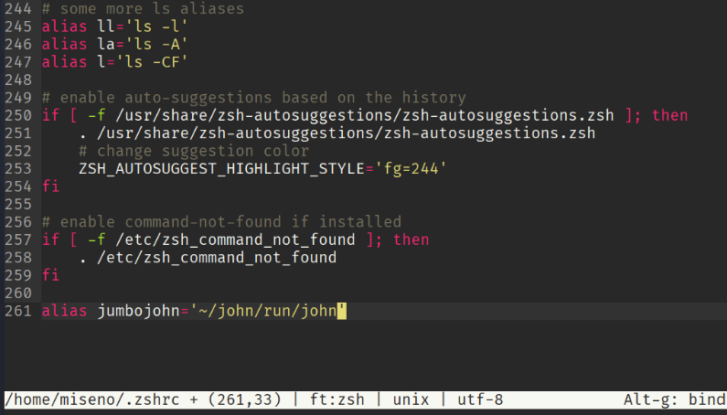

Sitten pitäisi luoda jokin suojattu tiedosto. Tämä onnistuu zip -komennolla, joka pakkaa tiedoston tai tiedostot, ja tarjoaa mahdollisuuden salata paketti `-e` flagilla.

```
zip -e secure.zip tiedosto.txt
```
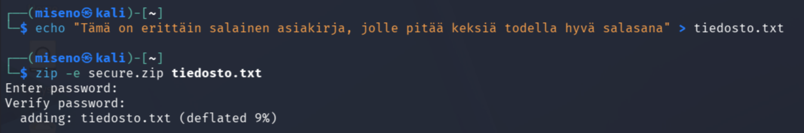

Tiedostossa täytyy olla jotain sisältöä jotta seuraava vaihe onnistuu. Zip2john ei toimi tyhjään tiedostoon.

Zip2john tulostaa zip-tiedoston tiivisteen uuteen tiedostoon.

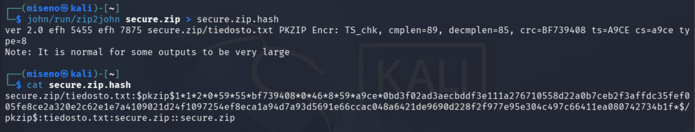

Sitten voimme yrittää crackata tiedoston aikaisemmin luomallamme aliaksella. 

```
jumbojohn secure.zip
```

Ja sieltä löytyikin salasana jolla zip-tiedosto oli suojattu.

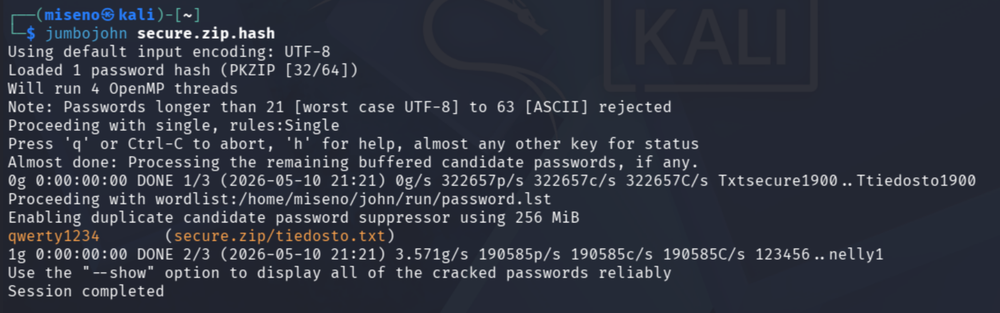

## e) Tiedosto. Tee itse tai etsi verkosta jokin salakirjoitettu tiedosto, jonka saat auki. Murra sen salaus. (Jokin muu formaatti kuin aiemmissa alakohdissa kokeilemasi).

Tietoturvan hallinta kurssilla käytettiin openssl:ää tiedostojen suojaamiseen, joten kokeillaan sitä nyt uudestaan. Tähän löytyi hyvät ohjeet muistia virkistämään. (Gumparthi, S 6.9.2024)

OpenSSL:llä tiedon saa salattua esim tällä tavalla

```
openssl enc -aes-256-cbc -salt -in tiedosto.txt -out salattu_tiedosto.txt
```
- `enc` Encrypt komento
- `-aes-256-cbc` Valittu salausalgoritmi. OpenSSL tukee paljon muitakin salausalgoritmeja.
- `-salt` Lisätään salasanaan suola. Suola lisää satunnaisen merkkijonon yleensä salasanan alkuun tai loppuun. Tämä suojaa rainbow table attackeja vastaan, jossa hyökkääjä käytää valmiita hasheja. Lukemani perusteella johnin pitäisi pystyä tunnistamaan suola automaattisesti ja ottamaan se huomioon.

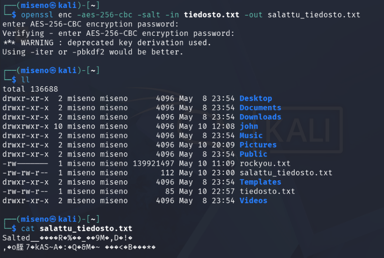

Kokeilin ensin ajaa tätä ihan sellaisenaan, mikä ei tuottanut toivottua lopputulosta.

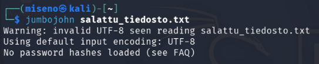

Ajattelin, että pitääköhän tässäkin tehdä tiedostolle jotain ennen kuin sen ajaa, ja run -hakemistosta löytyikin vastaavanlainen ohjelma mitä aiakisemmin käytettiin zip-tiedostoon.

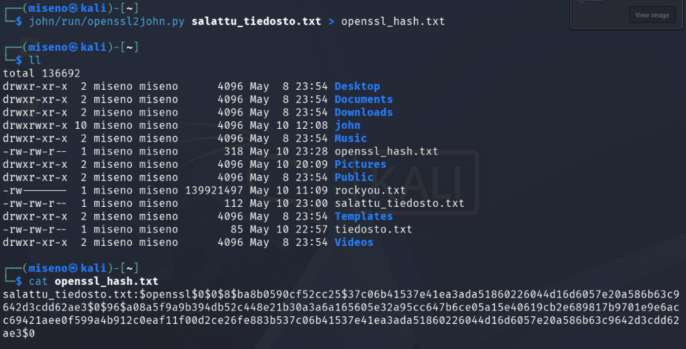

Sitten ajoin johnin samalla tavalla kuin edellisessä tehtävässä.

Tässä kävikin mielenkiintoinen juttu. John pyöri ainakin 15 minuuttia ja lopputuloksena taisi olla se, että se löysi false positiven, sillä tämä ei kyllä ole salasana jolla salasin tiedoston.

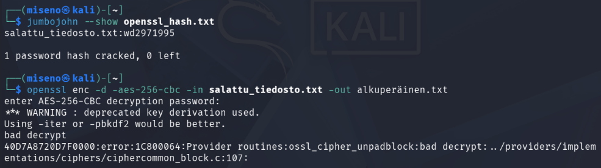

Laitoin kuvakaappauksen ChatGPT:lle, ja sieltä tuli hypoteesi jonka mukaan OpenSSL:n käyttämä vanha EVP_BytesToKey -mekanismi saattaa antaa false positiveja erityisesti pienillä tiedostoilla. Se suositteli käyttämään avaimenjohdantoalgoritmi (Key Derivation Function) -pbkdf2.

Koitin samat toimenpiteet uudestaan, nyt käyttämällä tuota em. algoritmia. Crackays rullasi toisessa terminaalissa samalla kuin tein muita tehtäviä. Ajantaju katosi, mutta varmaan 2-3h :D. Lopulta prosessi loppui siihen että levytila täyttyi. Olin todennäköisesti saanut aikaan jonkin runaway-looppin. Valitettavasti en muistanut ottaa screenshotteja antamistani komennoista, mutta ne olivat samat kuin aiakisemmassa yrityksessä, nyt vaan salaus luotiin -pbkdf2 flagilla.


Johnin lokitiedostot täyttyivät koko kovalevyn.

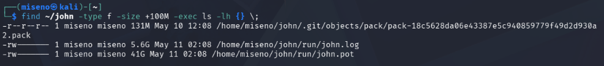

Poistin ne ja nyt koneella on taas tilaa.


## f) Tiiviste. Tee itse tai etsi verkosta salasanan tiiviste, jonka saat auki. Murra sen salaus. (Jokin muu formaatti kuin aiemmissa alakohdissa kokeilemasi. Voit esim. tehdä käyttäjän Linuxiin ja murtaa sen salasanan.)

Tein tämäntyyppisen tehtävän jo yhden edellisen kotitehtävän yhteydessä. Aikaa säästääkseni viittaan tässä vaan siihen. Joten voitte käydä lukemassa sen. Kyseisessä tehtävässä murran metasploitablesta löydetyt shadow-tiivisteet.

https://github.com/m1seno/Tunkeutumistestaus/blob/main/h3%20EternalHomework.md

Skrollaa alaspäin kunnes löydät tehtävän "Lateral movement metasploitable", tai paina linkistä jossa lukee "John the Ripper -tehtävä".

## g) Sanakirja. Oman sanakirjan teko parantaa onnistumismahdollisuuksia. Demonstroi, kuinka teet oman sanakirjan hashcat:n tai john:iin.

Tein bash-scriptin joka luo sanakirjan suomalaisista kuukusien nimistä, vuosista ja yleisimmistä erikoismerkeistä. Se sisältää kolme sisäkkäistä for-looppia jotka käyvät läpi vuodet 1900-2026, kaikki kuukaudet sekä erikoismerkit ja parsii ne yhteen.

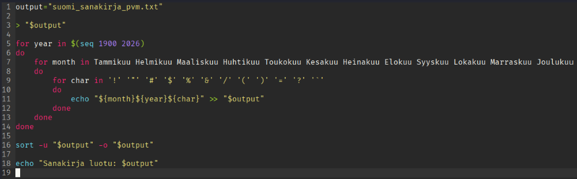

Sitten annetaan ajo-oikeudet ja ajetaan scripti.

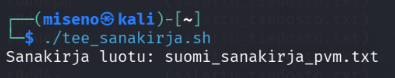

Näemme, että sanakirja sisältää yli 18 000 riviä.

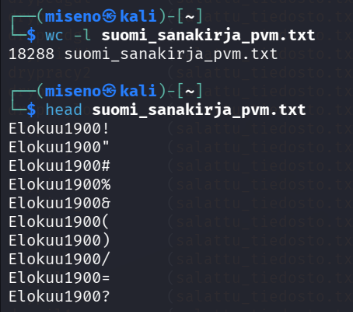

Kokeilin vielä murtaa hashia tällä sanalistalla.

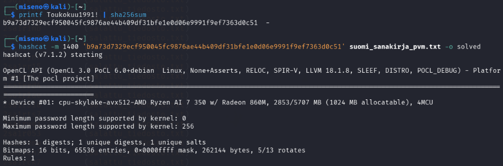

Hienosti onnistui!

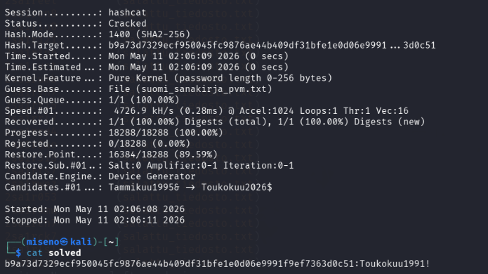

Tässä näemme myös oman sanalistan vahvuuden. Suomi on sen verran harvinainen kieli maailmalla, että tätä kyseistä salasanaa ei löytynyt edes rockyou -sanalistalta.

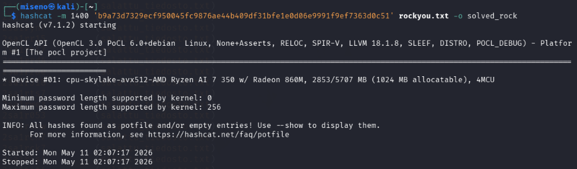

## h) Hash rules. Näytä esimerkki HashCatin sääntöjen käytöstä (rules)

Hashcatin sääntöjen avulla sanakirjan sanoja voidaan muokata automaattisesti. Best64 toimii käytännössä niin, että se ottaa jokaisen sanalistan sanan ja tekee siitä kymmeniä muunnelmia (iso etukirjain, pieni etukirjain, erikoismerkki eteen ja perään jne).(ChatGPT) Tällöin valtavalle sanakirjalle ei ole tarvetta. Toisaalta valtava sanakirja kasvaa entisestään mikä voi myös olla hyödyllistä.

Kokeillaan vaikka edellisessä tehtävässä luomaani salasanaa ja sanakirjaa. Tiedämme, että Toukokuu1991! on sanalistassa, mutta toukokuu1991! ei ole. Luodaan siis sellainen hash.

Kokeillaan ensin ilman sääntöä.

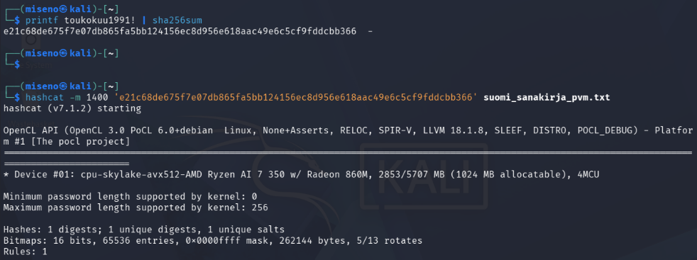
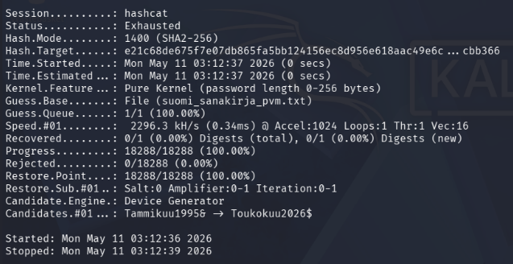

Ei löydy. Mutta jos lisätään sääntö, niin salasanan pitäisi löytyä.


Salasana löytyi.

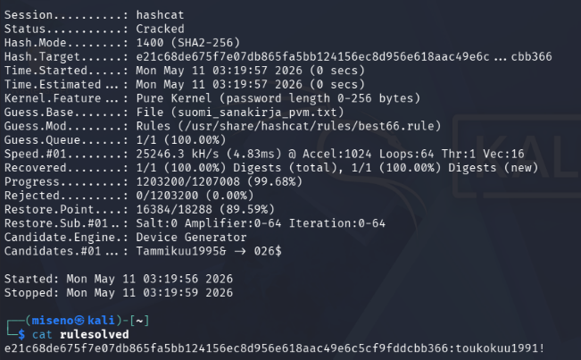

## i) Lippuvalmistelu. Valmistele kone ensi viikon lipunryöstöön. Tästä kohdasta ei tarvita kattavaa raporttia, riittää pelkkä luettelo siitä, miten ratkaisit allaolevat kysymykset. Jos sinulla on esimerkiksi valmis, toimiva Kali VM tavallisella PC:llä, tässä ei tarvitse tehdä juuri mitään.

Tilaamani uusi läppäri saapui tällä viikolla ja halusin otta sen heti käyttöön, joten asensin siihen uuden kali-virtuaalikoneen. Minun täyty vielä asentaa siihen tällä kurssilla käytettyjä ohjelmia, mutta hoidan sen huomenna (maanantaina).

## Lähteet

ChatGPT. "Miten best64 sääntö toimii?"

DuckDuckGo search assistant. "create hash linux command line"

Karvinen, T. 22.3.2026. Tunkeutumistestaus. Luettavissa: https://terokarvinen.com/tunkeutumistestaus/. Luettu: 7.5.2026.

Karvinen, T. 9.2.2023. Crack File Password With John. Luettavissa: https://terokarvinen.com/2023/crack-file-password-with-john/ Luettu: 7.5.2026.

Karvinen, T. 6.4.2022. Cracking Passwords with Hashcat. Luettavissa: https://terokarvinen.com/2022/cracking-passwords-with-hashcat/. Luettu: 7.5.2026.

Gumparthi, S. 6.9.2024. Encrypting and Decrypting Files with OpenSSL. Luettavissa:https://vsgump.medium.com/encrypting-and-decrypting-files-with-openssl-9bd1b0f2c87b. Luettu 10.5.2025.