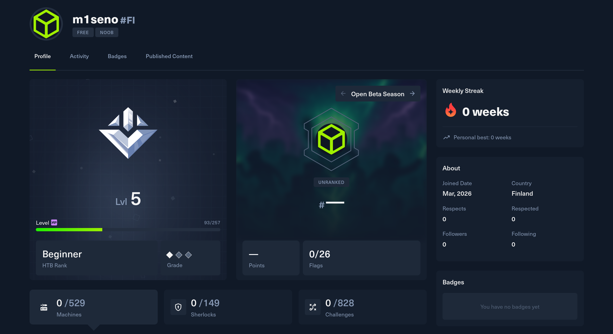

# Bonus
Harjoitukset on tehty kotitoimistossa Kaarinassa. Koneena oli Lenovo V14 G4 AMN. Käyttöjärjestelmänä Windows 11 Pro version 25H2. Virtuaalikoneena oli Linux Kali 6.16.8+kali-amd64.

Harjoituksessa seurataan Teron kotisivujen (Karvinen, T 22.3.2026) tehtävänantoa.

## a) Vapaaehtoiset tehtävät
### h2
f) Vapaaehtoinen bonus: Sisään vaan. Pääsetkö murtautumaan Metasploitableen?
### h6
m) Vapaaehtoinen: Asenna Windows-virtuaalikone ja tee kotiin soittava haittaohjelma siihen. Itse tykkään Linuxista ja käytän paljon sitä, tässä hieman vaihtelua. Windows-käyttäjät ovat myös usein tottuneet (paketinhallinnan puutteessa) lataamaan ohjelmia weppisivuilta.

## c) Kurssin ulkopuolella tekemäsi kiinnostavat hakkerointihaasteet, esimerkiksi HackTheBox korkatut koneet, mukaan ruutukaappaus pistesivustasi. Erottele retired ja non-retired. (Ei non-retired boksien läpikävelyohjeita julkiseen weppiin)

Olen tehnyt pelkästään starting pointin koneita (Tier 0 ja Tier 1), näissä ei käsittääkseni ole non-retired.

## Lähteet
Karvinen, T. 22.3.2026. Tunkeutumistestaus. Luettavissa: https://terokarvinen.com/tunkeutumistestaus/. Luettu: 7.5.2026.